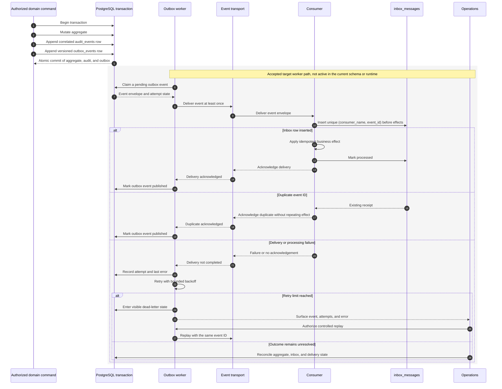

# ADR-005: Transactional Outbox and Inbox Deduplication

**Status:** Accepted
**Date:** 2026-09-14
**Owners:** Architecture/Operations

## Decision

Aggregate changes, audit records, and outbox events commit in one database transaction. Consumers record `(consumer, eventId)` in an inbox before applying effects.

## Consequences

Events may be delivered more than once but business effects are idempotent. Failed messages retry with backoff and then enter a visible dead-letter state. Event schemas are versioned and additive within a major version.
