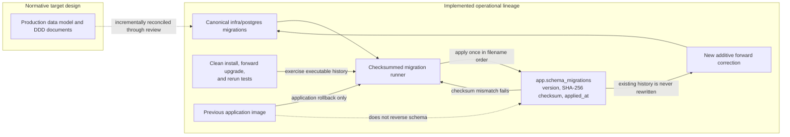

# ADR-013: Operational migration lineage

**Status:** Accepted on 2026-09-16

## Context

KEYFORTA has a normative target data model under `docs/` and a checksummed,
deployed migration lineage under `infra/postgres/migrations`. Replacing the
operational lineage with the reference schema would invalidate recorded
checksums, risk existing data, and prevent expand-first releases.

The full PRD backend is approved for implementation. Qualified DRC counsel has
not yet approved jurisdiction-specific policy values or commercial legal
workflows.

## Decision

`infra/postgres/migrations` is the canonical executable database history. New
domain capabilities evolve it through additive, forward-only migrations. The
production data model and DDD documents remain the normative target design and
must be reconciled incrementally through reviewed migrations and acceptance
tests.

Jurisdiction-sensitive behavior is selected through immutable, versioned policy
records. A capability that requires approval fails closed when its applicable
policy, owner evidence, counsel evidence, or effective activation is absent or
invalid. No migration seeds legal conclusions, consent, or approval evidence.

## Migration authority and execution lineage

The diagram distinguishes authority from intent: the documents describe the
normative target, while the migration directory, runner, ledger, and tests are
the implemented executable path. Database rollback is not implied; corrections
remain forward-only even when the application image is rolled back.

## Consequences

- Existing migration files and checksums are never rewritten.
- Every increment proves clean installation, forward upgrade, rerun, RLS, and
  cross-organization isolation.
- Application rollback may use a previous image, but database corrections use a
  new forward migration.
- Commercial lease execution, screening, regulated payment automation,
  jurisdiction-specific notices, production personal data, and other legal
  blockers remain disabled until the decision register contains approved
  evidence.
- Public discovery and synthetic, noncommercial workflows remain compatible.