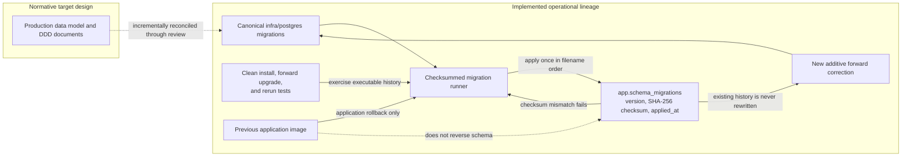

# ADR-013: Operational migration lineage

**Status:** Accepted on 2026-09-16

## Context

KEYFORTA has a normative target data model under `docs/` and a checksummed,
deployed migration lineage under `infra/postgres/migrations`. Replacing the
operational lineage with the reference schema would invalidate recorded
checksums, risk existing data, and prevent expand-first releases.

The full PRD backend is approved for implementation. Qualified DRC counsel has
not yet approved jurisdiction-specific policy values or commercial legal
workflows.

## Decision

`infra/postgres/migrations` is the canonical executable database history. New
domain capabilities evolve it through additive, forward-only migrations. The
production data model and DDD documents remain the normative target design and
must be reconciled incrementally through reviewed migrations and acceptance
tests.

Jurisdiction-sensitive behavior is selected through immutable, versioned policy
records. A capability that requires approval fails closed when its applicable
policy, owner evidence, counsel evidence, or effective activation is absent or
invalid. No migration seeds legal conclusions, consent, or approval evidence.

## Migration authority and execution lineage

```mermaid
flowchart LR
  subgraph Target[Normative target design]
    Docs[Production data model and DDD documents]
  end

  subgraph Implemented[Implemented operational lineage]
    Migrations[Canonical infra/postgres migrations]
    Runner[Checksummed migration runner]
    Ledger[app.schema_migrations<br/>version, SHA-256 checksum, applied_at]
    Tests[Clean install, forward upgrade,<br/>and rerun tests]
    Correction[New additive forward correction]
    PreviousImage[Previous application image]
  end

  Docs -. incrementally reconciled through review .-> Migrations
  Migrations --> Runner
  Runner -->|apply once in filename order| Ledger
  Ledger -->|checksum mismatch fails| Runner
  Tests -->|exercise executable history| Runner
  Ledger -->|existing history is never rewritten| Correction
  Correction --> Migrations
  PreviousImage -->|application rollback only| Runner
  PreviousImage -. does not reverse schema .-> Ledger
```

The diagram distinguishes authority from intent: the documents describe the
normative target, while the migration directory, runner, ledger, and tests are
the implemented executable path. Database rollback is not implied; corrections
remain forward-only even when the application image is rolled back.

## Consequences

- Existing migration files and checksums are never rewritten.
- Every increment proves clean installation, forward upgrade, rerun, RLS, and
  cross-organization isolation.
- Application rollback may use a previous image, but database corrections use a
  new forward migration.
- Commercial lease execution, screening, regulated payment automation,
  jurisdiction-specific notices, production personal data, and other legal
  blockers remain disabled until the decision register contains approved
  evidence.
- Public discovery and synthetic, noncommercial workflows remain compatible.

## Amendment (2026-09-27): one-time pre-launch consolidation

Before any environment held production tenant data, the 36 files that made up
the lineage at the time (`0001_initial.sql` through
`0036_media_review_admin_rls_policies.sql`) were squashed into a single
`0001_baseline.sql`, generated by applying the full historical sequence to a
scratch database and taking a schema-only dump (extensions, roles, and RLS
policies included; verified to reproduce an equivalent schema, role set, and
RLS policy inventory to the pre-squash lineage -- the only `pg_dump` diff is
14 lines of cosmetic CHECK-constraint parenthesization, not a functional
difference). This was a one-time consolidation, authorized because no real
tenant data existed yet in any environment. It is not a precedent: the
"existing migration files and checksums are never rewritten" rule above
applies in full, without exception, from `0001_baseline.sql` forward.

Consequences of this amendment:

- Any already-deployed environment's `app.schema_migrations` ledger recorded
  against the pre-squash filenames is invalidated and must be reset by
  dropping and recreating the database. Clearing only the ledger table is
  not a valid alternative: the baseline's `CREATE TABLE`/`CREATE TYPE`
  statements are not idempotent, so reapplying it against a database whose
  schema objects already exist (with the ledger cleared but the objects
  still present) fails outright.
- The migration runner (`apps/api/src/migrate.ts`) does not rely on operator
  discipline alone to enforce the reset above: `applyMigrations()` checks the
  ledger before running any SQL, and refuses to apply `0001_baseline.sql` --
  failing the deploy's migration job closed with an actionable error --
  whenever the ledger already has rows recorded but none of them is
  `0001_baseline.sql` itself. This turns a confusing mid-transaction
  "already exists" failure into a clear, fail-fast signal that the target
  database still needs the drop-and-recreate reset described above.
- Historical documentation (for example `docs/engineering/REQUIREMENTS_GAPS.md`
  and `docs/contracts/keyforta-production-data-model.md`) may still cite the
  pre-squash migration filenames as a record of when a decision or capability
  was introduced. Those files remain recoverable from git history prior to
  this amendment's commit; citations are not rewritten.
- The migration-runner workarounds that existed solely to keep the immutable
  pre-squash files applying correctly under Azure's restricted Entra-admin
  role (`provisionMediaReviewAdminRole`, the per-statement `set local role`
  ownership scoping, and the `0017`/`0022` upgrade-path preconditions) were
  removed from `apps/api/src/migrate.ts`, since a freshly authored baseline
  can create roles and grant final ownership directly instead of replaying
  historical workarounds.