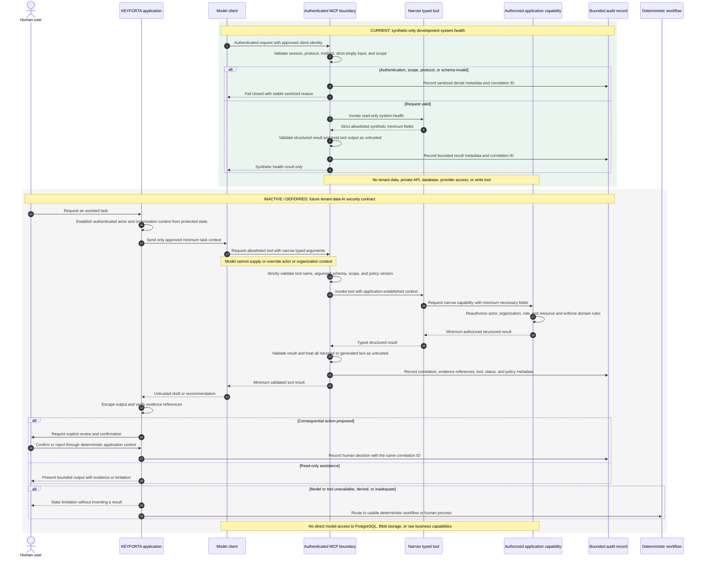

# AI Tool Policy

1. Tools expose business capabilities, never raw database access.
2. The application establishes actor and organization context; the model cannot
   supply or override it.
3. Read tools return only the minimum authorized fields needed for the task.
4. Write tools validate normal domain rules and default to preview mode.
5. Lease, notice, ledger, payment, refund, access, and disclosure changes require
   explicit confirmation at the application layer.
6. Tool calls, evidence references, result status, model configuration, and
   human decisions receive one correlation ID and auditable record.
7. Model-generated text is escaped and treated as untrusted at every output
   boundary.

## Remote MCP boundary

8. `apps/mcp-server` is the only Model Context Protocol boundary. It is a
   standalone service approved for a synthetic-only ChatGPT connection in the
   dev environment through the protected activation process. It remains
   unavailable in production and has no private API, database, tenant-data, or
   model-provider access.
9. Every MCP request is authenticated before protocol dispatch. Actor identity
   comes from the approved authentication boundary, never from JSON-RPC
   content, tool arguments, or client-supplied organization context.
10. The first slice exposes only server metadata and the synthetic read-only
    `system.health` capability tool. Tenant, lease, payment, document,
    maintenance, and other business tools, and every write tool, require
    separate product, architecture, and security/privacy approval.
11. Missing identity, unsupported origins, unsupported protocol versions,
    malformed messages, insufficient scope, and unknown or expired sessions
    fail closed with sanitized errors carrying only a stable reason and
    correlation ID.
12. MCP audit records retain correlation ID, client identity, protocol version,
    method, tool name, result status, denial reason, policy version, and a
    hashed session reference. They never retain credentials, prompts, tool
    arguments, tool results, or personal data.

## AI and MCP tool-boundary sequence

The first section is the current approved synthetic capability. The second is a
security contract for future tenant-data AI and remains inactive and deferred
until its separate product, architecture, and security/privacy approvals exist.

