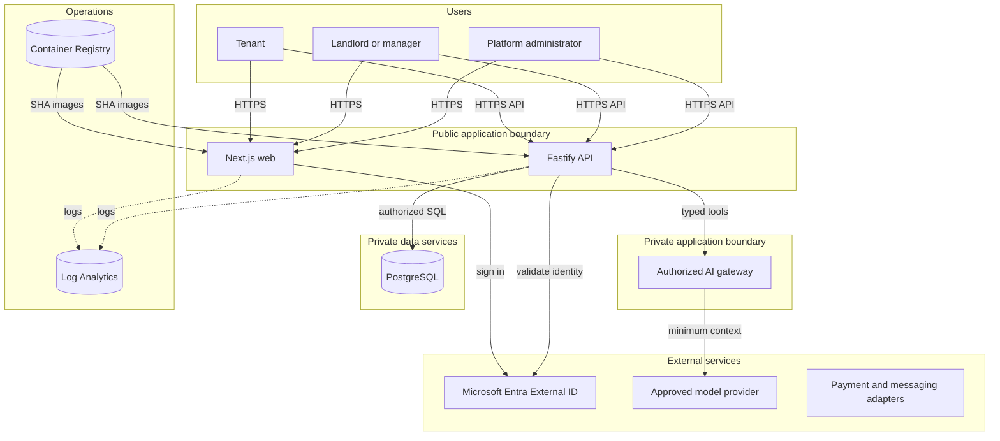
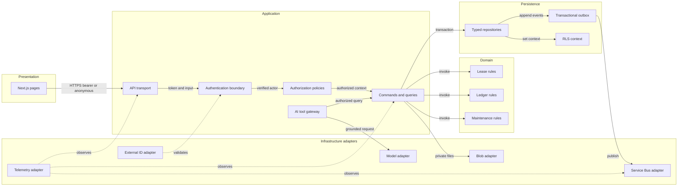

# Azure Architecture

KEYFORTA uses one lean `dev` deployment stamp in South Africa North for the
private pilot. Test and production stamps and unused managed services are
deferred by ADR-0006. Reviewed Bicep and deployment workflows remain the
authority for deployed resources.

## Application Architecture

<!-- mermaid-checked: no \n, no em-dash/en-dash, no {} in labels, subgraphs are id["label"], arrows are -->|"label"|, all subgraphs closed by end, ids unique -->

### Technology Stack Summary

| Layer            | Technology                          | Purpose                                        |
| ---------------- | ----------------------------------- | ---------------------------------------------- |
| Web              | Next.js and React                   | French-first responsive UI                     |
| API              | Fastify and Zod                     | Validation, authorization, orchestration       |
| Domain           | Framework-free TypeScript           | Deterministic business rules                   |
| Runtime          | Azure Container Apps                | Public web and API revisions                   |
| System of record | PostgreSQL Flexible Server          | Transactional, organization-scoped records     |
| Identity         | Microsoft Entra External ID         | Customer authentication                        |
| Observability    | Log Analytics                       | Bounded platform and application logs          |
| Evidence         | Private Azure Blob Storage          | Scan-gated tenant application documents        |
| Delivery         | GitHub Actions OIDC, Bicep, and ACR | Reviewed immutable deployments                 |

### Model Context Protocol Boundary

`apps/mcp-server` is a standalone authenticated read-only MCP service accepted
by [ADR-012](../adr/ADR-012-standalone-mcp-service.md). It is not part of the
deployed topology: no Container App, ingress, identity registration, or
workflow scope is provisioned for it, and it runs only in local and test
environments. It never imports API implementation modules, connects to
PostgreSQL, or calls a model provider. Activation requires separate
infrastructure, identity, cost, ingress, and deployment approval.

### Data Storage and External Services

PostgreSQL is authoritative for application state, application document
metadata, the transactional outbox, financial postings, authorization
memberships, and audit records. Tenant application evidence bytes use private
Blob Storage behind a scan-gated API adapter. Other document workflows,
asynchronous delivery, and AI providers remain deferred adapters. External
identity and payment providers never establish KEYFORTA authorization or
financial truth.

The implemented public-discovery backend uses managed-identity PostgreSQL
connections, security-definer listing functions, strict API projections, and a
serialized visit-inquiry command. It does not expose organization or unit IDs.
Protected-route bearer authentication and browser consumption of this API are
separate, incomplete slices.

### Key Architectural Decisions

- Use a modular monolith with separately scalable web, API, and worker processes.
- Expose the web application and API. Restrict browser access with exact-origin
    CORS and independently authenticate and authorize every protected API request.
- Use application authorization first and PostgreSQL RLS as defense in depth.
- Keep AI behind narrow typed tools and preserve deterministic workflows when AI
  is unavailable.

## Component Relationships

<!-- mermaid-checked: no \n, no em-dash/en-dash, no {} in labels, subgraphs are id["label"], arrows are -->|"label"|, all subgraphs closed by end, ids unique -->

### Component Inventory

| Component               | Layer          | Responsibility                                       |
| ----------------------- | -------------- | ---------------------------------------------------- |
| Next.js pages           | Presentation   | Role-specific, mobile-first user workflows           |
| API transport           | Application    | CORS, input validation, correlation, safe projection |
| Authentication boundary | Application    | Validate issuer, audience, subject, and token state  |
| Authorization policies  | Application    | Resolve membership and record-level permissions      |
| Commands and queries    | Application    | Validate, authorize, transact, version, and audit    |
| Domain rules            | Domain         | Deterministic lease, ledger, and workflow invariants |
| Typed repositories      | Persistence    | Parameterized SQL within explicit transactions       |
| RLS context             | Persistence    | Defense-in-depth organization and actor scoping      |
| Transactional outbox    | Persistence    | Commit events atomically with domain changes         |
| Infrastructure adapters | Infrastructure | Isolate Azure and provider SDKs from domain code     |
| AI tool gateway         | Application    | Narrow authorized tools, evidence, and safe fallback |

## Pilot Deployment

| Property             | Pilot value                  |
| -------------------- | ---------------------------- |
| Resource group       | `rg-keyforta-dev-san`        |
| App minimum replicas | Zero                         |
| PostgreSQL           | Burstable B1ms, no HA        |
| Backup retention     | 7 days                       |
| Log retention        | 30 days                      |
| Deployment           | Manual, reviewed registry digest |
| Public web origin     | `https://keyforta.com`        |
| DNS authority         | Cloudflare, DNS-only records  |

Production architecture is intentionally undefined until pilot evidence sets
availability, recovery, compliance, and budget requirements.

## Network and Access Rules

- Allow PostgreSQL traffic from Azure services during the private pilot.
- Disable PostgreSQL password authentication and require Entra database
  identities, restricted grants, application authorization, and RLS.
- Disable ACR admin authentication. Deployment uses `AcrPush`; Container Apps
  pulls with managed identity.
- Do not lock PostgreSQL VNet, subnet, or private DNS resources in ways that
  interfere with HA or DNS updates.
- Authenticate data-plane access with managed identities and Azure RBAC.

## Cost Controls

- Scale Container Apps to zero and use consumption capacity.
- Use burstable PostgreSQL without HA and retain backups for seven days.
- Use ACR Basic and 30-day log retention.
- Review the Azure resource inventory and cost after every deployment.
- Add a subscription budget before redeployment.

## Security and Operational Gates

No real tenant data is imported until authentication, application authorization,
cross-organization tests, RLS tests, private document access, audit records,
backup restore, incident handling, and rollback exercises pass. No Azure resource
is deployed or destroyed without reviewed `what-if` output and explicit approval.

## References

- [Azure Container Apps networking](https://learn.microsoft.com/azure/container-apps/networking)
- [Private PostgreSQL networking](https://learn.microsoft.com/azure/postgresql/flexible-server/concepts-networking-private)
- [PostgreSQL business continuity](https://learn.microsoft.com/azure/postgresql/flexible-server/concepts-business-continuity)
- [Azure resource locks](https://learn.microsoft.com/azure/azure-resource-manager/management/lock-resources)
