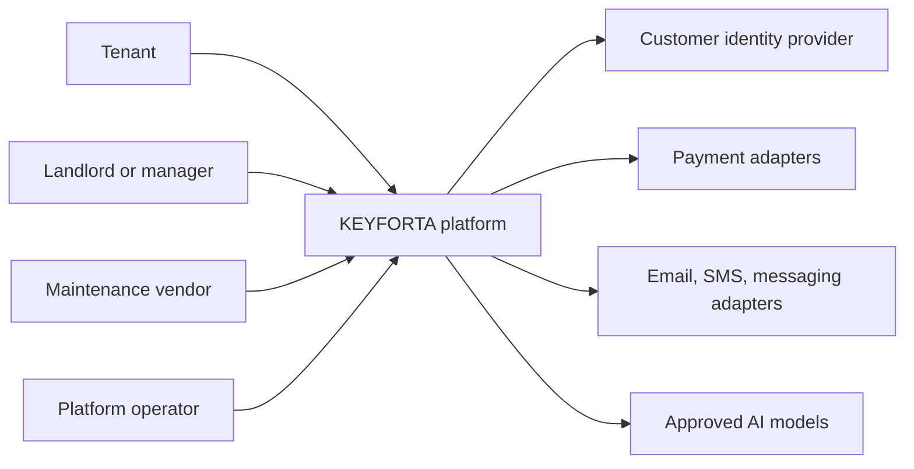

# System Context

KEYFORTA owns the authoritative property, party, lease, operational, document,
and financial subledger records. External providers supply identity, delivery,
payment events, or model inference; they do not replace KEYFORTA’s business
state or authorization decisions.
