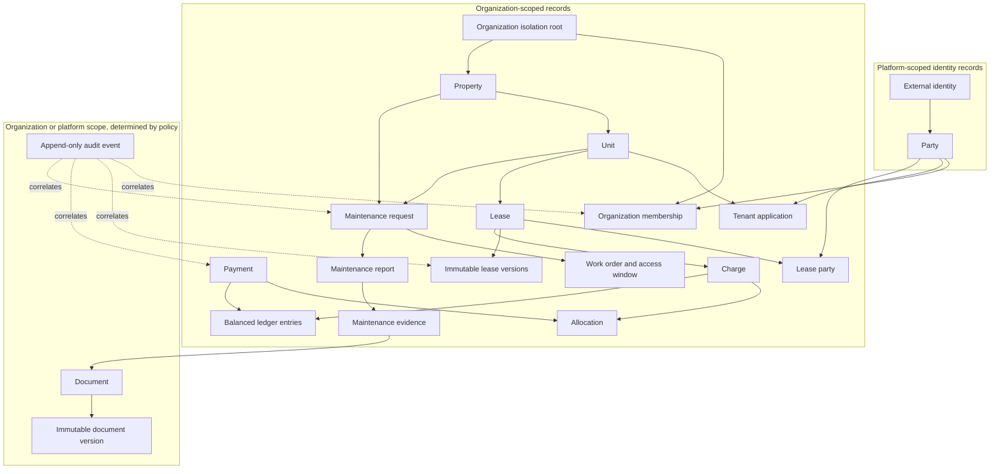
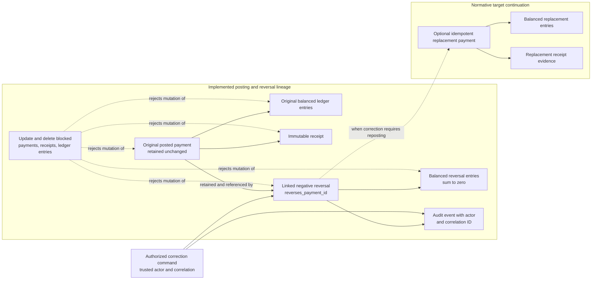

# Data Model Direction

The persistence implementation follows accepted
[organization-isolation](../adr/ADR-002-organization-isolation.md),
[production-persistence](../adr/ADR-010-production-persistence-boundary.md), and
[migration-lineage](../adr/ADR-013-operational-migration-lineage.md) decisions.
Executable migrations and PostgreSQL integration tests establish the current
foundation; this document remains a supporting conceptual view.

## Principal entity groups

| Domain       | Initial entities                                                          |
| ------------ | ------------------------------------------------------------------------- |
| Organization | Organization, Membership, Role, Invitation                                |
| Party        | Person, Company, ContactMethod, PartyRole, Consent                        |
| Property     | Portfolio, Property, Unit, Asset, Meter, Media                            |
| Lease        | Lease, LeaseVersion, LeaseParty, Occupancy, Handover                      |
| Pricing      | RentRule, Concession, DepositRule, ChargeSchedule                         |
| Finance      | Charge, LedgerEntry, Payment, Allocation, Receipt, Reconciliation         |
| Operations   | MaintenanceRequest, WorkOrder, Vendor, Inspection, Expense                |
| Content      | Document, DocumentVersion, Signature, Conversation, Notification          |
| Governance   | AuditEvent, AccessEvent, RetentionPolicy, Incident                        |
| AI           | Interaction, ToolCall, EvidenceReference, HumanDecision, EvaluationResult |

## Conceptual relationship map

This is a conceptual view of the principal relationships, not a replacement for
the normative columns, constraints, or executable migration lineage.

## Immutable payment correction lineage

This is a correction-lineage view, not a full ERD. The original payment,
receipt, postings, reversal link, balanced reversal entries, and correlated
audit event are implemented in the operational lineage. Atomic optional
replacement and its receipt evidence remain the normative target continuation.

## Required persistence conventions

- Tenant-owned rows carry `organization_id`; database row policies provide
  defense in depth behind application authorization.
- Identifiers are opaque and globally unique.
- Money is stored as integer minor units with an ISO currency code.
- Timestamps are stored in UTC; property time zone and contractual local date
  are retained where deadlines depend on them.
- Mutable business records use optimistic concurrency and history where needed.
- Properties and units use optimistic versions and `archived_at`; active reads
  hide archived rows while retained lease and audit records keep their links.
- ManagerPropertyAssignment links an active manager membership to one property;
  revocation is timestamped rather than deleted so delegated access history is
  retained.
- Landlord portfolio reads obtain active manager display names and assignment
  IDs through a narrow security-definer function that verifies the trusted
  organization, actor, and landlord membership context.
- Lease-draft commands resolve units and active tenants inside the trusted
  organization context, store contractual rent as integer minor units, leave
  acceptance unset, and emit a correlated `lease.draft_created` audit event.
  Each lease series records immutable provenance: either an approved tenant
  application from the same organization and tenant, or an external/historical
  source with a required justification. Existing leases are migrated as
  historical rather than being presented as validated applications.
- Lease revisions append a new row in the same lease series and supersede the
  previous head. Existing lease rows cannot be updated or deleted; archiving a
  draft appends an archived version instead of rewriting contractual history.
- Signed terms, posted ledger entries, evidence, and audit events are immutable.
- Every write has an actor, correlation ID, and application command context.
- Payment-provider identifiers and idempotency keys are uniquely constrained.
- Payment corrections append a linked negative reversal and, when needed, an
  idempotent replacement. Posted payments have no update or delete operation.
- Managers and tenants are identities with organization memberships. Their
  onboarding and removal require invitation, acceptance, and revocation
  workflows rather than direct user-row CRUD.
- Tenant applications have no submission timestamp only while in draft. The
  submitted, approved, and declined states retain the original submission
  timestamp, and review decisions remain append-only human actions.
- AI retrieval indexes carry the same organization and record permissions as
  their sources and can be rebuilt from authoritative records.

Physical schema changes must follow the canonical executable lineage in
[`infra/postgres/migrations`](../../infra/postgres/migrations/) and keep
migration, authorization, idempotency, immutability, and RLS isolation tests
green.
