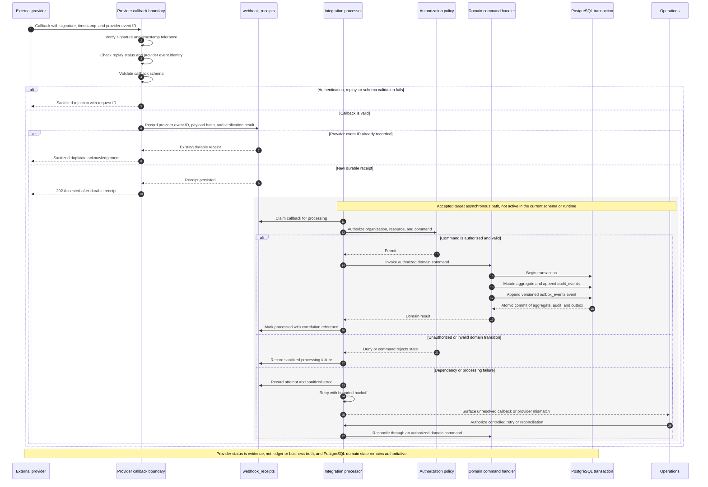

# Integration Boundaries

Integrations are adapters around KEYFORTA’s authoritative state.

## Initial adapter categories

| Category  | Inbound responsibility                             | Outbound responsibility                             |
| --------- | -------------------------------------------------- | --------------------------------------------------- |
| Identity  | Verified external subject and authentication event | Sign-in and account-recovery journey                |
| Payment   | Authenticated, replayable transaction status event | Payment request or instructions                     |
| Messaging | Delivery status and authorized user reply          | Notification rendered from an approved template     |
| Document  | Signature, scan, or extraction result              | Versioned document prepared for an authorized user  |
| AI model  | Structured candidate output and usage metadata     | Minimum necessary prompt, evidence, and tool result |

## Adapter rules

- The domain never imports a provider SDK.
- Inbound messages are authenticated, schema-validated, idempotent, and stored
  with provider and correlation references.
- Retries use bounded backoff and a dead-letter or exception queue.
- Provider success does not imply domain success; reconciliation links both.
- Personal data sent to a provider is minimized and governed by documented
  purpose, consent or other authority, retention, region, and deletion rules.
- Every provider requires a failure mode, fallback path, and replacement plan.

## Provider callback sequence

