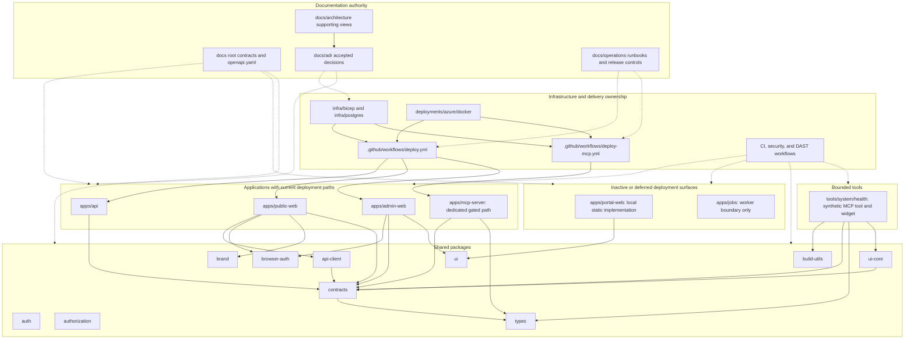

# Architecture supporting documents

This directory adds detailed KEYFORTA context, domain, integration, security,
data, and Azure views. The authoritative architecture decisions remain in
`../adr/`.

The files under `adr/` are retained candidate and historical decision records.
They do not supersede `../adr/`, the backend implementation specification, or
the production data model unless a reviewed decision explicitly reconciles and
promotes them.

## Repository topology and ownership

This map describes source-control ownership and available deployment paths, not
the live state of an environment. **Deployment-capable** means the repository
contains a gated workflow, image definition, and infrastructure definition;
deployment still requires reviewed evidence and human approval. Portal and jobs
remain outside those deployment paths.

Arrows from applications and tools to packages are current manifest
dependencies. The unconnected `auth` and `authorization` nodes are shared
package surfaces but are not direct application or tool dependencies in current
manifests.
Infrastructure and workflow arrows show delivery ownership, while dotted
documentation arrows show governance rather than runtime calls. See the
[diagram catalog](../DIAGRAMS.md) for status, semantic ownership, authoritative
sources, and review triggers.