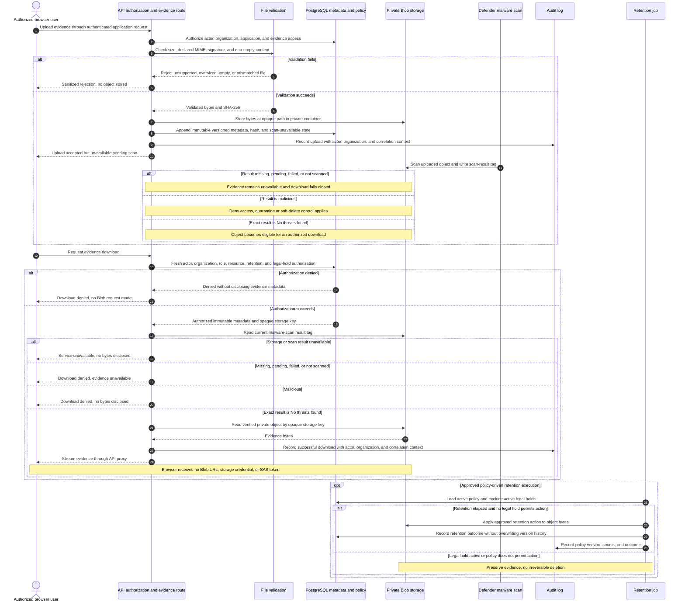

# ADR-0007: Store Application Evidence in Private Azure Blob Storage

> **Candidate record:** This file does not supersede the accepted
> [ADR-006](../../adr/ADR-006-private-document-storage.md). In particular,
> ADR-006's fresh authorization and short-lived signed URL decision controls
> until a reviewed ADR reconciles the download approach described here.

- **Status:** Proposed candidate; not approved for implementation
- **Date:** 2026-09-10
- **Relationship:** Does not supersede accepted ADR-006 or authorize its
    divergent API-proxied download design

## Context

Tenants need to provide identity, income, address, and rental-reference evidence
for human application review. These files contain sensitive personal data and
must not enter PostgreSQL, public object paths, source control, AI prompts, or an
unapproved third-party scanning service.

The application decision remains human-only. Evidence availability must not make
approval autonomous or cause a reservation, lease, refund, pricing, or money
movement action.

## Proposed decision

Use one private, locally redundant StorageV2 account in South Africa North and a
private `tenant-applications` container. The API accesses the container through
its managed identity and container-scoped Storage Blob Data Contributor role.
Shared-key authentication and anonymous Blob access are disabled. Authorized
browsers upload and download through the API; the product does not issue browser
SAS tokens.

Accept PDF, JPEG, and PNG files up to 10 MB. Validate declared MIME type and file
signature, use opaque blob paths, retain the original filename only as protected
metadata, and record SHA-256 in PostgreSQL and Blob metadata. PostgreSQL stores
immutable, versioned, organization-scoped metadata under forced RLS.

Enable Microsoft Defender for Storage on-upload malware scanning with Blob Index
Tags and a monthly cost cap. Every file is unavailable while its result is
missing, pending, not scanned, or malicious. Only the exact `No threats found`
result permits API-proxied download. Enable Blob soft delete for seven days and
enable Defender's built-in soft-delete-malicious-blobs control during deployment
verification when that control is not exposed by the supported Bicep schema.

Record upload and successful download audit events with actor, organization, and
correlation identifiers. Preserve application review as an explicit human action
that cannot create or activate a lease or reserve a unit.

### Evidence security sequence

## Consequences

- Sensitive evidence is stored outside the relational database and remains
  inaccessible to browsers and landlords until Defender reports it clean.
- Defender scanning and Blob transactions add usage-based cost; a 100 GB monthly
  cap bounds scanning cost but can leave later files unavailable when exhausted.
- The API remains usable without storage configuration, but evidence routes fail
  closed with a service-unavailable response.
- The pilot gains one managed resource that must be included in access reviews,
  incident response, retention checks, and deployment validation.

## Validation

1. Cross-role and cross-organization tests prove tenant ownership and landlord
   review authorization at the API and PostgreSQL boundaries.
2. Unsupported, oversized, empty, and signature-mismatched files are rejected.
3. Pending, not-scanned, and malicious files cannot be downloaded; clean files
   can be downloaded only through an authorized API request.
4. Bicep compiles and assigns no storage keys or public container access.
5. Deployment verification confirms Defender writes Blob Index Tags and soft
   deletes a synthetic EICAR test blob without using real tenant data.
