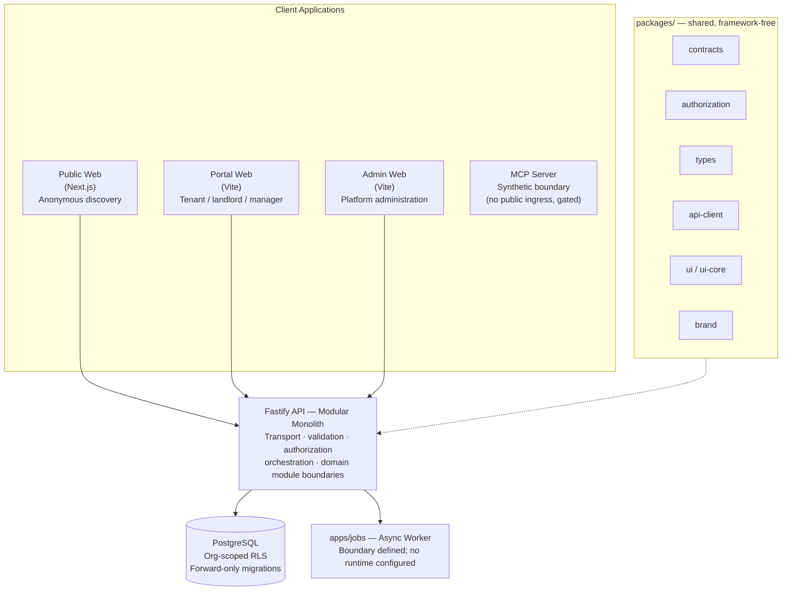
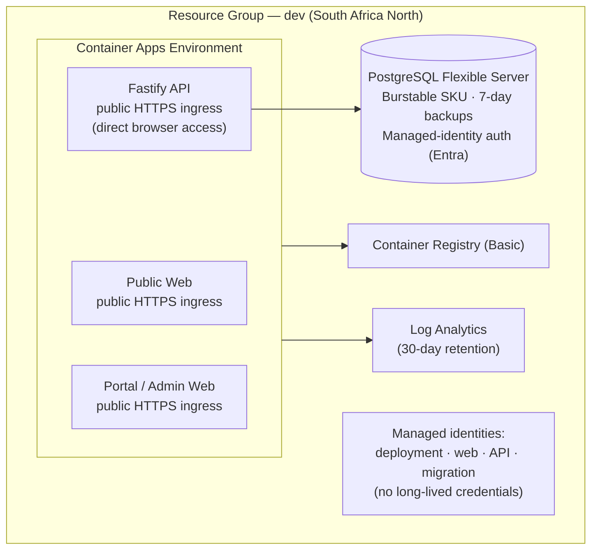
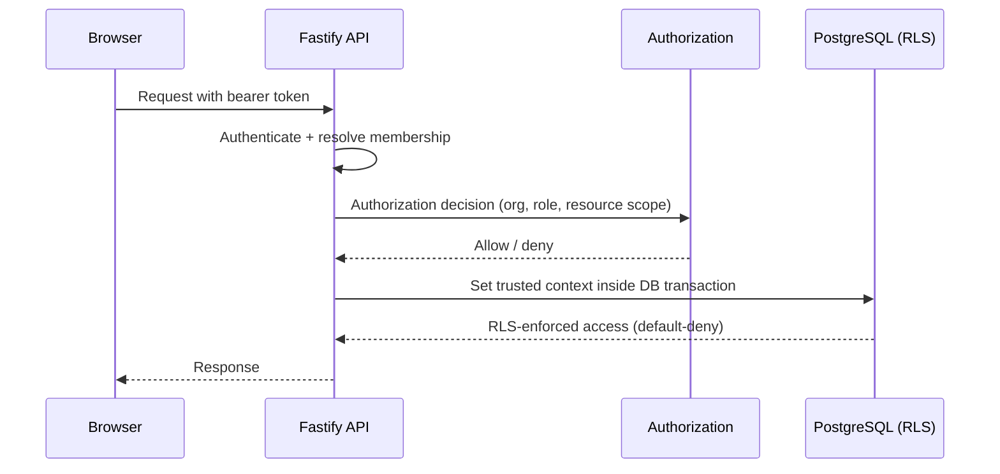
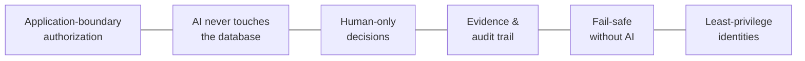
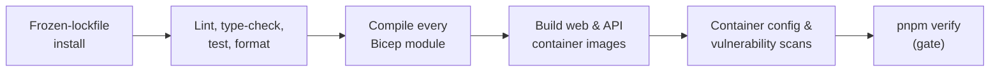

# KEYFORTA — Solution Architecture Overview

Companion Markdown/Mermaid version of the leadership presentation
(`keyforta-architecture-overview.pptx` / `.pdf` in this folder). GitHub renders
the diagrams below natively.

## Agenda

1. Product & architecture principles
2. System landscape — apps, packages, and boundaries
3. Deployment architecture on Azure
4. Data, tenancy, and financial integrity
5. Security, authorization, and AI safety boundaries
6. Delivery pipeline and quality gates
7. Key architecture decisions (ADRs)
8. Open decisions before production launch

---

## 1. Product & Architecture Principles

Product invariants drive the architecture:

- **Financial integrity** — money is never binary floating point; posted
  transactions are reversed and replaced, never silently edited.
- **Zero-trust authorization** — every organization, user, role, property,
  unit, and lease ID is re-validated at the API boundary, never trusted from
  the client.
- **AI stays narrow** — AI models never touch the database directly; they
  call narrow, typed, authorized tools only.
- **Humans decide** — acceptance, eviction, legal, pricing, refund, and
  money-movement decisions remain human, not autonomous.
- **Evidence & audit** — document versions, approvals, and audit correlation
  IDs are preserved end to end.
- **Resilient by design** — core workflows keep working even when AI services
  are unavailable.

---

## 2. System Landscape

Browsers call the public API directly (no BFF hop — see ADR-0008); every app
consumes shared contracts instead of duplicating financial or authorization
logic.

---

## 3. Deployment Architecture — Azure Lean Single-Environment Pilot

Deferred until justified by demand: test/prod stamps, Service Bus, Blob
Storage, Key Vault, Application Insights, general-purpose workers, private
endpoints, HA, geo-redundant backups (ADR-0006).

---

## 4. Data, Tenancy & Financial Integrity

Key rules:

- Every organization-owned table carries a non-null `organization_id`.
- The API authorizes every command/query before persistence access — client
  IDs are never trusted.
- RLS defaults to deny when trusted organization context is absent (defense
  in depth).
- The runtime role cannot own or bypass RLS on protected tables;
  `FORCE ROW LEVEL SECURITY` closes ownership loopholes.
- A separate migration identity owns schema change; application startup never
  auto-applies migrations.
- **Money uses integer minor units, never binary floating point.** Posted
  financial transactions are reversed and replaced — never silently edited.

---

## 5. Security, Authorization & AI Safety

- **Application-boundary authorization** — no client-supplied ID is trusted
  without re-validation at the API.
- **AI never touches the database** — models call narrow, typed, authorized
  tools only.
- **Human-only decisions** — acceptance, eviction, legal, pricing, refunds,
  and money movement are never autonomous.
- **Evidence & audit trail** — document versions, evidence references,
  approvals, and correlation IDs preserved end to end.
- **Fail-safe without AI** — core workflows keep working when AI services are
  unavailable.
- **Least-privilege identities** — separate managed identities for web, API,
  worker, database, and deployment.

---

## 6. Delivery Pipeline and Quality Gates

GitHub Actions with OIDC — no long-lived Azure credentials:

| Aspect | Detail |
| --- | --- |
| Identity | Per-environment federated deployment identity via workload identity federation |
| Environments | dev / test / production GitHub Environments; manual approval required for production |
| Promotion | Deployments allowed only from the protected `main` branch, tied to an immutable commit SHA |
| Evidence | CI worktree must stay clean after build; evidence-manifest gate fails otherwise |

---

## 7. Key Architecture Decision Records

| ADR | Decision | Why it matters |
| --- | --- | --- |
| ADR-0001 | Modular monolith | One API, internally enforced domain modules; service extraction deferred until measurable value |
| ADR-0002 | TypeScript monorepo | pnpm + Turborepo; framework-free domain code kept portable |
| ADR-0004 | PostgreSQL + app authorization + RLS | Application authorizes first; RLS is defense in depth, not the authorizer |
| ADR-0006 | Lean single-environment pilot | One dev environment; test/prod and extra services deferred until justified |
| ADR-0008 | Direct browser → API access | Removed the web BFF hop; API independently authorizes every request |
| ADR-0005 | GitHub OIDC deployment | No long-lived Azure credentials; federated identity per environment |

---

## 8. Open Decisions Before Production Launch (ADR-0009)

| Decision needed | Required before |
| --- | --- |
| Identity provider tenant & onboarding | Protected production access |
| PostgreSQL hosting region | Production personal data |
| Payment provider | Automated payments |
| Object storage & malware scanning | Document uploads |
| Messaging provider (email/SMS/WhatsApp) | Outbound communications |
| DRC retention / lease / notice policy | Commercial leasing |
| Backup & recovery targets (RPO/RTO) | Production launch |
| Observability & on-call ownership | Production launch |

Owners: Technology, Finance, Product, Privacy. Each decision requires context,
options, selected choice, security/privacy and cost impact, and documented
approval evidence.

---

## Glossary

| Term | Meaning |
| --- | --- |
| Modular monolith | A single deployed application internally organized into strict domain modules that communicate through commands, queries, and events instead of shared database access |
| Row-Level Security (RLS) | A PostgreSQL feature that restricts which rows a query can see or modify based on the caller's context; used here as defense in depth behind application authorization |
| Managed identity | An Azure identity automatically managed by the platform so an application or pipeline can authenticate without a stored password or secret |
| Access token (bearer scheme) | A credential included with an API request that grants access to whoever presents it, without further proof of identity |
| Zero-trust authorization | A design principle where every request is independently authenticated and authorized, regardless of network location or prior trust |
| Minor units (money) | The smallest whole unit of a currency (e.g., cents) used to avoid floating-point rounding errors in financial calculations |
| Immutable posting | A financial transaction record that is never edited after being recorded; corrections are made by reversing and replacing it |
| Forward-only migration | A database schema change that is only ever applied moving forward in time; past migrations are never rewritten |
| BFF (Backend-for-Frontend) | A server-side layer placed between a browser and backend API to tailor and forward requests on the browser's behalf |
| OIDC (OpenID Connect) | An identity protocol used here so GitHub Actions can authenticate to Azure without storing long-lived credentials |
| Workload identity federation | A mechanism that lets an external system (like GitHub) exchange its own identity for a cloud provider's identity, without a shared secret |
| Blue/green deployment | A release technique that runs two versions of an application side by side and shifts traffic from the old to the new version |
| Canary deployment | A release technique that gradually shifts a small percentage of traffic to a new version before a full rollout |
| RPO (Recovery Point Objective) | The maximum acceptable amount of data loss, measured in time, after an incident |
| RTO (Recovery Time Objective) | The maximum acceptable time to restore service after an incident |
| SLO (Service Level Objective) | A measurable reliability target (e.g., latency, uptime) that a team commits to internally |
| ADR (Architecture Decision Record) | A short document capturing one architecture decision, its context, and its consequences |

## Abbreviations

| Abbreviation | Expansion |
| --- | --- |
| API | Application Programming Interface |
| BFF | Backend-for-Frontend |
| CDN | Content Delivery Network |
| CI/CD | Continuous Integration / Continuous Deployment |
| CORS | Cross-Origin Resource Sharing |
| DRC | Democratic Republic of the Congo |
| HA | High Availability |
| HTTPS | Hypertext Transfer Protocol Secure |
| MCP | Model Context Protocol |
| OIDC | OpenID Connect |
| PKCE | Proof Key for Code Exchange |
| RLS | Row-Level Security |
| RPO | Recovery Point Objective |
| RTO | Recovery Time Objective |
| SKU | Stock Keeping Unit (here, a cloud service pricing/capacity tier) |
| SLO | Service Level Objective |
| SQL | Structured Query Language |
| VNet | Virtual Network |
| WAF | Web Application Firewall |
