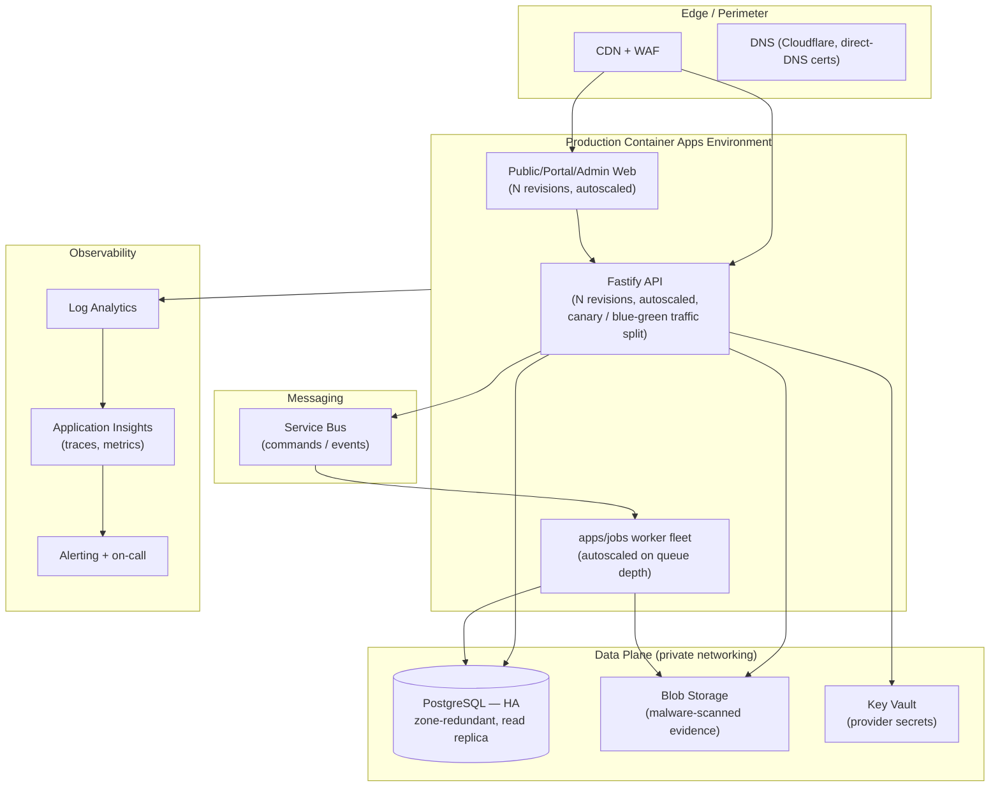
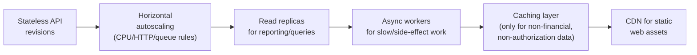

# KEYFORTA — Production Scalability & Modern Architecture Proposal

> **Status:** Discussion draft / proposal register — **not an accepted ADR**.
> **Does not supersede** [ADR-0006 — Lean Single-Environment Pilot](adr/0006-lean-single-environment-pilot.md),
> which remains the accepted, deployed architecture.
> Production topology and availability is an explicitly open decision — see
> [ADR-009: Open Decisions Before Production Launch](../adr/ADR-009-open-architecture-decisions.md)
> and the "Production topology and availability" row in
> [`docs/engineering/REQUIREMENTS_GAPS.md`](../engineering/REQUIREMENTS_GAPS.md).
> Nothing in this document authorizes implementation. Each option requires an
> accepted ADR, product-owner approval, and a measured product/security/
> reliability justification before it changes cost, scope, or infrastructure
> (per [`AGENTS.md`](../../AGENTS.md)).

This document exists to give leadership and architecture reviewers a single,
diagrammed reference for **what a scaled, real production environment could
look like**, evaluated against the product invariants that never change
regardless of scale.

## Non-negotiable invariants at any scale

These carry forward unchanged from the pilot ([`AGENTS.md`](../../AGENTS.md)):

- Money is never binary floating point; posted transactions are reversed and
  replaced, never silently edited.
- Every client-supplied organization/user/role/property/unit/lease ID is
  re-authorized at the API boundary.
- AI models never access the database directly — only narrow, typed,
  authorized tools.
- Tenant acceptance, eviction, legal, pricing, refund, and money-movement
  decisions remain human.
- Document versions, evidence references, approvals, and audit correlation
  IDs are preserved.
- Core workflows keep working when AI is unavailable.

Scaling changes **where and how** these are enforced technically; it never
relaxes them.

---

## 1. From pilot to production — what changes

| Dimension | Current pilot (ADR-0006) | Candidate production shape |
| --- | --- | --- |
| Environments | Single `dev` | `dev` → `test` → `production` promotion (ADR-0005 pattern, currently dormant) |
| Compute | Container Apps, single revision | Container Apps with autoscaling rules, multiple revisions, blue/green or canary traffic split |
| Data tier | Burstable PostgreSQL, 7-day backups | General-purpose/HA PostgreSQL, zone-redundant HA, geo-redundant backups, read replicas for reporting |
| Networking | Public HTTPS ingress on API | Private data-plane networking (VNet-integrated Postgres, private endpoints), WAF/CDN in front of public ingress |
| Async work | `apps/jobs` boundary defined, no runtime | Managed messaging (e.g., Service Bus) driving a deployed worker fleet |
| Secrets | Managed identities only | Managed identities **and** centralized secret/config management (e.g., Key Vault) for third-party provider credentials |
| Observability | Log Analytics, 30-day retention | Full observability stack: metrics, traces, dashboards, alerting, on-call rotation, SLO error budgets |
| Storage | No object storage provisioned | Private Blob Storage with malware scanning for tenant evidence documents (candidate ADR-0007) |

Every row above is a **candidate**, not a decision. Each requires its own ADR.

---

## 2. Candidate production topology

Key differences from the pilot: a CDN/WAF perimeter, private data-plane
networking, HA/replica database, managed messaging decoupling API from worker,
and a full observability chain feeding alerting/on-call.

---

## 3. Scalability levers (evaluate before adopting)

- **Stateless API** — already true today (Fastify, no server session); a
  precondition for horizontal scaling.
- **Autoscaling rules** — HTTP concurrency and/or queue-depth triggers on
  Container Apps; requires load testing to size correctly.
- **Read replicas** — for reporting/read-heavy queries only; write paths and
  anything requiring RLS-authoritative freshness stay on the primary.
- **Async workers** — move slow, non-blocking work (notifications, document
  scanning callbacks) off the request path via `apps/jobs` + messaging.
- **Caching** — only ever for non-financial, non-authorization-sensitive,
  already-authorized read data; must never cache across organization
  boundaries or bypass RLS-equivalent checks.
- **CDN** — static web assets and public anonymous discovery content only.

## 4. Modern architecture patterns considered

| Pattern | Applicability here | Constraint |
| --- | --- | --- |
| Modular monolith → selective service extraction | Only when a module needs independent scaling, deployment cadence, regulatory boundary, or team ownership (ADR-0001) | Requires an accepted ADR showing measurable need; no speculative microservices |
| Event-driven async processing | Notifications, document scanning results, background reconciliation | Must not make human-only decisions autonomous; events remain audit-correlated |
| CQRS-style read models | Reporting/dashboards at scale | Write path remains the single source of truth; read models are derived, never authoritative for money or lifecycle state |
| Blue/green or canary deployment | Safer production releases | Must preserve immutable evidence chain and rollback per `RELEASE_CHECKLIST.md` |
| Multi-region / geo-redundancy | Disaster recovery, latency | Requires approved region, data-residency, and DRC-jurisdiction legal review (ADR-009) before selection |
| Zero-trust networking (private endpoints, VNet integration) | Defense in depth for the data plane | Complements, never replaces, application-level authorization |

---

## 5. Reliability & operational readiness gaps to close before production

Directly from [ADR-009](../adr/ADR-009-open-architecture-decisions.md) and
[`REQUIREMENTS_GAPS.md`](../engineering/REQUIREMENTS_GAPS.md):

| Gap | Must be resolved by |
| --- | --- |
| Backup/recovery RPO/RTO targets | Product owner + SRE, before production launch |
| Observability ownership and on-call rota | Product owner + SRE, before production launch |
| Identity provider tenant and onboarding mode | Before protected production access |
| Payment provider selection | Before automated payments |
| Object storage + malware scanning provider | Before document uploads go live |
| Messaging provider (email/SMS/WhatsApp) | Before outbound communications |
| DRC retention/lease/notice legal policy | Before commercial leasing |
| Production topology and availability (this document's scope) | Consequential ADR + approval required |

None of these are resolved by this document. They remain tracked decisions
requiring named owners and approval evidence.

---

## 6. Suggested path to a production ADR

1. Quantify actual pilot load/usage data (do not size for hypothetical scale).
2. Draft one ADR per topology change (e.g., "Production HA PostgreSQL",
   "Async worker deployment", "Private data-plane networking") rather than one
   monolithic architecture change — consistent with existing ADR granularity.
3. Attach cost impact, security/privacy impact, and rollback plan to each ADR,
   per the ADR-009 template.
4. Route each ADR through the named decision owners (Technology, Finance,
   Product, Privacy) before implementation.
5. Update `docs/architecture/adr/0006-lean-single-environment-pilot.md`
   status only once a production ADR is accepted that supersedes it.

---

*This is a planning artifact for leadership discussion. Authoritative,
accepted decisions live in [`docs/adr/`](../adr/) and
[`docs/architecture/adr/`](adr/); do not treat this document as approved
scope, architecture, or infrastructure authorization.*
