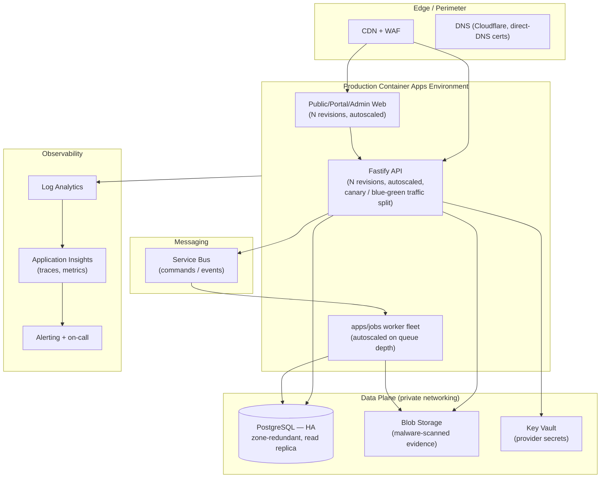
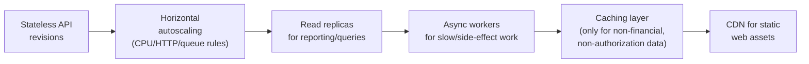
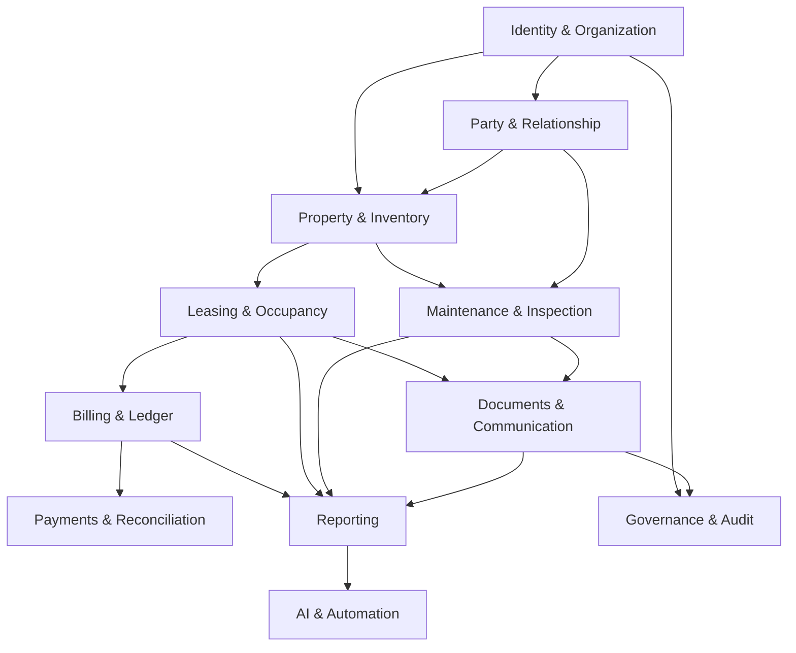
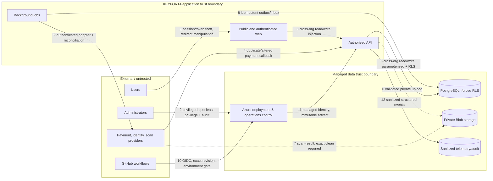
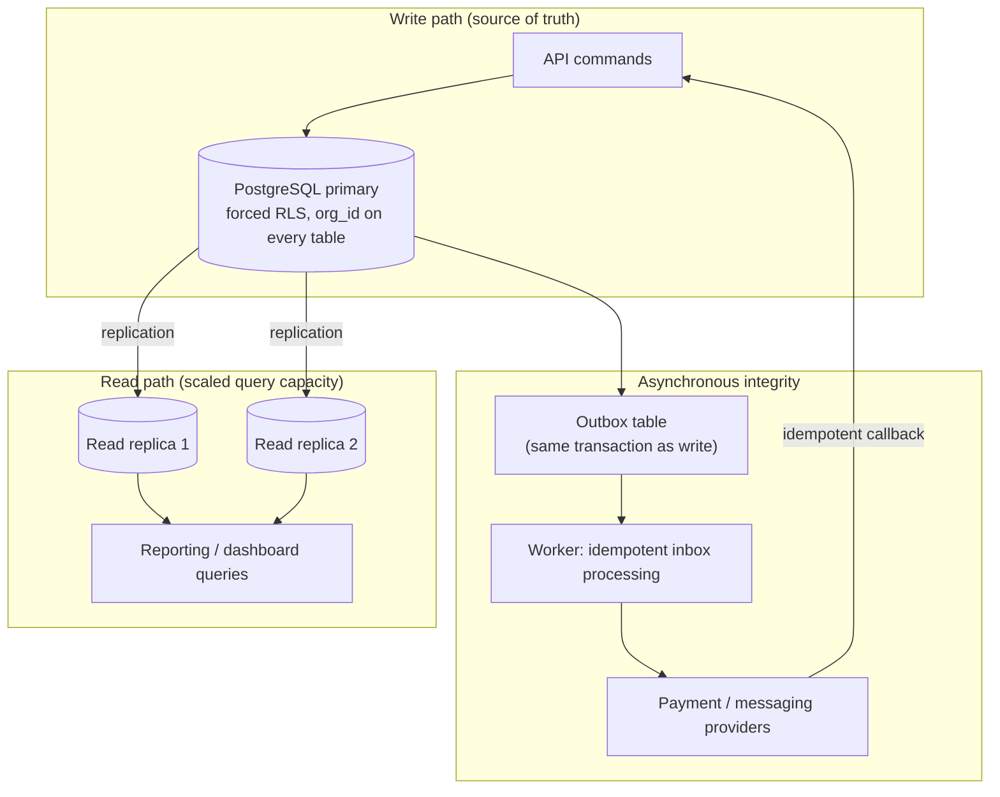
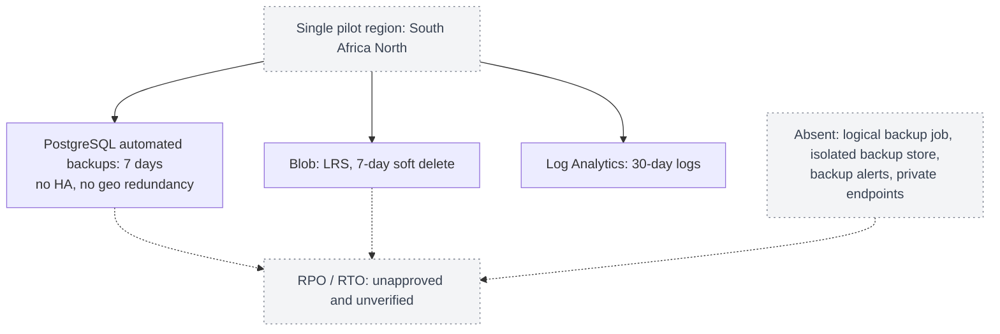
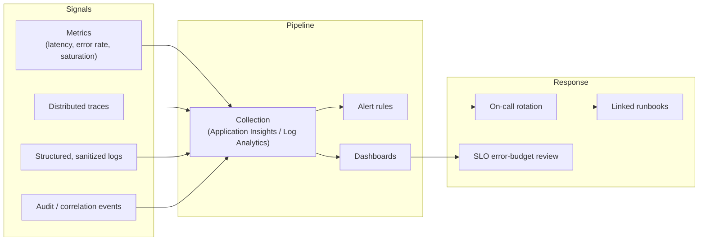

# KEYFORTA — Production Scalability & Modern Architecture Proposal

> **Status:** Discussion draft / proposal register — **not an accepted ADR**.
> **Does not supersede** ADR-0006 (Lean Single-Environment Pilot), which
> remains the accepted, deployed architecture. Production topology and
> availability is an explicitly open decision (ADR-009: Open Decisions Before
> Production Launch, and the repository's tracked requirements-gap register).
> Nothing in this document authorizes implementation. Each option requires an
> accepted ADR, product-owner approval, and a measured product/security/
> reliability justification before it changes cost, scope, or infrastructure.

This document exists to give leadership and architecture reviewers a single,
diagrammed reference for **what a scaled, real production environment could
look like**, evaluated against the product invariants that never change
regardless of scale.

### Contents

1. [From pilot to production — what changes](#1-from-pilot-to-production--what-changes)
2. [Candidate production topology](#2-candidate-production-topology)
3. [Scalability levers](#3-scalability-levers-evaluate-before-adopting)
4. [Modern architecture patterns considered](#4-modern-architecture-patterns-considered)
5. [Domain module boundaries at scale](#5-domain-module-boundaries-at-scale)
6. [Security and compliance architecture at scale](#6-security-and-compliance-architecture-at-scale)
7. [Data architecture, tenancy, and scaling](#7-data-architecture-tenancy-and-scaling)
8. [Testing strategy at production scale](#8-testing-strategy-at-production-scale)
9. [Reliability & operational readiness gaps](#9-reliability--operational-readiness-gaps-to-close-before-production)
10. [Backup, disaster recovery, and business continuity](#10-backup-disaster-recovery-and-business-continuity)
11. [Observability, capacity, and cost planning](#11-observability-capacity-and-cost-planning)
12. [Suggested path to a production ADR](#12-suggested-path-to-a-production-adr)

## Non-negotiable invariants at any scale

These carry forward unchanged from the pilot:

- Money is never binary floating point; posted transactions are reversed and
  replaced, never silently edited.
- Every client-supplied organization/user/role/property/unit/lease ID is
  re-authorized at the API boundary.
- AI models never access the database directly — only narrow, typed,
  authorized tools.
- Tenant acceptance, eviction, legal, pricing, refund, and money-movement
  decisions remain human.
- Document versions, evidence references, approvals, and audit correlation
  IDs are preserved.
- Core workflows keep working when AI is unavailable.

Scaling changes **where and how** these are enforced technically; it never
relaxes them.

---

## 1. From pilot to production — what changes

| Dimension | Current pilot (ADR-0006) | Candidate production shape |
| --- | --- | --- |
| Environments | Single `dev` | `dev` → `test` → `production` promotion (ADR-0005 pattern, currently dormant) |
| Compute | Container Apps, single revision | Container Apps with autoscaling rules, multiple revisions, blue/green or canary traffic split |
| Data tier | Burstable PostgreSQL, 7-day backups | General-purpose/HA PostgreSQL, zone-redundant HA, geo-redundant backups, read replicas for reporting |
| Networking | Public HTTPS ingress on API | Private data-plane networking (VNet-integrated Postgres, private endpoints), WAF/CDN in front of public ingress |
| Async work | `apps/jobs` boundary defined, no runtime | Managed messaging (e.g., Service Bus) driving a deployed worker fleet |
| Secrets | Managed identities only | Managed identities **and** centralized secret/config management (e.g., Key Vault) for third-party provider credentials |
| Observability | Log Analytics, 30-day retention | Full observability stack: metrics, traces, dashboards, alerting, on-call rotation, SLO error budgets |
| Storage | No object storage provisioned | Private Blob Storage with malware scanning for tenant evidence documents (candidate ADR-0007) |

Every row above is a **candidate**, not a decision. Each requires its own ADR.

---

## 2. Candidate production topology

Key differences from the pilot: a CDN/WAF perimeter, private data-plane
networking, HA/replica database, managed messaging decoupling API from worker,
and a full observability chain feeding alerting/on-call.

---

## 3. Scalability levers (evaluate before adopting)

- **Stateless API** — already true today (Fastify, no server session); a
  precondition for horizontal scaling.
- **Autoscaling rules** — HTTP concurrency and/or queue-depth triggers on
  Container Apps; requires load testing to size correctly.
- **Read replicas** — for reporting/read-heavy queries only; write paths and
  anything requiring RLS-authoritative freshness stay on the primary.
- **Async workers** — move slow, non-blocking work (notifications, document
  scanning callbacks) off the request path via `apps/jobs` + messaging.
- **Caching** — only ever for non-financial, non-authorization-sensitive,
  already-authorized read data; must never cache across organization
  boundaries or bypass RLS-equivalent checks.
- **CDN** — static web assets and public anonymous discovery content only.

## 4. Modern architecture patterns considered

| Pattern | Applicability here | Constraint |
| --- | --- | --- |
| Modular monolith → selective service extraction | Only when a module needs independent scaling, deployment cadence, regulatory boundary, or team ownership (ADR-0001) | Requires an accepted ADR showing measurable need; no speculative microservices |
| Event-driven async processing | Notifications, document scanning results, background reconciliation | Must not make human-only decisions autonomous; events remain audit-correlated |
| CQRS-style read models | Reporting/dashboards at scale | Write path remains the single source of truth; read models are derived, never authoritative for money or lifecycle state |
| Blue/green or canary deployment | Safer production releases | Must preserve immutable evidence chain and rollback per `RELEASE_CHECKLIST.md` |
| Multi-region / geo-redundancy | Disaster recovery, latency | Requires approved region, data-residency, and DRC-jurisdiction legal review (ADR-009) before selection |
| Zero-trust networking (private endpoints, VNet integration) | Defense in depth for the data plane | Complements, never replaces, application-level authorization |
| Outbox/inbox pattern for async delivery | Payment provider callbacks, cross-module event publication | Already the required pattern for jobs (see §7); prevents duplicate/altered payment processing |
| API gateway / BFF re-introduction | Only if multiple client types need divergent request shaping at scale | ADR-0008 removed the BFF deliberately; reintroducing it needs its own ADR and measurable justification |

---

## 5. Domain module boundaries at scale

Scaling infrastructure must not blur the modular-monolith domain boundaries
already defined in the product's context map and ownership contract.
These boundaries are what make **selective service extraction** (if ever
justified) safe later — they are the seams, not an afterthought.

Rules that hold regardless of deployment topology:

- No module imports another module's persistence entities or private
  repositories, and no module joins another module's private tables in
  request handlers — even across a future service boundary.
- A payment callback never writes a ledger entry directly; it calls the
  Billing module's published command.
- Reporting and AI read models are never authoritative for money or lifecycle
  state and are never used to authorize a command.
- An architecture test must fail the build if a module imports another
  module's persistence package — this remains true whether modules are
  extracted into services or not.

If a module is ever extracted into an independently deployed service (per
ADR-0001's stated conditions — independent scaling, deployment cadence,
regulatory boundary, or team ownership), its **published contract** (commands,
queries, events) in the ownership matrix becomes its network API surface
essentially unchanged. This is why keeping the internal boundaries strict now
is what makes extraction low-risk later, rather than a rewrite.

---

## 6. Security and compliance architecture at scale

Production scale increases the number of trust boundaries; it must not weaken
any of them. The existing numbered threat-boundary flow (from the
repository's threat model) is the baseline that a production topology must
preserve and extend:

At production scale, each numbered crossing above requires an explicit,
evidenced control — not just a network boundary:

| Crossing | Pilot control | Production hardening candidate |
| --- | --- | --- |
| 1. Browser → Web | OIDC PKCE, exact CORS origin, HTTPS validation | WAF rules, bot/abuse detection, MFA policy review |
| 3/5. Web/API → PostgreSQL | Zod contracts, parameterized queries, forced RLS | Same controls at scale; add query-cost limits and replica routing that never bypasses RLS |
| 4/9. Provider ↔ API/Jobs | Organization-scoped uniqueness, balanced ledger, reversal/replacement | Provider authentication hardening, reconciliation dashboards, alerting on mismatch |
| 6/7. Evidence upload/scan | Candidate: private Blob, malware scan gating (ADR-0007, not yet approved) | Must be approved and exercised via a runbook before activation, at any scale |
| 10/11. CI/CD → Azure | GitHub OIDC, exact-SHA evidence, immutable tags, environment gate | Add required production approval gate, artifact signing (open gap, see §8) |
| 12. API → Telemetry | Sanitized structured events | Full observability stack (§9) with retention and access-control policy |

Security assumptions carried into production planning without change: Azure
and GitHub identity controls are administered correctly, managed identity
object IDs are trusted configuration, TLS endpoints are valid, and
PostgreSQL/Blob platform encryption behaves as documented. These remain
operationally tested assumptions, not inferred guarantees.

---

## 7. Data architecture, tenancy, and scaling

- **Every organization-owned table keeps its non-null `organization_id`** and
  forced RLS regardless of read-replica count; replicas inherit the same
  policies, they do not relax them.
- **Read replicas serve reporting/dashboard queries only.** Any workflow that
  needs read-your-write consistency (e.g., a just-posted ledger entry) reads
  from the primary.
- **The outbox/inbox pattern** (already required for jobs per the threat
  model's control 8/9) is the mechanism that lets Payments & Reconciliation
  scale independently from Billing & Ledger without losing idempotency or
  creating duplicate/altered postings.
- **Executable, checksummed forward-only migrations** (`infra/postgres/migrations`,
  ADR-013) remain the only schema-change path at any scale — no
  environment-specific schema drift, no direct production DDL.
- **Capacity growth** is handled first by vertical sizing and read replicas;
  horizontal sharding/partitioning by organization is a candidate only after
  replica capacity is exhausted and would need its own ADR given the
  RLS-and-authorization model this product depends on.

---

## 8. Testing strategy at production scale

The existing layered test strategy does not change shape with scale — it gets
exercised against more infrastructure:

| Layer | Pilot gate | Production addition |
| --- | --- | --- |
| Unit | `pnpm test` | Unchanged |
| API contract | `packages/contracts`, `apps/api/test/app.test.ts` | Unchanged; contract stays the wire authority |
| Database integration | RLS, transactions, idempotency, cross-org denial | Add replica-lag-aware test cases; same cross-org denial proof pattern against replicas |
| Architecture | `pnpm check:architecture` | Add a module-boundary test that fails if extraction changes an internal import into a network call without an approved ADR |
| Infrastructure | Bicep compilation, pilot resource policy | Add production Bicep parameter sets and policy review per environment |
| Security | Negative authorization, secret patterns, dependency audit | Add authenticated DAST (currently a tracked gap — needs an approved synthetic issuer/JWKS) |
| End-to-end/smoke | A few critical boundaries post-deploy | Add blue/green traffic-shift verification and automated rollback trigger |
| Load/capacity | Not yet performed | **New layer required before production**: load test to size autoscaling rules and replica count from real traffic shape, not assumptions |

The reusable cross-organization proof pattern (same-org success, absent
context, cross-org denial, revocation, non-disclosure, direct RLS probe) is
mandatory for every authorization data path and does not get weaker as
infrastructure scales — every new read replica or cache layer must be run
through the same proof pattern before it is trusted.

---

## 9. Reliability & operational readiness gaps to close before production

Directly from ADR-009 (Open Decisions Before Production Launch) and the
repository's tracked requirements-gap register:

| Gap | Must be resolved by |
| --- | --- |
| Backup/recovery RPO/RTO targets | Product owner + SRE, before production launch |
| Observability ownership and on-call rota | Product owner + SRE, before production launch |
| Identity provider tenant and onboarding mode | Before protected production access |
| Payment provider selection | Before automated payments |
| Object storage + malware scanning provider | Before document uploads go live |
| Messaging provider (email/SMS/WhatsApp) | Before outbound communications |
| DRC retention/lease/notice legal policy | Before commercial leasing |
| Production topology and availability (this document's scope) | Consequential ADR + approval required |

None of these are resolved by this document. They remain tracked decisions
requiring named owners and approval evidence.

---

## 10. Backup, disaster recovery, and business continuity

Current pilot mechanisms (from the backup and retention runbook) are
explicitly **not** a recovery guarantee — RPO/RTO remain unapproved and
unverified:

Candidate production hardening — each still requires an approved RPO/RTO
target and a verified restore exercise before it counts as a control:

| Area | Candidate production target | Verification required |
| --- | --- | --- |
| PostgreSQL | Zone-redundant HA + geo-redundant backup, point-in-time restore | Isolated restore drill with observed RPO/RTO, not just configuration |
| Blob evidence storage | Geo-redundant storage (GRS/GZRS), versioning | Restore drill for accidental deletion and ransomware-style corruption |
| Outbox/inbox recovery | Replay verified idempotent under duplicate delivery | Chaos-style duplicate-delivery test in a non-production environment |
| Infrastructure recreation | Bicep + immutable image SHA already supports full re-creation | Full environment rebuild drill from IaC alone |
| Runbook coverage | Existing: auth redirect, cross-org access, payment integrity, document security, deployment/migration failure | Add: account recovery, incorrect charge schedule, AI grounding/tool policy, messaging outage, data export/deletion (currently listed as missing procedures) |

A production launch decision requires: an approved RPO/RTO target, an
executed and evidenced restore drill, and a named on-call owner — not
inferred configuration.

---

## 11. Observability, capacity, and cost planning

- **Pilot targets are explicitly learning targets, not customer commitments**;
  production commitments require the same table re-approved with measured
  data and an accountable on-call owner.
- **Capacity planning must follow measured pilot load**, not assumed scale:
  autoscaling thresholds, replica count, and connection-pool sizing are set
  from observed traffic and load tests (§8), then re-validated after each
  material feature launch.
- **Cost impact is part of every production ADR** — HA database tiers,
  geo-redundant storage, managed messaging, and a dashboards/alerting stack
  all carry recurring cost that must be sized against actual usage, not
  headroom for hypothetical growth.
- **Alert-to-runbook linkage** — every new alert rule must reference an
  existing or newly written runbook using the operations team's required
  runbook template.

---

## 12. Suggested path to a production ADR

1. Quantify actual pilot load/usage data (do not size for hypothetical scale).
2. Draft one ADR per topology change (e.g., "Production HA PostgreSQL",
   "Async worker deployment", "Private data-plane networking") rather than one
   monolithic architecture change — consistent with existing ADR granularity.
3. Attach cost impact, security/privacy impact, and rollback plan to each ADR,
   per the ADR-009 template.
4. Route each ADR through the named decision owners (Technology, Finance,
   Product, Privacy) before implementation.
5. Verify each hardening claim (backup, HA, autoscaling) with an executed
   drill or load test — configuration alone is not evidence.
6. Update the lean single-environment pilot decision's status only once a
   production ADR is accepted that supersedes it.

---

*This is a planning artifact for leadership discussion. Authoritative,
accepted architecture decisions govern this repository; do not treat this
document as approved scope, architecture, or infrastructure authorization.*
