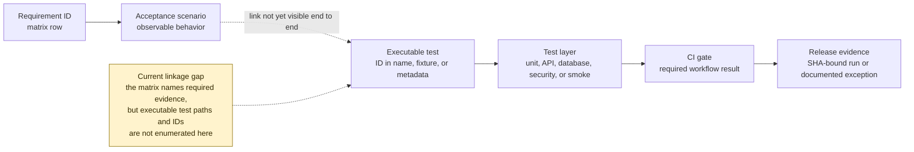

# KEYFORTA Acceptance-Test Traceability

**Status:** Normative acceptance and verification matrix v1.0

## 1. Test identifiers

Automated tests use the IDs below in test names, fixtures, or test metadata. A feature is not complete until every required scenario is linked to an executable test or an approved documented exception.

### Requirement-to-evidence chain

The target chain is complete only when a reviewer can follow the requirement ID
to a specific executable test and onward to the gate and release record. The
current matrix records scenarios and required evidence types, but it does not
enumerate executable test files or demonstrate that every test carries the
corresponding ID. That missing linkage remains a visible verification gap and
must not be interpreted as test coverage.

## 2. Traceability matrix

| ID | Requirement | Acceptance scenario | Required evidence |
| --- | --- | --- | --- |
| AUTH-001 | Valid identity resolves to party and memberships | Valid token returns only active memberships and roles | API integration test |
| AUTH-002 | Invalid identity is rejected | Missing, expired, wrong issuer, or wrong audience token returns `UNAUTHENTICATED` | Auth integration test |
| AUTH-003 | Tenant isolation | Tenant from organization A cannot read organization B resource by guessed ID | Authorization integration test |
| AUTH-004 | Manager delegation scope | Manager can act only inside effective invited portfolio | Policy and API test |
| AUTH-005 | Expired operator access | Operator loses property/job detail access after access window | Time-controlled authorization test |
| AUTH-006 | Support access | Support actor requires approved reason, scope, and expiry | Governance test and audit assertion |
| AUTH-007 | Platform administrator bootstrap | Only a verified Entra object ID in the environment allowlist can access landlord onboarding review | Authentication and API authorization test |
| ONBOARD-001 | Empty initialization | Fresh schema contains no demonstration or customer business records | Migration integration test |
| ONBOARD-002 | Authenticated landlord application | Verified prospective landlord can submit one pending application; unauthenticated and duplicate pending submissions are rejected | API and database test |
| ONBOARD-003 | Atomic landlord provisioning | Admin approval creates exactly one organization and active landlord membership or rolls back entirely | Database transaction test |
| ONBOARD-004 | Rejected application isolation | Rejection creates no organization or membership and preserves immutable decision evidence | Database and audit test |
| ONBOARD-005 | Review authorization | Non-allowlisted identities cannot list or decide applications and receive no application details | API authorization test |
| PROP-001 | Property publication | Unverified/incomplete property cannot publish | Aggregate and API test |
| PROP-002 | Unit uniqueness | Duplicate unit label in one property is rejected | Database constraint test |
| PROP-003 | Pricing history | New pricing version does not alter signed lease terms | Domain test |
| PROP-004 | Verification workflow | Submit, review, approve, reject, expire, and resubmit follow state machine | State-machine test |
| PROP-005 | Listing manager assignment | Active landlord can assign themselves or another eligible same-organization member; exactly one assignment remains active | Database and API authorization test |
| PROP-006 | Manager-only listing control | Assigned manager can publish or withdraw listings for units in that property; unassigned landlord and managers are denied | Database and API authorization test |
| PROP-007 | Assignment revocation and reassignment | Revocation or replacement immediately removes prior listing authority and preserves immutable assignment history | Database transaction and audit test |
| PROP-008 | Listing cross-organization isolation | Assignment and listing identifiers from another organization fail without disclosing resource existence | Database and API authorization test |
| LEASE-001 | Application completeness | Incomplete application cannot submit | Application policy test |
| LEASE-002 | Application authorization | Only authorized landlord/manager can decide | Authorization test |
| LEASE-003 | Application versioning | Submitted version remains immutable and resubmission creates a new version | Persistence test |
| LEASE-004 | No overlapping occupancy | Conflicting active lease or occupancy period is rejected | Transaction/concurrency test |
| LEASE-005 | Lease activation | Unsigned or unavailable lease cannot activate | State and integration test |
| BILL-001 | Deterministic charges | Same schedule/period produces one identical charge set | Idempotency test |
| BILL-002 | Currency integrity | USD and CDF values remain in original currency; no implicit FX | Domain test |
| BILL-003 | Immutable ledger | Posted entry can only be reversed/replaced | Ledger test |
| BILL-004 | Payment allocation limit | Allocation above payment or charge balance is rejected | Domain/API test |
| BILL-005 | Webhook replay | Repeated provider event produces one financial effect | Webhook/inbox test |
| BILL-006 | Reconciliation exception | Provider mismatch is visible and does not silently alter ledger | Integration test |
| MAINT-001 | Request relationship | Unrelated actor cannot create/read a private maintenance request | Authorization test |
| MAINT-002 | Assignment eligibility | Unverified/ineligible operator cannot be assigned | Policy test |
| MAINT-003 | Access window | Operator sees only assigned job data during active window | Authorization/time test |
| MAINT-004 | Completion evidence | Required report/evidence is enforced before completion | State test |
| MAINT-005 | Reopen behavior | Reopen requires reason and retains prior completion history | Aggregate/audit test |
| DOC-001 | Document privacy | Private document is never returned through public route | API/security test |
| DOC-002 | Document versioning | Uploading a new version preserves prior hash and metadata | Persistence test |
| DOC-003 | Access expiry | Expired/revoked grant cannot download document | Storage authorization test |
| COM-001 | Message authorization | Participant cannot message or read unrelated conversation | Authorization test |
| COM-002 | Notification retry | Failed delivery retries and final status is recorded | Job/integration test |
| GOV-001 | Audit completeness | Every mutation records actor, target, organization, action, outcome, and correlation ID | Cross-module test |
| GOV-002 | Audit immutability | Ordinary API cannot update/delete audit events | API/database test |
| AI-001 | AI source traceability | AI answer includes authorized source IDs and policy/model metadata | AI integration test |
| AI-002 | AI cannot mutate | AI result cannot approve, activate, post money, or grant access without human command | Policy test |
| OPS-001 | Outbox atomicity | Aggregate change without outbox event cannot commit | Transaction test |
| OPS-002 | Duplicate event handling | Duplicate event delivery has one business effect | Inbox/consumer test |
| OPS-003 | Error safety | Errors do not expose secrets, stack traces, or unauthorized data | API security test |

## 3. Definition of evidence

Each implementation PR must identify:

- requirement IDs covered;
- domain tests and API tests;
- authorization matrix cases;
- migration/constraint evidence;
- event/outbox/inbox evidence;
- failure and retry behavior;
- audit assertions; and
- any deferred scenario with an owner and due date.

## 4. Release gate

No production release is approved when an `AUTH`, `BILL`, `DOC`, `GOV`, or tenant-isolation requirement is untested. A temporary exception requires product, security, and engineering-owner approval and must be visible in the release record.
