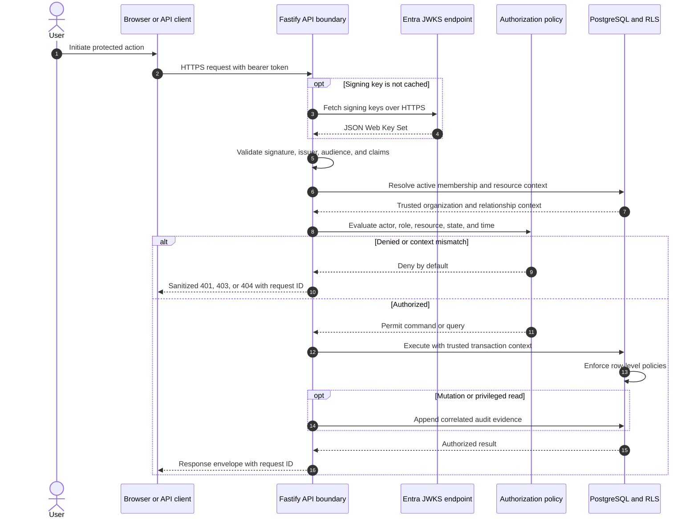
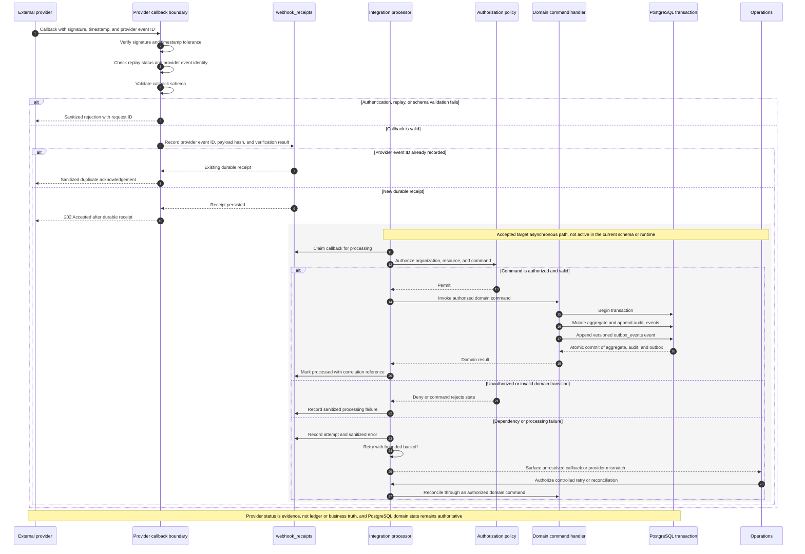

# KEYFORTA API, Event, and Error Contract

**Status:** Normative backend interface contract v1.0

## 1. Transport and security

- Base URL: `https://api.keyforta.com/api/v1`.
- Local base URL: `http://localhost:3000/api/v1`.
- Transport: HTTPS in every non-local environment; JSON request and response bodies; UTF-8.
- `docs/openapi.yaml` is the named HTTP wire authority. This document describes
  the domain API/event contract and must be synchronized with OpenAPI for
  enabled routes; unresolved route inventory questions remain in the engineering
  requirements-gap report.
- Public routes are explicitly marked `PUBLIC` below and return only published, public-safe fields.
- Protected routes require a bearer token issued for KEYFORTA's configured identity provider.
- Authorization is deny-by-default and is evaluated server-side for organization, role, relationship, resource, action, state, and effective time.
- Every response includes `X-Request-Id`; the same ID appears in `meta.requestId` or `traceId`.
- Never accept `organizationId` from the client as an unrestricted access selector.

## 2. Headers

| Header | Required | Use |
| --- | --- | --- |
| `Authorization` | Protected routes | `Bearer <access-token>` |
| `Content-Type` | Requests with a body | `application/json` |
| `If-Match` | Updates and commands with concurrency risk | Aggregate version, e.g. `7` |
| `Idempotency-Key` | Retryable commands and financial/external effects | Client-generated key, 16–128 characters |
| `X-Request-Id` | Optional request correlation | Server generates one when omitted |
| `Accept-Language` | Optional | `fr-CD`, `en-US`, or supported locale |
| `X-Webhook-Signature` | Provider callbacks | Provider-specific signed payload |
| `X-Webhook-Timestamp` | Provider callbacks | Replay-protection timestamp |

### Protected request flow



The external identity establishes a subject only. Organization and resource
access come from protected server state and are enforced again by PostgreSQL
row-level policies.

## 3. Response envelopes

### Single resource

```json
{
  "data": {
    "id": "lease_01J...",
    "version": 3
  },
  "meta": { "requestId": "req_01J..." },
  "auditEventId": "aud_01J..."
}
```

### Collection

```json
{
  "items": [],
  "meta": { "requestId": "req_01J..." },
  "nextCursor": null,
  "total": 0
}
```

Collection queries accept `cursor`, `limit` (default 25, maximum 100), stable `sort`, and context-specific filters. When `total` is present, it is computed after authorization and must not be used to bypass authorization.

## 4. Resource schemas

All organization-owned resources contain `id`, `organizationId`, `createdAt`, `updatedAt`, `createdBy`, `updatedBy`, and integer `version`. Platform-scoped resources explicitly identify their scope instead of pretending to belong to a landlord organization.

### Money

```json
{ "amountMinor": 40000, "currency": "USD" }
```

`amountMinor` is an integer. USD 400.00 is `40000`; CDF values are retained in CDF and are not silently converted. FX requires a separately approved policy.

### Property and unit

```json
{
  "id": "property_01J...",
  "organizationId": "org_01J...",
  "name": "Gombe Residence",
  "propertyType": "residential",
  "address": { "line1": "...", "city": "Kinshasa", "countryCode": "CD" },
  "timeZone": "Africa/Kinshasa",
  "verificationStatus": "pending",
  "publicationStatus": "draft",
  "version": 1
}
```

```json
{
  "id": "unit_01J...",
  "propertyId": "property_01J...",
  "label": "A-101",
  "unitType": "apartment",
  "bedrooms": 2,
  "bathrooms": 1,
  "availabilityStatus": "available",
  "pricing": { "amountMinor": 40000, "currency": "USD", "effectiveFrom": "2026-10-01" },
  "version": 1
}
```

### Application

```json
{
  "id": "application_01J...",
  "unitId": "unit_01J...",
  "applicantPartyId": "party_01J...",
  "state": "submitted_for_manager_review",
  "currentVersion": 2,
  "requestedMoveIn": "2026-10-01",
  "consent": { "accepted": true, "acceptedAt": "2026-09-14T00:00:00Z", "policyVersion": "privacy-1" },
  "decision": null,
  "version": 2
}
```

### Lease

```json
{
  "id": "lease_01J...",
  "unitId": "unit_01J...",
  "tenantPartyIds": ["party_01J..."],
  "state": "active",
  "term": { "startDate": "2026-10-01", "endDate": "2027-09-30" },
  "rent": { "amountMinor": 40000, "currency": "USD" },
  "deposit": { "amountMinor": 160000, "currency": "USD" },
  "advanceRent": { "amountMinor": 0, "currency": "USD" },
  "dueDay": 5,
  "gracePeriodDays": 0,
  "lateFeePolicyVersion": "pending-policy",
  "signedTermsVersion": 1,
  "version": 4
}
```

### Maintenance request

```json
{
  "id": "maintenance_01J...",
  "propertyId": "property_01J...",
  "unitId": "unit_01J...",
  "requesterPartyId": "party_01J...",
  "state": "assigned",
  "priority": "high",
  "category": "plumbing",
  "assignment": { "operatorPartyId": "party_01J...", "accessWindowId": "access_01J..." },
  "version": 5
}
```

## 5. Endpoint contract

The following endpoint inventory is normative for MVP. A route may be renamed only through an ADR and synchronized OpenAPI change.

| Method and route | Access | Request contract | Success |
| --- | --- | --- | --- |
| `GET /me` | Protected | No body | `200 ProfileSummary` |
| `POST /landlord-onboarding-applications` | Protected | applicant and proposed organization name | `201 LandlordOnboardingApplication` |
| `POST /onboarding/maintenance-operators` | Protected | profile, service categories, coverage, evidence references | `201 OperatorProfile` |
| `GET /organizations` | Protected | cursor/filter | `200 Organization[]` |
| `POST /manager-invitations` | Protected | email, scope, expiresAt | `201 Invitation` |
| `POST /manager-invitations/{id}/accept` | Protected | optional profile completion | `200 Membership` |
| `GET /properties` | Public | city, type, cursor, limit | `200 PublicProperty[]` |
| `GET /properties/{id}` | Public | none | `200 PublicPropertyDetail` |
| `GET /public/units/{id}` | Public | none | `200 PublicUnitDetail` |
| `GET /properties` | Protected | authorized filters, cursor, limit | `200 Property[]` |
| `POST /properties` | Protected | property input | `201 Property` |
| `GET /properties/{id}` | Protected | none | `200 Property` |
| `PATCH /properties/{id}` | Protected | allowed draft fields + `If-Match` | `200 Property` |
| `POST /properties/{id}/submit-verification` | Protected | evidence references | `200 Property` |
| `POST /properties/{id}/publish` | Protected | reason if required | `200 Property` |
| `POST /properties/{id}/archive` | Protected | reason | `200 Property` |
| `POST /public-listings/{id}/publish` | Protected + organization context | none | `200 ListingPublication` |
| `POST /public-listings/{id}/withdraw` | Protected + organization context | none | `200 ListingPublication` |
| `GET /properties/{id}/units` | Protected | cursor, limit | `200 Unit[]` |
| `POST /properties/{id}/units` | Protected | unit input | `201 Unit` |
| `PATCH /units/{id}` | Protected | allowed draft fields + `If-Match` | `200 Unit` |
| `POST /units/{id}/publish` | Protected | none | `200 Unit` |
| `POST /units/{id}/pause` | Protected | reason | `200 Unit` |
| `POST /units/{id}/pricing` | Protected | money + effectiveFrom | `201 PricingVersion` |
| `POST /viewing-requests` | Public/limited | requester, requested window | `202 Accepted` |
| `POST /units/{id}/rental-applications` | Protected | application draft | `201 Application` |
| `GET /rental-applications` | Protected | authorized filters | `200 Application[]` |
| `GET /rental-applications/{id}` | Protected | none | `200 Application` |
| `PATCH /rental-applications/{id}` | Protected | draft fields + `If-Match` | `200 Application` |
| `POST /rental-applications/{id}/submit` | Protected | consent, version | `200 Application` |
| `POST /rental-applications/{id}/request-changes` | Protected | reason, requestedChanges | `200 Application` |
| `POST /rental-applications/{id}/resubmit` | Protected | version | `200 Application` |
| `POST /rental-applications/{id}/approve` | Protected | reason + `If-Match` | `200 Application` |
| `POST /rental-applications/{id}/reject` | Protected | reason + `If-Match` | `200 Application` |
| `POST /rental-applications/{id}/withdraw` | Protected | reason | `200 Application` |
| `GET /leases` | Protected | authorized filters | `200 Lease[]` |
| `POST /leases` | Protected | lease draft input | `201 Lease` |
| `GET /leases/{id}` | Protected | none | `200 Lease` |
| `PATCH /leases/{id}` | Protected | draft terms + `If-Match` | `200 Lease` |
| `POST /leases/{id}/offer` | Protected | terms version | `200 Lease` |
| `POST /leases/{id}/accept` | Protected | acknowledgement + `If-Match` | `200 Lease` |
| `POST /leases/{id}/sign` | Protected | signature/acknowledgement reference | `200 Lease` |
| `POST /leases/{id}/activate` | Protected | effective date + `If-Match` | `200 Lease` |
| `POST /leases/{id}/renew` | Protected | new term/version | `200 Lease` |
| `POST /leases/{id}/terminate` | Protected | effective date, reason | `200 Lease` |
| `POST /leases/{id}/move-in` | Protected | inspection/document references | `200 OccupancyPeriod` |
| `POST /leases/{id}/move-out` | Protected | date, inspection/document references | `200 OccupancyPeriod` |
| `GET /leases/{id}/charges` | Protected | cursor, period | `200 Charge[]` |
| `POST /leases/{id}/charges/generate` | Protected | billing period + idempotency key | `201 Charge[]` |
| `GET /payments` | Protected | authorized filters | `200 Payment[]` |
| `POST /payment-intents` | Protected | lease, amount, currency, method | `201 PaymentIntent` |
| `POST /payments/{id}/record` | Protected | provider/cash/bank reference | `200 Payment` |
| `POST /payments/{id}/allocate` | Protected | charge allocations | `200 Payment` |
| `POST /payments/{id}/refund` | Protected | amount, reason | `200 Payment` |
| `POST /payments/{id}/reverse` | Protected | reason | `200 Payment` |
| `POST /payments/{id}/reconcile` | Protected | provider statement reference | `200 Payment` |
| `POST /webhooks/{provider}/payments` | Provider-signed | signed provider event | `202 Accepted` |
| `GET /service-offers` | Protected/public-safe | category, coverage, availability | `200 ServiceOffer[]` |
| `POST /service-offers` | Protected | offer input | `201 ServiceOffer` |
| `POST /service-offers/{id}/publish` | Protected | none | `200 ServiceOffer` |
| `GET /maintenance-requests` | Protected | authorized filters | `200 MaintenanceRequest[]` |
| `POST /maintenance-requests` | Protected | request input | `201 MaintenanceRequest` |
| `GET /maintenance-requests/{id}` | Protected | none | `200 MaintenanceRequest` |
| `POST /maintenance-requests/{id}/triage` | Protected | priority/category | `200 MaintenanceRequest` |
| `POST /maintenance-requests/{id}/assign` | Protected | operator, access window | `200 MaintenanceRequest` |
| `POST /maintenance-requests/{id}/accept` | Protected | operator acknowledgement | `200 MaintenanceRequest` |
| `POST /maintenance-requests/{id}/schedule` | Protected | time window | `200 MaintenanceRequest` |
| `POST /maintenance-requests/{id}/start` | Protected | arrival reference | `200 MaintenanceRequest` |
| `POST /maintenance-requests/{id}/complete` | Protected | report/evidence references | `200 MaintenanceRequest` |
| `POST /maintenance-requests/{id}/confirm` | Protected | tenant/manager confirmation | `200 MaintenanceRequest` |
| `POST /maintenance-requests/{id}/reopen` | Protected | reason | `200 MaintenanceRequest` |
| `POST /maintenance-requests/{id}/cancel` | Protected | reason | `200 MaintenanceRequest` |
| `POST /maintenance-requests/{id}/quotes` | Protected | components, validity | `201 Quote` |
| `POST /maintenance-quotes/{id}/approve` | Protected | reason + `If-Match` | `200 Quote` |
| `POST /maintenance-quotes/{id}/reject` | Protected | reason + `If-Match` | `200 Quote` |
| `POST /maintenance-requests/{id}/reports` | Protected | work performed, cost, timestamps | `201 Report` |
| `POST /maintenance-reports/{id}/evidence` | Protected | private upload reference | `201 Evidence` |
| `GET /documents` | Protected | related record, type, cursor | `200 Document[]` |
| `POST /documents` | Protected | metadata + private storage reference | `201 Document` |
| `POST /documents/{id}/versions` | Protected | hash, storage reference, media type | `201 DocumentVersion` |
| `POST /documents/{id}/review` | Protected | decision, reason | `200 Document` |
| `POST /documents/{id}/access` | Protected | grantee, scope, expiry | `201 AccessGrant` |
| `POST /documents/{id}/revoke-access` | Protected | grant, reason | `200 Document` |
| `GET /conversations` | Protected | related record, cursor | `200 Conversation[]` |
| `POST /conversations` | Protected | participant and subject IDs | `201 Conversation` |
| `POST /conversations/{id}/messages` | Protected | body, attachment IDs | `201 Message` |
| `POST /messages/{id}/read` | Protected | none | `200 Message` |
| `GET /notifications` | Protected | unread/type/cursor | `200 Notification[]` |
| `POST /notifications/{id}/read` | Protected | none | `200 Notification` |
| `GET /landlord/dashboard` | Protected | period and authorized scope | `200 DashboardReadModel` |
| `GET /audit-events` | Elevated | target, actor, period, cursor | `200 AuditEvent[]` |
| `GET /support-access-grants` | Elevated | status, target, cursor | `200 SupportAccessGrant[]` |

## 6. Event contract

Every event uses this envelope:

```json
{
  "eventId": "evt_01J...",
  "eventType": "LeaseActivated",
  "schemaVersion": 1,
  "occurredAt": "2026-09-14T00:00:00Z",
  "organizationId": "org_01J...",
  "aggregateType": "Lease",
  "aggregateId": "lease_01J...",
  "actor": { "partyId": "party_01J...", "type": "user" },
  "correlationId": "cor_01J...",
  "causationId": "cmd_01J...",
  "payload": {}
}
```

Minimum required payload fields:

| Event | Payload |
| --- | --- |
| `PropertyPublished` | `propertyId`, `publicationVersion`, `publishedAt` |
| `UnitAvailabilityChanged` | `unitId`, `previousStatus`, `currentStatus`, `effectiveAt`, `reason` |
| `RentalApplicationSubmitted` | `applicationId`, `unitId`, `applicantPartyId`, `applicationVersion`, `submittedAt` |
| `ApplicationApproved` | `applicationId`, `unitId`, `decisionVersion`, `reason`, `decidedBy` |
| `LeaseSigned` | `leaseId`, `signedTermsVersion`, `signerPartyIds`, `signedAt` |
| `LeaseActivated` | `leaseId`, `unitId`, `termStart`, `termEnd`, `termsVersion` |
| `ChargeGenerated` | `chargeId`, `leaseId`, `billingPeriod`, `amountMinor`, `currency`, `dueDate` |
| `LedgerEntryPosted` | `ledgerEntryId`, `accountIds`, `amountMinor`, `currency`, `sourceType`, `sourceId` |
| `PaymentRecorded` | `paymentId`, `leaseId`, `amountMinor`, `currency`, `method`, `providerReference`, `receivedAt` |
| `PaymentAllocated` | `paymentId`, `allocations`, `unallocatedAmountMinor` |
| `PaymentReconciled` | `paymentId`, `providerReference`, `reconciliationBatchId`, `reconciledAt` |
| `OperatorAssigned` | `maintenanceRequestId`, `operatorPartyId`, `assignmentId`, `accessWindowId` |
| `AccessWindowOpened` | `accessWindowId`, `maintenanceRequestId`, `operatorPartyId`, `startsAt`, `endsAt` |
| `WorkCompleted` | `maintenanceRequestId`, `reportId`, `completedAt`, `evidenceIds` |
| `DocumentVersionUploaded` | `documentId`, `documentVersionId`, `contentHash`, `storageKey`, `mediaType` |
| `MessageSent` | `conversationId`, `messageId`, `senderPartyId`, `attachmentIds`, `sentAt` |

Events are backward-compatible within a major schema version. Additive fields are permitted; semantic changes require a new schema version and migration strategy. Consumers must deduplicate by `eventId`.

## 7. Error contract

```json
{
  "type": "https://api.keyforta.com/problems/state-conflict",
  "title": "State conflict",
  "status": 409,
  "code": "STATE_CONFLICT",
  "detail": "The requested command is not valid for the current state.",
  "traceId": "req_01J...",
  "details": { "currentState": "completed", "allowedCommands": ["confirm", "reopen"] }
}
```

| Code | HTTP | Required use |
| --- | ---: | --- |
| `VALIDATION_ERROR` | 400 | Schema or domain input invalid |
| `UNAUTHENTICATED` | 401 | Missing/invalid/expired token |
| `FORBIDDEN` | 403 | Actor lacks permission or scope |
| `NOT_FOUND` | 404 | Missing or intentionally hidden resource |
| `STATE_CONFLICT` | 409 | Invalid lifecycle command |
| `VERSION_CONFLICT` | 409 | Stale `If-Match`/version |
| `IDEMPOTENCY_REPLAY` | 409/200 | Same completed command key; return original result according to endpoint policy |
| `IDEMPOTENCY_KEY_REUSED` | 409 | Same key used with a different request body |
| `PAYMENT_PROVIDER_ERROR` | 502/503 | Provider failure; no unverified financial effect |
| `DOCUMENT_ACCESS_DENIED` | 403 | Missing, revoked, or expired grant |
| `RATE_LIMITED` | 429 | Caller exceeded limit; include `Retry-After` |
| `DEPENDENCY_UNAVAILABLE` | 503 | Required dependency unavailable |

Errors must not include stack traces, secrets, access tokens, raw provider payloads, or private records outside the actor's scope.

## 8. Webhooks and asynchronous processing

Webhook handlers verify signature, timestamp tolerance, provider event ID, and replay status before enqueueing work. They return `202 Accepted` after durable receipt, not after all business processing completes.

The outbox record and aggregate mutation commit together. Consumers use an inbox record keyed by consumer and event ID. Failed messages retry with backoff, then move to a visible dead-letter state. Reconciliation jobs must surface unresolved payments and provider mismatches.

## Appendix A. Supporting integration diagrams and evidence

This supporting appendix preserves the former integration boundaries and
evidence. It does not replace the normative API and event contract. Provider
status remains evidence rather than business truth, and every provider boundary
retains its required fallback.

### Integration Boundaries

Integrations are adapters around KEYFORTA’s authoritative state.

#### Initial adapter categories

| Category  | Inbound responsibility                             | Outbound responsibility                             |
| --------- | -------------------------------------------------- | --------------------------------------------------- |
| Identity  | Verified external subject and authentication event | Sign-in and account-recovery journey                |
| Payment   | Authenticated, replayable transaction status event | Payment request or instructions                     |
| Messaging | Delivery status and authorized user reply          | Notification rendered from an approved template     |
| Document  | Signature, scan, or extraction result              | Versioned document prepared for an authorized user  |
| AI model  | Structured candidate output and usage metadata     | Minimum necessary prompt, evidence, and tool result |

#### Adapter rules

- The domain never imports a provider SDK.
- Inbound messages are authenticated, schema-validated, idempotent, and stored
  with provider and correlation references.
- Retries use bounded backoff and a dead-letter or exception queue.
- Provider success does not imply domain success; reconciliation links both.
- Personal data sent to a provider is minimized and governed by documented
  purpose, consent or other authority, retention, region, and deletion rules.
- Every provider requires a failure mode, fallback path, and replacement plan.

#### Provider callback sequence


