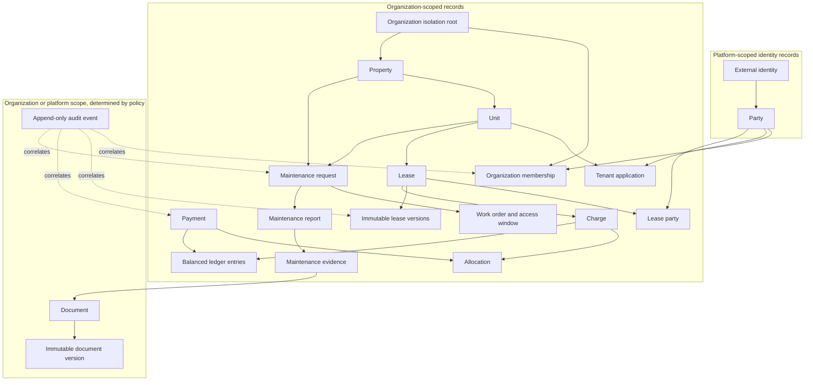
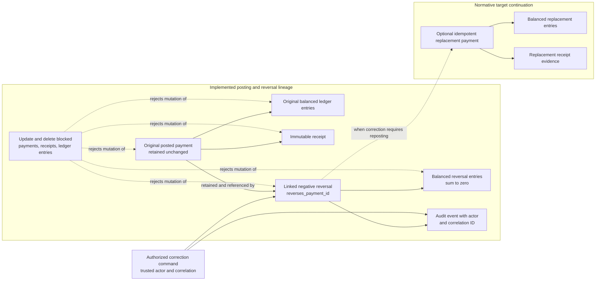

# KEYFORTA Production Data Model

**Status:** Normative production logical/physical data design v2.0
**Database assumption:** PostgreSQL 16+
**Primary scope:** Kinshasa-first rental management with USD/CDF multi-currency support

This is the normative target relational model for the backend implementation. The reviewed SQL under [`docs/database/`](../database/) is a reference representation of that target, not the deployed migration lineage. Per ADR-013, [`infra/postgres/migrations`](../../infra/postgres/migrations/) is the canonical executable history applied by the checksummed migration runner.

The target SQL is authoritative for intended PostgreSQL column types, enum names, constraints, indexes, and policies. Operational differences must be explicit, additive migration steps toward this design; the abbreviated table descriptions below explain ownership and intent and do not replace either SQL artifact set.

## 0. Target reference artifacts

| Artifact | Purpose |
| --- | --- |
| [`V001__keyforta_schema.sql`](../database/V001__keyforta_schema.sql) | Extensions, enumerations, tables, primary/foreign keys, checks, unique/exclusion constraints, and indexes |
| [`V002__keyforta_security_and_rls.sql`](../database/V002__keyforta_security_and_rls.sql) | Runtime roles, trusted session helpers, row-level-security policies, and immutable/audit protections |
| [`V003__keyforta_reference_seed.sql`](../database/V003__keyforta_reference_seed.sql) | Idempotent reference data for currencies, locales, roles, policy keys, maintenance categories, and event schemas |
| [`backup-retention-runbook.md`](../database/backup-retention-runbook.md) | Azure PostgreSQL/Blob backup, retention, restore testing, deletion, and legal-hold procedures |

The intended reference composition order is `V001 → V002 → V003`; its current
composition and jurisdiction defaults have unresolved gaps and it is not a
deployment input. Deployment applies only ordered migrations from
`infra/postgres/migrations` through the migration role, records checksums in the
deployment ledger, and tests clean installation and forward upgrade.

## 1. Conventions

- Primary keys use opaque UUID or ULID values represented as `uuid` or `text` consistently within the implementation.
- All timestamps are `timestamptz` and stored in UTC.
- Business dates use `date` and are interpreted using the relevant property's IANA time zone.
- Money uses `amount_minor bigint` and `currency char(3)`; no floating-point columns.
- Enumerated business values use PostgreSQL enums or checked text values. New values require an additive migration.
- JSONB is permitted for versioned answers, provider payloads, and extensible metadata; authoritative fields remain typed columns.
- Organization-owned rows include `organization_id` and are protected by application authorization plus row-level security where enabled.
- Audit, ledger, outbox, inbox, and idempotency rows are append-only or lifecycle-controlled.

## 1.1 Production persistence boundary

PostgreSQL is the authoritative system of record for all transactional Keyforta data. This model deliberately does not require a NoSQL database.

| Data category | System | What PostgreSQL stores |
| --- | --- | --- |
| Business and transactional state | Managed PostgreSQL | Organizations, parties, properties, units, applications, leases, occupancy, charges, ledger entries, payments, maintenance state, document metadata, access grants, audit records, and workflow state |
| File and evidence bytes | Private Azure Blob Storage or equivalent | Storage key, version, content hash, media type, size, retention, review state, and relationship to the domain record; never public storage credentials or unrestricted URLs |
| Asynchronous work | PostgreSQL outbox/inbox plus background worker | Event envelope, delivery state, attempts, deduplication, errors, and replay metadata |
| Search and reporting | Rebuildable PostgreSQL projections initially | Projection state and generated-at metadata; projections cannot authorize access or replace source tables |
| Cache and rate limits | Optional managed cache | No authoritative business state; cache loss must be safe |

MongoDB, Cosmos DB, DynamoDB, Cassandra, or another NoSQL store must not be introduced for the MVP without an accepted ADR and a measured workload requiring it. If a future specialized store is approved, it must have an explicit owner, consistency model, reconciliation process, security boundary, backup/recovery plan, cost limit, and migration/retirement plan. It must not become authoritative for financial, lease, authorization, audit, or lifecycle state.

## 1.2 Database safety requirements

- Use managed PostgreSQL with encryption, automated backups, point-in-time recovery, monitored storage growth, and tested restore procedures.
- Use separate development, test, staging, and production environments and credentials.
- Apply least-privilege database roles: runtime read/write, worker, migration, read-only reporting, and break-glass operations.
- Keep schema changes in reviewed forward migrations. Prefer expand/contract releases for changes requiring more than one application version.
- Do not cascade-delete leases, financial records, audit events, document history, provider receipts, or legal-hold data.
- Record migration verification queries, lock/latency assessment, backfill strategy, rollback impact, and operational owner.

## 2. Scope ownership

| Scope | Records | Isolation rule |
| --- | --- | --- |
| Platform | external identities, parties, independent operator profiles, service offers, provider references | Accessible only through platform policy and relationship checks |
| Organization | properties, units, leases, applications, charges, payments, maintenance, documents, communications | `organization_id` required and checked against active membership |
| Assignment | maintenance access window, operator job data | Organization/job scope plus active time window |
| Projection | dashboards and reports | Rebuildable, query-only, never used as authorization source |

## 3. Common columns

Organization-owned tables:

```text
id uuid primary key
organization_id uuid not null references organizations(id)
created_at timestamptz not null
updated_at timestamptz not null
created_by uuid not null references parties(id)
updated_by uuid not null references parties(id)
version integer not null default 1 check (version > 0)
```

Platform-scoped tables use `created_at`, `updated_at`, and actor columns but omit `organization_id` only where Section 2 explicitly permits it.

## 4. Identity and organization tables

### `organizations`

| Column | Type | Rules |
| --- | --- | --- |
| `id` | uuid | PK |
| `legal_name` | citext | Required |
| `display_name` | citext | Required |
| `organization_type` | text | `landlord`, `manager`, `operator`, `platform` |
| `status` | text | `active`, `suspended`, `closed` |
| `default_currency` | char(3) | `USD` or `CDF` initially |
| `time_zone` | text | Valid IANA zone |
| `jurisdiction_code` | text | Nullable until explicitly selected; policy-driven |
| `policy_version` | text | Version of approved business/legal policy |
| common audit columns | — | As applicable |

Constraints/indexes: unique normalized legal identity where policy allows; index `status`; check valid currency and time zone.

### `external_identities`

`id uuid PK`, `issuer text not null`, `subject text not null`, `party_id uuid FK parties`, `email citext`, `status text`, `last_authenticated_at timestamptz`, timestamps.

Constraints/indexes: unique `(issuer, subject)`; index `party_id`; never store access tokens.

### `parties`

`id uuid PK`, `party_type text not null` (`person`, `legal_entity`), `legal_name text`, `preferred_name text`, `status text`, timestamps.

Constraints/indexes: status check; search index on normalized names; personal data access is policy-controlled.

### `profiles`

`id uuid PK`, `party_id uuid FK`, `profile_type text`, `display_name text`, `email citext`, `phone text`, `locale text`, `verification_status text`, `service_area jsonb`, `skills jsonb`, `availability jsonb`, audit columns.

Constraints/indexes: unique `(party_id, profile_type)`; email uniqueness only when product policy permits; index verification status.

### `memberships`

`id uuid PK`, `organization_id uuid FK`, `party_id uuid FK`, `roles text[]`, `scope jsonb`, `status text`, `effective_from timestamptz`, `effective_to timestamptz`, `invitation_id uuid`, audit columns.

Constraints/indexes: effective range valid; exclusion constraint prevents prohibited overlapping active memberships; indexes `(organization_id, status)`, `(party_id, status)`.

### `invitations`

`id uuid PK`, `organization_id uuid FK`, `email citext`, `proposed_roles text[]`, `scope jsonb`, `token_digest text`, `status text`, `expires_at timestamptz`, `accepted_at timestamptz`, `invited_by uuid FK parties`, timestamps.

Constraints/indexes: token digest unique; accepted/revoked invitations cannot be reused; index `(organization_id, status, expires_at)`; never store raw invitation token.

Operational migration `0015_party_and_jurisdiction_policy_foundation.sql`
introduces parties, identity profiles, effective membership dates, and nullable
organization/property jurisdiction fields additively. Existing `users` and
single-role membership columns remain compatibility fields while later slices
migrate callers toward the target model. The backfill maps each existing user
to a deterministic party while leaving `party_type` unset; it preserves legacy
display names verbatim and does not infer legal identity, consent, verification,
expanded roles, or jurisdiction. Memberships receive independent identifiers
and non-overlapping active intervals so role changes retain prior rows.

Operational migration `0016_bounded_public_listing_pagination.sql` adds indexed,
database-side public listing filters, stable sort-specific keyset pagination,
exact totals, and explicit invalid-cursor signaling. The API receives at most
the requested page plus one look-ahead row and never exposes organization or
unit identifiers through this projection.

Operational migration `0017_public_listing_publication_control.sql` adds
fail-closed property and unit lifecycle columns and one shared eligibility
predicate for public list, detail, and inquiry functions. Each property contains
units and has at most one active assigned listing manager. The assignee may be
the landlord or another eligible same-organization manager, but ownership alone
grants no unit-listing authority. Publication and withdrawal require that exact
active assignment. Every assignment change and accepted listing transition
appends immutable organization, actor, assignee or resource, correlation,
action, and timestamp evidence. Runtime roles retain no direct listing-status
or history mutation permission. Rollback is operational: revoke execute on the
transition function to stop new changes, preserve existing evidence, and ship
corrections as a later forward migration rather than dropping lifecycle data or
history.

### `jurisdiction_policy_versions`, approval evidence, and activations

Jurisdiction policy versions contain a capability key, jurisdiction code,
monotonic version, typed JSON rule payload, counsel-approval requirement,
creator, and creation time. Approval evidence records the policy-owner or
qualified-counsel role, approver, source reference, optional evidence hash, and
approval time. Revocations and effective-dated activations are append-only.

The active-policy resolver returns no policy when an activation is absent or
outside its effective interval, required evidence is missing or mismatched, or
referenced evidence has been revoked. Operational migrations never seed a
jurisdiction, legal conclusion, consent, or approval evidence.

## 5. Relationships and inventory

### `relationships`

`id uuid PK`, `organization_id uuid`, `subject_type text`, `subject_id uuid`, `from_party_id uuid`, `to_party_id uuid`, `relationship_type text`, `scope jsonb`, `effective_from timestamptz`, `effective_to timestamptz`, `status text`, `source text`, audit columns.

Constraints/indexes: valid effective range; indexes on subject and parties; exclusion constraints for relationships that cannot overlap; cross-organization party references rejected by service policy.

### `properties`

`id uuid PK`, `organization_id uuid FK`, `name text`, `property_type text`, `address jsonb`, `time_zone text`, `verification_status text`, `publication_status text`, `archived_at timestamptz`, audit columns.

Constraints/indexes: valid IANA time zone; no publication unless required ownership/management relationship exists; indexes `(organization_id, publication_status)`, city/search fields.

### `units`

`id uuid PK`, `organization_id uuid FK`, `property_id uuid FK`, `label text`, `unit_type text`, `bedrooms smallint`, `bathrooms numeric(4,1)`, `area numeric(12,2)`, `availability_status text`, `publication_status text`, common audit columns.

Constraints/indexes: unique `(property_id, lower(label))`; non-negative physical values; property and organization must agree; indexes `(property_id, availability_status)`, `(organization_id, publication_status)`.

### `unit_pricing_versions`

`id uuid PK`, `organization_id uuid FK`, `unit_id uuid FK`, `amount_minor bigint`, `currency char(3)`, `effective_from date`, `effective_to date`, `discount_policy jsonb`, `created_at`, `created_by`.

Constraints/indexes: amount non-negative; valid currency/range; exclusion constraint prevents overlapping effective pricing for one unit; index `(unit_id, effective_from desc)`.

## 6. Leasing and occupancy

### `viewing_requests`

`id uuid PK`, `organization_id uuid`, `unit_id uuid FK`, `requester_party_id uuid FK`, `requested_window tstzrange`, `scheduled_window tstzrange`, `status text`, `notes text`, audit columns.

Constraints/indexes: public request may be anonymous only through a controlled lead record; unit must be published at request time; index `(unit_id, status)`.

### `rental_applications`

`id uuid PK`, `organization_id uuid FK`, `unit_id uuid FK`, `applicant_party_id uuid FK`, `state text`, `current_version integer`, `decision_reason text`, `decided_by uuid`, `decided_at timestamptz`, common audit columns.

Constraints/indexes: one application has one unit; state transition service required; indexes `(organization_id, state)`, `(unit_id, state)`, `(applicant_party_id, created_at desc)`.

### `rental_application_versions`

`id uuid PK`, `organization_id uuid FK`, `application_id uuid FK`, `version_number integer`, `answers jsonb`, `occupants jsonb`, `income jsonb`, `references jsonb`, `requested_move_in date`, `consent jsonb`, `document_ids uuid[]`, `submitted_at timestamptz`, `created_at`, `created_by`.

Constraints/indexes: unique `(application_id, version_number)`; submitted versions immutable; indexes by application and submission time.

### `leases`

`id uuid PK`, `organization_id uuid FK`, `unit_id uuid FK`, `state text`, `term_start date`, `term_end date`, `rent_amount_minor bigint`, `rent_currency char(3)`, `deposit_amount_minor bigint`, `advance_rent_amount_minor bigint`, `due_day smallint`, `grace_period_days smallint`, `policy_version text`, `signed_terms_version integer`, common audit columns.

Constraints/indexes: valid term/date and money values; due day 1–31; exclusion constraint prevents overlapping active leases for one unit; indexes `(organization_id, state)`, `(unit_id, state)`.

### `lease_parties`

`lease_id uuid FK`, `party_id uuid FK`, `role text`, `signed_at timestamptz`, `acknowledged_at timestamptz`; composite PK `(lease_id, party_id, role)`.

Constraints: required party roles enforced by activation policy; parties must be authorized for organization.

### `lease_term_versions`

`id uuid PK`, `organization_id uuid FK`, `lease_id uuid FK`, `version_number integer`, `terms jsonb`, `status text`, `content_hash text`, `offered_at timestamptz`, `signed_at timestamptz`, `created_at`, `created_by`.

Constraints/indexes: unique `(lease_id, version_number)`; signed versions immutable; content hash required for signed status.

### `occupancy_periods`

`id uuid PK`, `organization_id uuid FK`, `lease_id uuid FK`, `unit_id uuid FK`, `start_date date`, `end_date date`, `state text`, `move_in_inspection_id uuid`, `move_out_inspection_id uuid`, common audit columns.

Constraints: valid date range; exclusion constraint prevents overlapping active periods per unit; lease/unit must agree.

## 7. Billing, ledger, and payments

### `charge_schedules`

`id uuid PK`, `organization_id uuid FK`, `lease_id uuid FK`, `frequency text`, `due_day smallint`, `effective_from date`, `effective_to date`, `rules jsonb`, `state text`, common audit columns.

Constraints: valid date range and due day; lease must be active/eligible; index `(lease_id, state)`.

### `charges`

`id uuid PK`, `organization_id uuid FK`, `lease_id uuid FK`, `schedule_id uuid`, `charge_type text`, `billing_period daterange`, `amount_minor bigint`, `currency char(3)`, `due_date date`, `state text`, `posted_at timestamptz`, common audit columns.

Constraints/indexes: amount non-negative; unique `(schedule_id, lower(billing_period), charge_type)`; indexes `(organization_id, state, due_date)`, `(lease_id, due_date)`.

### `ledger_accounts`

`id uuid PK`, `organization_id uuid FK`, `account_type text`, `party_id uuid`, `lease_id uuid`, `currency char(3)`, `status text`, common audit columns.

Constraints: account ownership scope explicit; unique account purpose per lease/currency; index organization and party.

### `ledger_entries`

`id uuid PK`, `organization_id uuid FK`, `entry_group_id uuid`, `account_id uuid FK`, `direction text`, `amount_minor bigint`, `currency char(3)`, `source_type text`, `source_id uuid`, `reversal_of_id uuid`, `posted_at timestamptz`, `period date`, `created_at`, `created_by`.

Constraints: amount positive; posted rows immutable; reversal references an existing entry; entry group balances according to chosen accounting rule; indexes source, account/period, and entry group.

### `payment_intents`

`id uuid PK`, `organization_id uuid FK`, `lease_id uuid`, `payer_party_id uuid`, `amount_minor bigint`, `currency char(3)`, `method text`, `provider text`, `provider_intent_id text`, `state text`, `expires_at timestamptz`, common audit columns.

Constraints/indexes: unique `(provider, provider_intent_id)` when present; positive amount; index lease and state.

### `payments`

`id uuid PK`, `organization_id uuid FK`, `lease_id uuid`, `payer_party_id uuid`, `amount_minor bigint`, `currency char(3)`, `method text`, `provider text`, `provider_reference text`, `state text`, `received_at timestamptz`, `reconciled_at timestamptz`, common audit columns.

Constraints/indexes: unique provider reference within provider namespace; positive amount; index `(organization_id, state, received_at)`, lease, provider reference.

### `payment_allocations`

`id uuid PK`, `organization_id uuid FK`, `payment_id uuid FK`, `charge_id uuid FK`, `amount_minor bigint`, `currency char(3)`, `created_at`, `created_by`.

Constraints: positive amount; same currency; aggregate allocation cannot exceed payment or charge outstanding balance; unique payment/charge allocation where policy requires.

### `reconciliation_batches`

`id uuid PK`, `organization_id uuid FK`, `provider text`, `statement_reference text`, `period daterange`, `state text`, `opened_at timestamptz`, `closed_at timestamptz`, `exception_count integer`, audit columns.

Constraints/indexes: unique provider statement reference; period valid; index organization/state.

## 8. Maintenance and inspection

### `service_offers`

`id uuid PK`, `operator_party_id uuid FK`, `categories text[]`, `coverage jsonb`, `rates jsonb`, `availability jsonb`, `verification_status text`, `publication_status text`, `version integer`, timestamps.

Platform-scoped for discovery. Publication requires operator verification. Index categories, coverage, and publication status.

### `maintenance_requests`

`id uuid PK`, `organization_id uuid FK`, `property_id uuid FK`, `unit_id uuid`, `requester_party_id uuid FK`, `category text`, `priority text`, `title text`, `description text`, `state text`, `completed_at timestamptz`, common audit columns.

Constraints/indexes: property/unit organization agreement; valid state transitions; index organization/state/priority, unit, requester.

### `maintenance_assignments`

`id uuid PK`, `organization_id uuid FK`, `maintenance_request_id uuid FK`, `operator_party_id uuid FK`, `state text`, `assigned_at timestamptz`, `accepted_at timestamptz`, `ended_at timestamptz`, common audit columns.

Constraints: only eligible operator; one active assignment per request unless explicitly modeled; index operator/state.

### `maintenance_access_windows`

`id uuid PK`, `organization_id uuid FK`, `maintenance_request_id uuid FK`, `operator_party_id uuid FK`, `starts_at timestamptz`, `ends_at timestamptz`, `state text`, `scope jsonb`, common audit columns.

Constraints: `ends_at > starts_at`; assignment must exist; index operator/time range and request.

### `maintenance_quotes`

`id uuid PK`, `organization_id uuid FK`, `maintenance_request_id uuid FK`, `operator_party_id uuid FK`, `labor_amount_minor bigint`, `materials_amount_minor bigint`, `fees_amount_minor bigint`, `total_amount_minor bigint`, `currency char(3)`, `valid_until timestamptz`, `state text`, `reviewed_by uuid`, common audit columns.

Constraints: non-negative components; total equals components; only assigned operator submits; expired quote cannot approve.

### `maintenance_reports` and `maintenance_evidence`

`maintenance_reports`: `id`, `organization_id`, `maintenance_request_id`, `operator_party_id`, arrival/start/completion timestamps, `work_performed`, `materials jsonb`, `total_cost_minor`, `currency`, `customer_confirmation`, `state`, audit columns.
`maintenance_evidence`: `id`, `organization_id`, `report_id`, `document_id`, `evidence_type`, `description`, `created_at`, `created_by`.

Constraints: report belongs to assigned request/operator; evidence references private document; completion policy decides required evidence by category.

## 9. Documents and communication

### `documents` and `document_versions`

`documents`: `id`, `organization_id`, `owner_party_id`, `related_type`, `related_id`, `document_type`, `state`, `retention_policy_version`, `legal_hold`, common audit columns.
`document_versions`: `id`, `organization_id`, `document_id`, `version_number`, `storage_key`, `content_hash`, `media_type`, `size_bytes`, `review_state`, `uploaded_at`, `uploaded_by`, `activated_at`.

Constraints/indexes: unique `(document_id, version_number)`; content hash and storage key required; storage key is not public; index related record and document type.

### `document_access_grants`

`id uuid PK`, `organization_id uuid FK`, `document_id uuid FK`, `grantee_party_id uuid FK`, `scope jsonb`, `starts_at timestamptz`, `ends_at timestamptz`, `state text`, `granted_by uuid`, `revoked_at timestamptz`.

Constraints: valid interval; revoke/expiry checked on every download; index document/grantee/state.

### `conversations`, `messages`, and `notifications`

`conversations`: subject reference, organization, state, created_by, timestamps.
`messages`: conversation, sender, body, attachment IDs, sent/read timestamps, state, audit columns.
`notifications`: recipient, type, title, body, channel, delivery state, provider reference, retry count, scheduled/delivered timestamps.

Constraints: participant authorization checked by service; attachments must be accessible to sender and recipient; provider references are unique within provider namespace; notification delivery is retryable.

## 10. Governance, integration, and operations

### `audit_events`

`id uuid PK`, `organization_id uuid`, `actor_party_id uuid`, `action text`, `target_type text`, `target_id uuid`, `outcome text`, `reason text`, `source text`, `request_id text`, `correlation_id text`, `before_state jsonb`, `after_state jsonb`, `occurred_at timestamptz`.

Append-only. Sensitive values are redacted according to policy. Index organization/time, target, actor, and correlation ID.

### `support_access_grants`

`id uuid PK`, `organization_id uuid`, `support_party_id uuid`, `target_type text`, `target_id uuid`, `scope jsonb`, `reason text`, `approved_by uuid`, `starts_at timestamptz`, `ends_at timestamptz`, `state text`, audit columns.

Constraints: reason, approver, scope, and expiry required; no access after expiry/revocation.

### `outbox_events`

`id uuid PK`, `event_type text`, `schema_version integer`, `aggregate_type text`, `aggregate_id uuid`, `organization_id uuid`, `payload jsonb`, `occurred_at timestamptz`, `published_at timestamptz`, `attempt_count integer`, `last_error text`.

Append-only payload. Unique event ID. Index unpublished events and aggregate ordering key.

### `inbox_messages`

`consumer_name text`, `event_id uuid`, `received_at timestamptz`, `processed_at timestamptz`, `status text`, `attempt_count integer`, `last_error text`; composite PK `(consumer_name, event_id)`.

Duplicate delivery must be harmless. Failed messages are retained for investigation.

### `idempotency_records`

`id uuid PK`, `scope_key text`, `actor_party_id uuid`, `operation text`, `request_hash text`, `response_status integer`, `response_body jsonb`, `resource_type text`, `resource_id uuid`, `expires_at timestamptz`, `created_at timestamptz`.

Unique `(scope_key, actor_party_id, operation)`. A different request hash for the same key returns `IDEMPOTENCY_KEY_REUSED`.

### `provider_references` and `webhook_receipts`

Provider reference rows store provider name, provider object type/ID, internal target, and metadata. Webhook receipts store provider event ID, signature verification result, received timestamp, payload hash, and processing state. Raw sensitive payload retention is policy-controlled.

### `retention_policies`, `legal_holds`, and `retention_executions`

`retention_policies` is the versioned approved policy catalog. `legal_holds` prevents deletion or anonymization for a specific organization record while the hold is active. `retention_executions` records each scheduled run, including evaluated, deleted, anonymized, archived, and failed counts. A retention worker may process only records whose policy is active, whose retention period has elapsed, and which are not covered by an active legal hold.

## 11. Row-level security and authorization

For organization-owned tables, the database session receives a trusted `app.organization_id` and `app.party_id` set by the API transaction after token/membership validation. RLS policies must:

- permit reads/writes only for the current organization;
- require explicit platform/support policy for platform-scoped data;
- never use a client-supplied organization ID without server validation;
- be supplemented by relationship/resource/time-window policy in the application layer;
- fail closed when the session context is absent.

RLS is defense in depth, not a replacement for domain authorization.

## 12. Migration and seed requirements

- Migrations are forward-only, reviewed, and numbered.
- Every new foreign key has an explicit delete behavior; financial, audit, document, and lease history must not cascade-delete.
- Large indexes and constraints use an online-safe rollout strategy where supported.
- Seed only reference data: supported currencies, locales, roles, policy keys, maintenance categories, and event schema versions.
- Never seed real tenant, payment, identity, or document data.
- A migration must include rollback impact, data backfill plan, lock/latency assessment, and verification query.

## 13. Backup and retention implementation

The database and object store have separate recovery and retention controls. The detailed operational procedure is [`backup-retention-runbook.md`](../database/backup-retention-runbook.md).

The implementation must:

- enable encrypted managed PostgreSQL backups and point-in-time recovery;
- create a separate encrypted logical backup on the approved schedule and verify its restore checksum;
- enable object-storage versioning, soft delete/equivalent recovery, malware quarantine, and legal-hold support;
- keep financial, lease, audit, document-version, webhook, and legal-hold history append-only or archive-only unless an approved policy explicitly permits anonymization;
- execute retention as a resumable, rate-limited job that records a `retention_executions` row and never deletes records under an active legal hold;
- retain deletion/anonymization evidence without retaining unnecessary personal content;
- test database restore, object restore, secret recovery, and outbox replay before launch and at least quarterly thereafter;
- use separate production backup storage and credentials, with no backup accessible through the public Site.

## 14. Data-model release gate

The physical schema is ready for implementation when the backend team has reviewed every table and type in `V001`, every policy in `V002`, and every reference row in `V003`; validated FK scope rules and exclusion constraints; executed RLS/authorization tests; and verified backup/restore, object recovery, retention dry runs, legal-hold protection, and outbox replay against a non-production database.

## Appendix A. Supporting diagrams and current evidence

This supporting appendix preserves the former conceptual diagrams and current
evidence. It does not replace the normative target model above or the canonical
executable migration lineage under `infra/postgres/migrations`.

### Data Model Direction

The persistence implementation follows accepted
[organization-isolation](../adr/ADR-002-organization-isolation.md),
[production-persistence](../adr/ADR-010-production-persistence-boundary.md), and
[migration-lineage](../adr/ADR-013-operational-migration-lineage.md) decisions.
Executable migrations and PostgreSQL integration tests establish the current
foundation; this appendix remains a supporting conceptual view.

#### Principal entity groups

| Domain       | Initial entities                                                          |
| ------------ | ------------------------------------------------------------------------- |
| Organization | Organization, Membership, Role, Invitation                                |
| Party        | Person, Company, ContactMethod, PartyRole, Consent                        |
| Property     | Portfolio, Property, Unit, Asset, Meter, Media                            |
| Lease        | Lease, LeaseVersion, LeaseParty, Occupancy, Handover                      |
| Pricing      | RentRule, Concession, DepositRule, ChargeSchedule                         |
| Finance      | Charge, LedgerEntry, Payment, Allocation, Receipt, Reconciliation         |
| Operations   | MaintenanceRequest, WorkOrder, Vendor, Inspection, Expense                |
| Content      | Document, DocumentVersion, Signature, Conversation, Notification          |
| Governance   | AuditEvent, AccessEvent, RetentionPolicy, Incident                        |
| AI           | Interaction, ToolCall, EvidenceReference, HumanDecision, EvaluationResult |

#### Conceptual relationship map



This is a conceptual view of the principal relationships, not a replacement for
the normative columns, constraints, or executable migration lineage.

#### Immutable payment correction lineage



This is a correction-lineage view, not a full ERD. The original payment,
receipt, postings, reversal link, balanced reversal entries, and correlated
audit event are implemented in the operational lineage. Atomic optional
replacement and its receipt evidence remain the normative target continuation.

#### Required persistence conventions

- Tenant-owned rows carry `organization_id`; database row policies provide
	defense in depth behind application authorization.
- Identifiers are opaque and globally unique.
- Money is stored as integer minor units with an ISO currency code.
- Timestamps are stored in UTC; property time zone and contractual local date
	are retained where deadlines depend on them.
- Mutable business records use optimistic concurrency and history where needed.
- Properties and units use optimistic versions and `archived_at`; active reads
	hide archived rows while retained lease and audit records keep their links.
- ManagerPropertyAssignment links an active manager membership to one property;
	revocation is timestamped rather than deleted so delegated access history is
	retained.
- Landlord portfolio reads obtain active manager display names and assignment
	IDs through a narrow security-definer function that verifies the trusted
	organization, actor, and landlord membership context.
- Lease-draft commands resolve units and active tenants inside the trusted
	organization context, store contractual rent as integer minor units, leave
	acceptance unset, and emit a correlated `lease.draft_created` audit event.
	Each lease series records immutable provenance: either an approved tenant
	application from the same organization and tenant, or an external/historical
	source with a required justification. Existing leases are migrated as
	historical rather than being presented as validated applications.
- Lease revisions append a new row in the same lease series and supersede the
	previous head. Existing lease rows cannot be updated or deleted; archiving a
	draft appends an archived version instead of rewriting contractual history.
- Signed terms, posted ledger entries, evidence, and audit events are immutable.
- Every write has an actor, correlation ID, and application command context.
- Payment-provider identifiers and idempotency keys are uniquely constrained.
- Payment corrections append a linked negative reversal and, when needed, an
	idempotent replacement. Posted payments have no update or delete operation.
- Managers and tenants are identities with organization memberships. Their
	onboarding and removal require invitation, acceptance, and revocation
	workflows rather than direct user-row CRUD.
- Tenant applications have no submission timestamp only while in draft. The
	submitted, approved, and declined states retain the original submission
	timestamp, and review decisions remain append-only human actions.
- AI retrieval indexes carry the same organization and record permissions as
	their sources and can be rebuilt from authoritative records.

Physical schema changes must follow the canonical executable lineage in
[`infra/postgres/migrations`](../../infra/postgres/migrations/) and keep
migration, authorization, idempotency, immutability, and RLS isolation tests
green.
