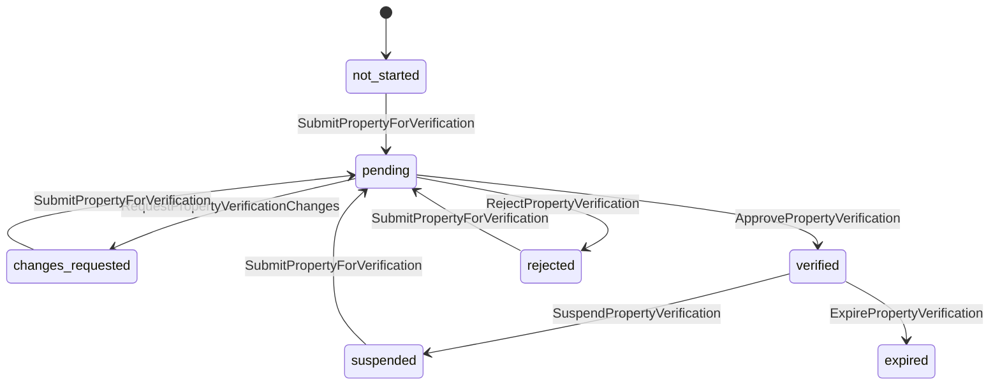
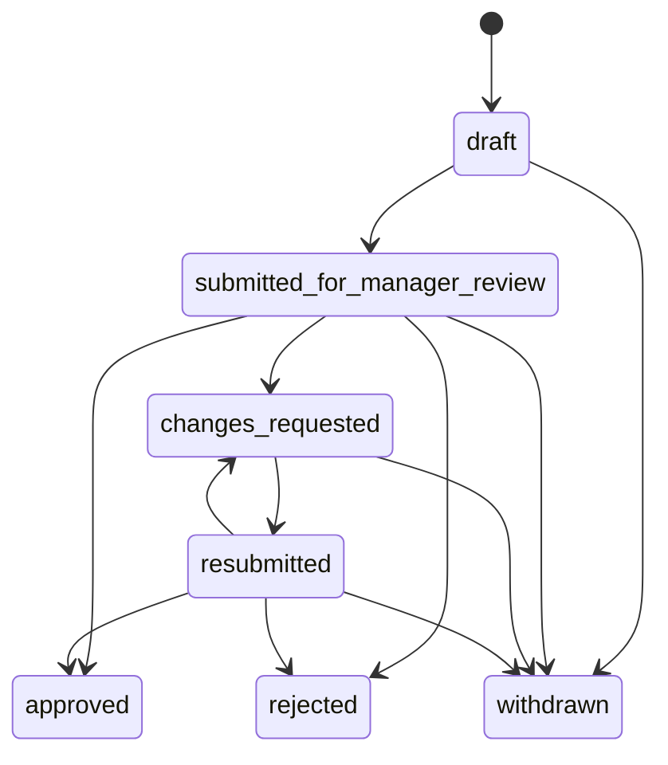
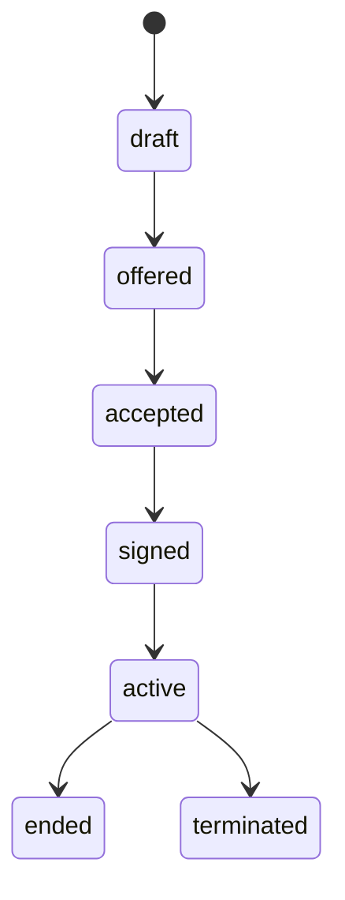
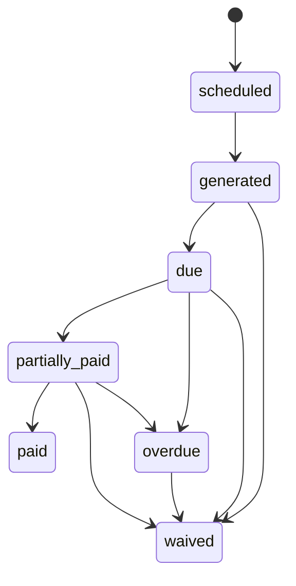
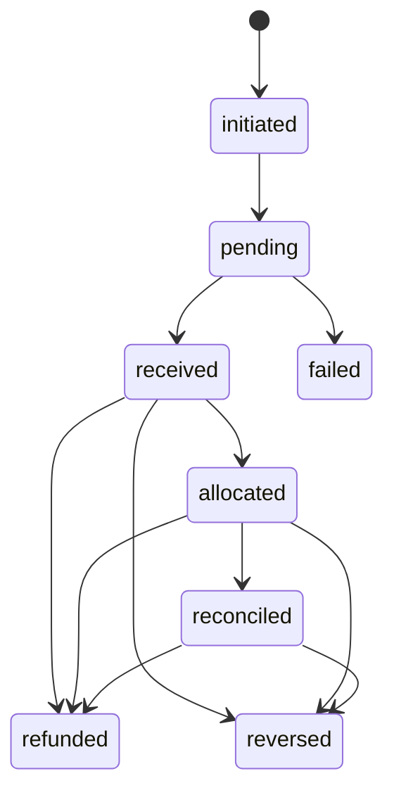
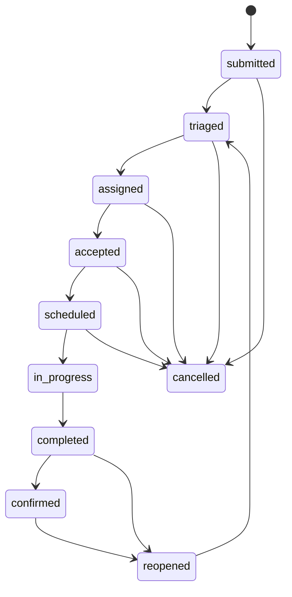
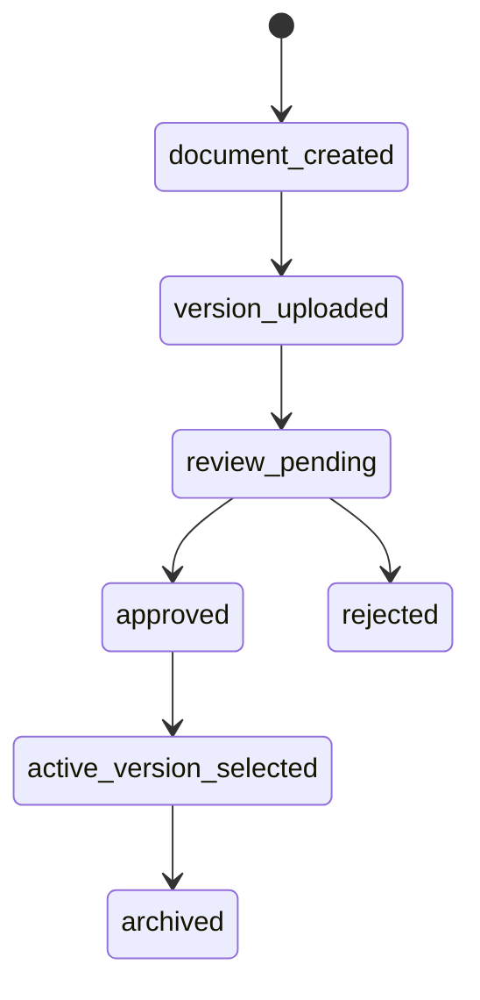
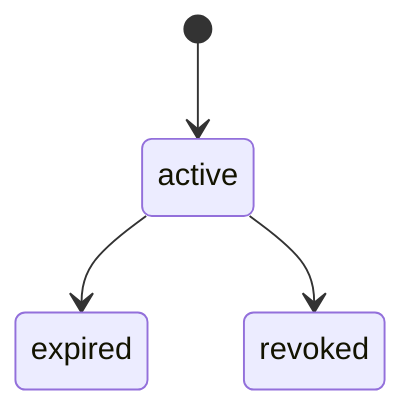
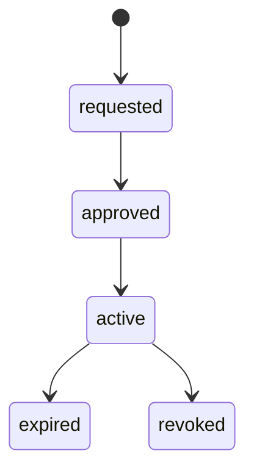
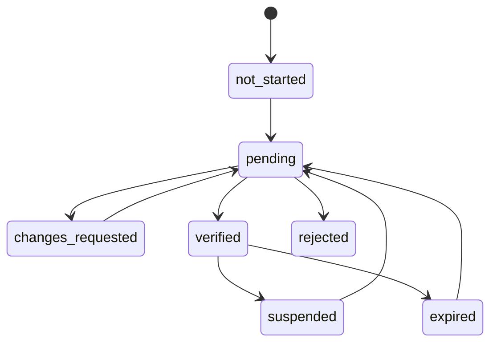

# KEYFORTA State Machines and Transition Guards

**Status:** Normative lifecycle contract v1.0

The diagrams in this document use the same vocabulary as the target SQL
`verification_status` enum (`docs/database/V001__keyforta_schema.sql`), which
is also what `packages/contracts/src/index.js` checks against
(`verificationStatus === 'verified'`). This resolves the vocabulary mismatch
previously tracked in the requirements-gap report and in issue #85: the SQL
enum is normative because it is the one already implemented, so this contract
was updated to match it rather than the other way around.

## 1. Transition format

Each transition has a command, authorized actor, guard, side effects, emitted event, and audit record. Invalid transitions return `STATE_CONFLICT`. The backend must not expose a generic status update.

## 2. Property verification

```text
not_started → pending → changes_requested → pending
                     └─→ verified → suspended → pending
                     └─→ rejected
verified → expired
```



| From | Command | Actor | Guard | To | Event |
| --- | --- | --- | --- | --- | --- |
| `not_started` | `SubmitPropertyForVerification` | Landlord/manager | Required property, ownership/management evidence present | `pending` | `PropertyVerificationSubmitted` |
| `pending` | `RequestPropertyVerificationChanges` | Platform admin | Evidence package incomplete or unclear; reason recorded | `changes_requested` | `PropertyVerificationChangesRequested` |
| `changes_requested` | `SubmitPropertyForVerification` | Landlord/manager | Corrected or additional evidence supplied | `pending` | `PropertyVerificationResubmitted` |
| `pending` | `ApprovePropertyVerification` | Platform admin | Evidence meets configured policy; reason recorded | `verified` | `PropertyVerificationApproved` |
| `pending` | `RejectPropertyVerification` | Platform admin | Reason and missing evidence recorded | `rejected` | `PropertyVerificationRejected` |
| `verified` | `SuspendPropertyVerification` | Platform admin | Policy violation or evidence revoked post-verification; reason recorded | `suspended` | `PropertyVerificationSuspended` |
| `suspended` | `SubmitPropertyForVerification` | Landlord/manager | Corrected or additional evidence supplied | `pending` | `PropertyVerificationResubmitted` |
| `verified` | `ExpirePropertyVerification` | Scheduled policy job | Policy validity period elapsed | `expired` | `PropertyVerificationExpired` |
| `rejected` | `SubmitPropertyForVerification` | Landlord/manager | New evidence or corrected data supplied | `pending` | `PropertyVerificationResubmitted` |

Approval (`verified`) is a workflow status, not a legal title determination. DRC property/legal evidence rules remain policy-configurable until counsel approval.

## 3. Application

```text
draft → submitted_for_manager_review → changes_requested → resubmitted
                                  ├─→ approved
                                  └─→ rejected
draft/submitted/changes_requested/resubmitted → withdrawn
```



Guards: required data and consent before submission; applicant may edit only draft or changes-requested versions; only authorized landlord/manager decides; decision reason is mandatory; approval does not activate a lease.

## 4. Lease

```text
draft → offered → accepted → signed → active → ended
                                      └──────→ terminated
```



Guards: offer requires valid terms; acceptance requires tenant acknowledgement; signing requires exact terms version; activation requires no overlapping active lease, required parties, availability, and required acknowledgements; termination requires effective date and reason; signed terms are immutable.

## 5. Payment and charge lifecycle

### Charge

```text
scheduled → generated → due → partially_paid → paid
                         └────→ overdue
generated/due/overdue/partially_paid → adjusted or waived by command
posted → reversed → replaced
```



`overdue` is derived from property-local time, due date, grace policy, and
outstanding balance. Adjustment, reversal, and replacement are explicit
append-only correction operations, not invented in-place lifecycle states. A
posted charge is never edited in place.

### Payment

```text
initiated → pending → received → allocated → reconciled
                  └──→ failed
received/allocated/reconciled → refunded or reversed
```



Guards: provider callback signature and replay checks; positive amount; explicit currency; allocation does not exceed payment or charge balance; refund/reversal references original effect.

## 6. Maintenance request

```text
submitted → triaged → assigned → accepted → scheduled → in_progress
                                                        → completed → confirmed
completed/confirmed → reopened → triaged
submitted/triaged/assigned/accepted/scheduled → cancelled
```



| Transition | Required guard |
| --- | --- |
| Submit | Requester is related to property/unit; required description and category exist |
| Triage | Authorized manager/landlord; priority and category selected |
| Assign | Operator is eligible; assignment and access window created |
| Accept | Assigned operator only; assignment active |
| Schedule | Assignment accepted; valid local time window |
| Start | Access window active; operator assigned |
| Complete | Report and category-required evidence present |
| Confirm | Authorized tenant/manager; completion exists |
| Reopen | Reason required; prior completion retained |
| Cancel | Authorized actor; cancellation reason required |

## 7. Document and access grant

```text
document_created → version_uploaded → review_pending → approved
                                            └───────→ rejected
approved → active_version_selected → archived
```



Document access grants are created active and are independently stateful:

```text
active → expired
     └──→ revoked
```



Privileged support access has a separate approval lifecycle:

```text
requested → approved → active → expired
                                     └──────→ revoked
```



Guards: one exact active version where required; content hash recorded; access
is relationship/scoped/expiring; private storage reference only; legal hold
blocks archive/deletion. Privileged support access additionally requires a
reason, target, scope, expiry, approver, and visibility.

## 8. Operator verification and eligibility

```text
not_started → pending → changes_requested → pending
                     └─→ verified → suspended → pending
                     └─→ rejected
verified → expired → pending
```



An operator may publish a service offer only in `verified` state. Verification does not grant access to any property. An assignment and active access window are still required.

## 9. Illegal-transition test requirements

The test suite must prove that the backend rejects at least:

- publishing an unapproved property or unit;
- approving an application by a tenant or unrelated manager;
- activating an unsigned lease;
- activating a lease overlapping another active lease;
- allocating a payment above the payment or charge balance;
- completing maintenance without required report/evidence;
- operator access after the access window expires;
- activating a superseded document version without an explicit command;
- using AI output as an authorization or financial command.
