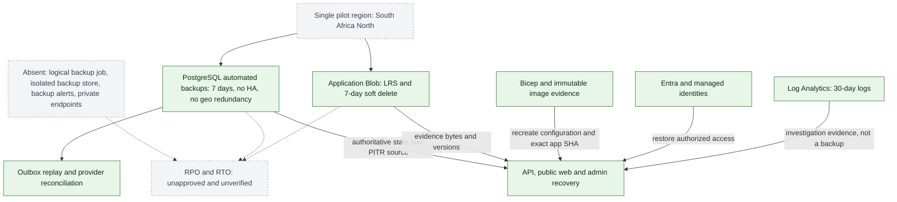
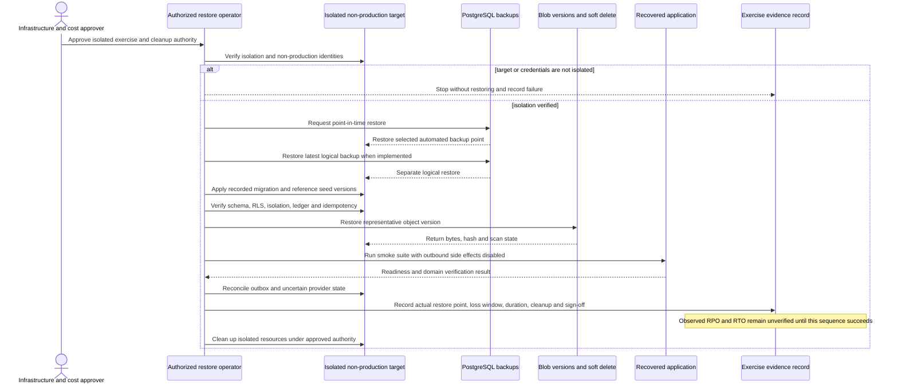

# KEYFORTA Backup, Recovery, and Retention Runbook

**Status:** Production implementation baseline
**Scope:** Managed PostgreSQL, private Azure Blob Storage, outbox/inbox recovery, audit, legal holds, and retention jobs
**Owner:** Technology/Operations, with Security, Finance, and qualified DRC privacy/legal review for policy values

This runbook defines the controls required before production traffic. It does not replace Azure service configuration, the provider's shared-responsibility terms, or jurisdiction-specific legal approval.

## Current pilot implementation

The `dev` foundation currently provides seven-day PostgreSQL automated-backup
retention, seven-day Blob soft delete, locally redundant storage,
password-disabled PostgreSQL authentication, and 30-day Container Apps log
retention. It does not provide logical backup jobs, private endpoints, HA,
geo-redundant backup, backup alerts, or verified restore evidence. The environment
must remain synthetic-only until a separately approved isolated restore exercise
records observed RPO/RTO.



This dependency map records current pilot mechanisms, not a recovery guarantee.
The single region, disabled PostgreSQL HA, LRS storage, and missing restore
evidence prevent any verified RPO or RTO claim.

## 1. Recovery objectives and ownership

Record the approved SLO, RPO, and RTO in an environment ADR before launch. Until those values are approved, do not advertise them publicly.

| Component | Required recovery behavior | Owner |
| --- | --- | --- |
| PostgreSQL | Point-in-time restore plus verified logical backup restore | Database/Operations |
| Blob storage | Version recovery, soft-delete recovery, and legal-hold preservation | Storage/Security |
| Outbox/worker | Resume from pending/failed rows; replay safely through inbox deduplication | Backend/Operations |
| Search/reporting projections | Rebuild from PostgreSQL/events; never restore as authoritative state | Backend/Data |
| Secrets/configuration | Recover through Key Vault/approved secret manager and IaC | Cloud/Security |
| Provider state | Reconcile uncertain payments, messages, and verification callbacks | Finance/Integrations |

## 2. PostgreSQL backup implementation

Configure the managed PostgreSQL production server with:

1. Encrypted automated backups and point-in-time recovery.
2. The approved backup retention period recorded in the environment ADR and policy register.
3. Zone/redundancy options selected after the approved availability and recovery targets are known.
4. Alerts for backup failure, stale backup age, storage exhaustion, replication/restore failure, and unexpected configuration drift.
5. Private network access and separate operational identities for runtime, migration, backup, and restore.

Run an encrypted logical backup at least daily, or more frequently if the approved RPO requires it. The job must:

- use a dedicated read-only backup identity;
- use custom format with ownership and ACL restoration controlled by the restore procedure;
- write to a separate private backup container/account, not the application container;
- include the schema version, source server, environment, start/end time, and checksum in a manifest;
- encrypt before transfer when the storage boundary does not already provide the required protection;
- fail closed when the dump or checksum is incomplete;
- emit metrics and an alert on failure.

Illustrative command shape; credentials must come from managed identity/secret injection and never from the command line:

```bash
pg_dump \
  --format=custom \
  --no-owner \
  --no-acl \
  --file=keyforta-<environment>-<utc-timestamp>.dump \
  "$KEYFORTA_DATABASE_URL"
sha256sum keyforta-<environment>-<utc-timestamp>.dump > keyforta-<environment>-<utc-timestamp>.sha256
```

Do not place production connection strings in this repository. The command is an implementation template only.

## 3. Restore verification

At least quarterly, after a major migration, and after a material backup configuration change:



1. Restore a point-in-time copy into an isolated non-production subscription/resource group.
2. Restore the latest logical backup into a separate isolated database.
3. Apply the same migration version and reference seed version recorded in the backup manifest.
4. Run schema verification: table count, enum values, foreign keys, indexes, RLS enabled/forced state, and migration ledger.
5. Run domain verification: tenant isolation, ledger immutability, idempotency replay, outbox replay, and document metadata-to-object checks.
6. Restore a representative object version and verify content hash, malware-scan state, access authorization, and legal-hold behavior.
7. Reconcile provider-facing records without sending duplicate external side effects.
8. Record duration, restore point, data loss window, failures, corrective actions, and owner sign-off.

A backup is not considered verified until the restored system can pass the application smoke suite without using production credentials or real outbound provider delivery.

The exercise record must contain the authorized change reference, source backup
identifier, isolated target, requested and actual restore points, start/end UTC
times, observed loss window, migration ledger result, isolation checks, smoke-test
result, cleanup status, corrective actions, reviewer, and evidence location. Stop
without restoring when the target is not isolated, credentials are production
runtime credentials, the backup identity is over-privileged, or cleanup authority
is absent. Executing the exercise requires explicit infrastructure and cost
approval; this runbook alone grants no deployment authority.

## 4. Object-storage protection

Use private containers with separate containers or storage accounts for development, staging, and production. Configure:

- versioning for document and evidence blobs;
- soft delete or the approved equivalent for blobs and containers;
- malware quarantine before a version becomes available to a domain workflow;
- server-side encryption and private network access where supported;
- short-lived, scoped access references generated only after API authorization;
- lifecycle rules that do not delete versions under legal hold;
- separate backup/export scope for objects referenced by active leases, financial records, investigations, or legal holds;
- periodic inventory reconciliation between `document_versions.storage_key` and stored blobs.

The database is authoritative for document access, review state, retention, and relationships. The object store is authoritative only for the bytes addressed by a verified storage key and content hash.

## 5. Retention execution

Retention values are stored in `retention_policies`; they must not be hard-coded in application code. A scheduled retention worker must:

1. Load the active policy version for the data class and jurisdiction.
2. Select only records past their retention deadline.
3. Exclude records with an active `legal_holds` row.
4. Exclude financial, lease, audit, and document history unless the approved policy explicitly authorizes archival/anonymization.
5. Process in bounded batches with a stable cursor and lock timeout.
6. Write one `retention_executions` record and update counts as work progresses.
7. Prefer reversible archive or cryptographic erasure of object bytes before irreversible relational deletion.
8. Write an audit event containing policy version, record class, count, outcome, and execution ID without copying unnecessary personal data.
9. Retry failures safely and stop on repeated integrity or legal-hold errors.
10. Produce a completion report for Security, Privacy, and the owning business function.

Default engineering behavior before legal approval is preservation: do not irreversibly delete or anonymize DRC operational, identity, lease, payment, or evidence data. Configure the approved retention period and action only after the legal/privacy decision register contains approval evidence.

## 6. Legal holds and deletion requests

- A legal hold is created before an investigation, dispute, regulatory request, or litigation response requires preservation.
- The hold covers the target record and all linked document versions, messages, payment evidence, audit references, and provider receipts identified by the approved scope.
- Retention jobs must check holds in the same transaction or with a repeatable-read selection immediately before mutation.
- Release requires an authorized actor, reason, timestamp, and audit event.
- A deletion or anonymization request is a workflow, not a direct SQL delete. It must evaluate identity, organization, legal hold, financial history, active lease, retention policy, and linked evidence before approval.
- Backups may retain data until their configured expiry; a deletion workflow must document that recovery copies are protected and expire according to the backup policy.

## 7. Outbox, inbox, and provider recovery

After a database restore:

- resume unpublished outbox rows from their last durable state;
- use `(consumer_name, event_id)` to make repeated delivery harmless;
- do not assume a provider callback was delivered because the local row exists;
- re-query or reconcile uncertain payment/provider records before issuing a new external command;
- keep failed and dead-lettered rows for investigation until their retention policy permits archive;
- rebuild reporting/search projections from source records/events and mark their generated-at timestamp.

## 8. Evidence required for production approval

- Backup configuration export and owner sign-off.
- Latest successful automated-backup and logical-backup manifests.
- Restore test report with observed RPO/RTO and corrective actions.
- Object version/soft-delete/legal-hold test report.
- Retention dry-run report showing exclusion of legal holds and protected financial history.
- Secret-rotation and least-privilege access review.
- Outbox replay and provider-reconciliation test evidence.
- Incident and recovery runbooks linked to on-call ownership.
