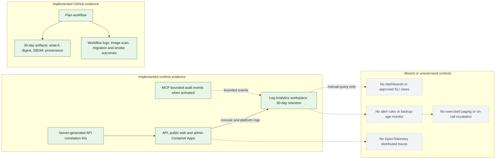

# Observability conventions

This document separates deployed pilot evidence from the implementation contract
for future telemetry work.

## Current pilot state

The Azure foundation routes Container Apps logs to one Log Analytics workspace
with 30-day retention. API requests receive server-generated correlation IDs,
deployment workflows preserve migration, smoke-test, image-digest, SBOM,
provenance, vulnerability-scan, and `what-if` evidence, and the MCP boundary
records bounded audit events. Dashboards, alert rules, distributed tracing,
backup-age monitoring, and an exercised on-call escalation path are not yet
implemented. Do not interpret log availability as an SLO or incident-response
guarantee.

Solid green nodes are implemented evidence paths. Gray dotted nodes are absent
or unexercised and must not be inferred from Log Analytics retention or GitHub
artifact availability.

## Signals

- Emit structured request start/end and sanitized failure events with timestamp,
  environment, release SHA, service, route template, method, status class,
  duration, and server-generated correlation ID.
- Propagate W3C `traceparent` across browser requests, API, database, Blob, identity, and
  provider adapters when OpenTelemetry is introduced.
- Measure request rate, duration, error ratio, dependency duration/failure,
  readiness, migration outcome, document-scan state age, payment idempotency
  conflicts, and queue/outbox age where those capabilities exist.
- Dashboards map directly to approved SLIs in `docs/operations/SLOS.md`. Alerts
  must be actionable, routed to an owner, and linked to a runbook.

## Data safety

Never log tokens, cookies, secrets, request/response bodies, identity documents,
raw payment credentials, invitation tokens, tenant names, emails, phone numbers,
or free-form model transcripts. Do not use organization, actor, lease, document,
or correlation IDs as metric labels. Correlation IDs may be searchable structured
log fields with approved retention. Record authorization outcomes and resource
types, not sensitive resource content.

## MCP boundary telemetry

The standalone MCP service records one bounded audit event per request with
correlation ID, client identity, protocol version, JSON-RPC method, tool name,
result status, denial reason, policy version, and a hashed session reference.
Credentials, prompts, tool arguments, tool results, and personal data are
excluded. Alert design for authentication failures, limit rejections, latency,
and session saturation is part of the separately approved activation work.

## Review triggers

Telemetry packages, exporters, sampling, retention, paid Azure resources, new
business metrics, or cross-region export require architecture, security/privacy,
platform/SRE, and owner review. Product metrics must derive only from approved
requirements.
