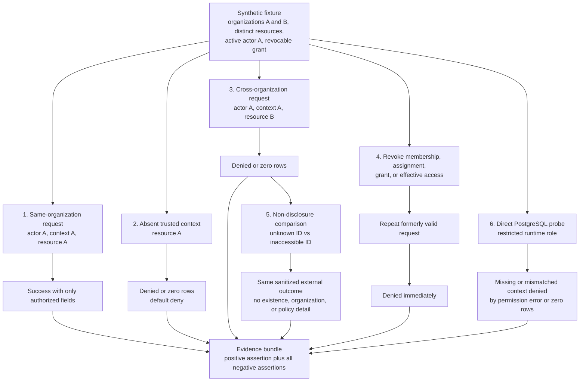
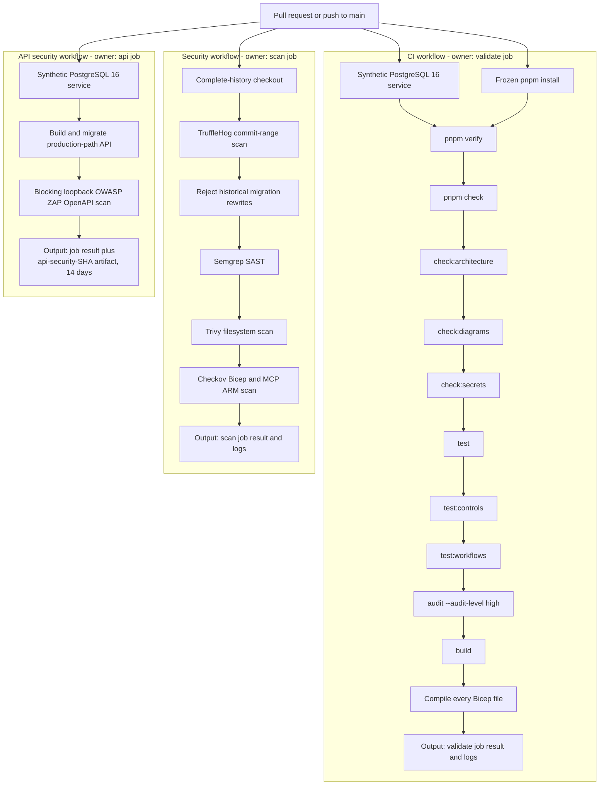

# Test strategy

Use the lowest deterministic layer that proves the risk.

| Layer                | Responsibility                                                                          | Location / gate                                                            |
| -------------------- | --------------------------------------------------------------------------------------- | -------------------------------------------------------------------------- |
| Unit                 | Pure money, schedule, authorization, parsing, and failure boundaries                    | `packages/*/test`, `apps/*/test`; `pnpm test`                              |
| Component            | Rendering helpers and loading, empty, error, and denied states                          | `apps/public-web/test`; add a DOM runner only through approved tooling            |
| API contract         | Zod input/output compatibility and sanitized transport behavior                         | `packages/contracts`, `apps/api/test/app.test.ts`                          |
| Database integration | Migrations, constraints, RLS, transactions, idempotency, immutability, cross-org denial | `apps/api/test/postgres.integration.test.ts`; CI PostgreSQL service        |
| Architecture         | Domain dependency direction and package boundaries                                      | `pnpm check:architecture`, package tests, and review                        |
| Infrastructure       | Bicep compilation and pilot resource policy                                             | CI compilation and policy review                                           |
| Security             | Negative authorization, isolation, secret patterns, dependency audit, abuse cases       | application tests, `pnpm check:secrets`, dependency audit, and CI           |
| Accessibility        | Keyboard, semantics, focus, contrast, responsive states                                 | automated axe smoke checks in component suites plus manual review          |
| End-to-end/smoke     | A few public/authenticated critical boundaries after deployment                         | deployment workflow; never substitute for lower-layer rules                |
| Migration/regression | Forward migration from supported state and exact incident reproductions                 | PostgreSQL suite and focused regression tests                              |

Tests use stable UUIDs, fixed dates, integer minor units, local service containers,
and synthetic identities. Do not call uncontrolled providers. Retries are bounded
and limited to deployed-service readiness. Snapshot tests do not replace semantic
assertions. Every authorization data path needs same-organization success and
cross-organization denial. AI work additionally requires the versioned evaluation
and safe-fallback evidence in `docs/ai/EVALUATION_PLAN.md`.

## Reusable cross-organization proof pattern

Use this proof pattern for each authorization data path. It is a test design,
not evidence that every path already implements every case.

The API or domain assertion proves the application boundary; the direct
restricted-role probe proves RLS defense in depth. Neither substitutes for the
other. Revocation uses the data path's actual membership, assignment, grant, or
effective-time control, and assertions must avoid accepting accidental `500`
responses as authorization denial.

## CI verification DAG

The pull-request and `main` triggers start three independent workflows. Boxes
identify the workflow/job that owns each output; a successful sibling workflow
does not compensate for a failed one.

The CI job's `pnpm verify` is the repository verification chain shown above;
Bicep compilation follows it as an additional CI-owned step. Security and API
security are separate workflow results and remain independently blocking when
configured as required GitHub checks.
