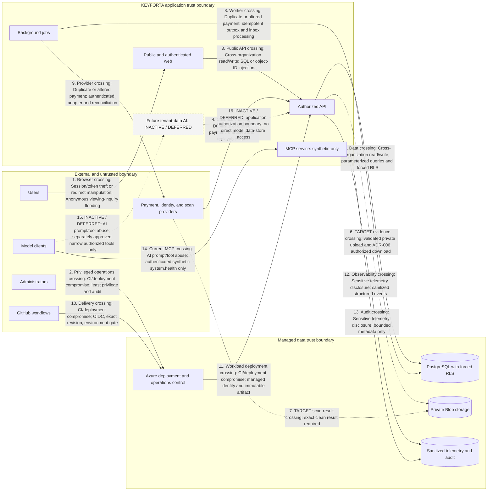
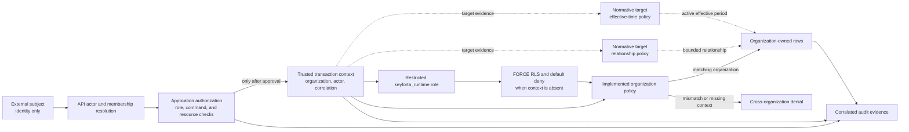
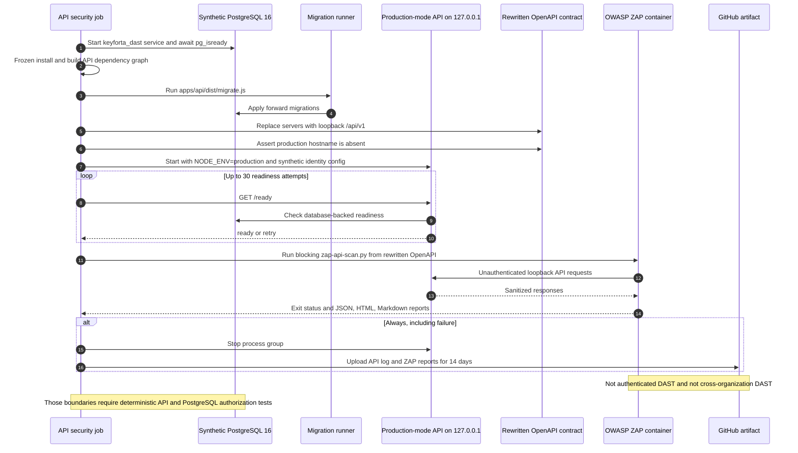

# Repository threat model

Review before external beta and whenever identity, authorization, payment,
document, AI, provider, or network boundaries change.

## Assets and boundaries

Assets include identities and sessions, organization membership, property and
lease records, applications and evidence, posted financial history, audit events,
infrastructure identities, deployment evidence, and future AI evidence. Boundaries
are browser to public API, API to PostgreSQL/Blob/providers,
GitHub OIDC to Azure, administrator workstation to Azure/PostgreSQL, and future
model tools to authorized application capabilities.

## Entry points and actors

Entry points are public pages, anonymous and bearer-token API routes, invitation
links, uploads, provider callbacks, deployment dispatches, PostgreSQL migrations,
and future AI tool calls. Threat actors include unauthenticated attackers,
malicious or compromised members, cross-organization users, replaying providers,
malicious files/documents, supply-chain attackers, compromised CI identities, and
operators making mistakes.

## Numbered threat-boundary data flow

Edge labels use the abuse-case names below so each trust crossing can be traced
to its existing mitigation and residual action. Dashed flows are inactive or
deferred; they do not describe a production capability.

## Abuse cases and mitigations

| Abuse case | Control status and mitigation | Residual risk / action |
| --- | --- | --- |
| Cross-organization read/write | Implemented in current data paths: server authorization, membership checks, forced RLS, and negative integration tests | Expand tests with every data path; treat any leak as critical |
| Session/token theft or redirect manipulation | Partial: OIDC PKCE, exact CORS origin, fixed callback, and HTTPS endpoint validation | Browser token storage, MFA, and External ID policy require security review |
| Duplicate or altered payment | Foundation: organization-scoped uniqueness, balanced ledger, and reversal/replacement | Provider authentication and reconciliation evidence remain release gates |
| Malicious or exposed evidence | Approved target: private Blob, validation, scan gating, and ADR-006 authorized download | No current evidence route; approve and exercise a runbook before activation |
| SQL or object-ID injection | Implemented in current paths: Zod contracts, parameterized queries, resource authorization, and RLS | Continue negative and cross-organization tests |
| Anonymous viewing-inquiry flooding | Partial: honeypot, per-replica rate limit, and duplicate suppression | Shared edge or distributed limiter remains required before external beta |
| CI/deployment compromise | Implemented repository controls: GitHub OIDC, exact-SHA evidence, immutable tags, and environment gate | GitHub administration remains an external control |
| AI prompt/tool abuse | Current synthetic MCP only: no database, tenant data, write tool, or autonomous decision | Tenant-data AI remains deferred until executable evaluations pass |
| Sensitive telemetry disclosure | Partial: sanitized API errors and logging conventions | Structured telemetry implementation and retention approval pending |

Security assumptions: Azure/GitHub identity controls are administered correctly,
managed identity object IDs are trusted configuration, TLS endpoints are valid,
and PostgreSQL/Blob platform encryption operates as documented. These assumptions
must be tested operationally, not inferred from code alone.

## Appendix A. Supporting security architecture

This supporting appendix preserves the former security architecture. Its status
labels and unresolved retention controls remain unchanged; it does not replace
the threat model, accepted ADRs, executable controls, or required human security
review.

### Security Architecture

#### Trust boundaries

- Browser and messaging input is untrusted.
- External identity proves a subject but does not grant organization access.
- During the single-tenant private pilot, external users must first redeem an
    Entra B2B guest invitation. That directory admission does not grant product
    access; organization membership still requires acceptance of the matching
    KEYFORTA invitation.
- Invitation acceptance uses Entra's explicit `email` claim. A transformed B2B
    `#EXT#` user principal name is not accepted as a verified recipient email.
- Application membership and policy determine authorization.
- Provider callbacks are authenticated, idempotent, and treated as replayable.
- AI output is untrusted input to deterministic application commands.

#### RLS trust and policy topology

This is a trust-path view, not an authorization substitution. The implemented
organization policy and forced RLS provide database defense in depth after API
authorization; relationship- and effective-time policies remain normative
target controls where the executable migration lineage has not implemented
them.

#### Required controls before external beta

- MFA for platform and landlord administrators
- Organization-scoped authorization on every command and query
- Row-level isolation as defense in depth
- Automated cross-organization access tests
- Private document storage and expiring authorized access
- Encryption in transit and at rest
- Upload validation and malware scanning
- Secret management through workload identity and a vault
- Correlation IDs, tamper-resistant audit events, metrics, traces, and alerts
- Backup restoration and incident-response exercises
- AI retrieval scoping, tool allowlists, structured output validation, prompt
    injection testing, and human approval for high-impact actions

#### DAST runtime sequence

The `API security` workflow exercises the production persistence path on
loopback with synthetic data. Its ZAP scan is blocking, but its OpenAPI requests
are not authenticated and do not prove cross-organization behavior.

#### Foundation and accepted target controls

Items described as future, target, or planned below are not implemented
capabilities. Current source and executable migrations control implementation
status.

- API bearer-token verification against the configured issuer, audience, and
    JWKS is required before protected browser routes are enabled.
- Future browser login uses authorization code with PKCE and direct API bearer
    tokens. Token storage requires security review before customer authentication
    is enabled; production CORS permits only the configured web origin.
- Landlord and manager workspace routes are selected from the API-resolved role.
    `/workspace` is the neutral entry;
    legacy `/pilot` URLs remain compatibility redirects, and browser input cannot
    select a role.
- Requested organization IDs are checked against active database membership;
    role permissions are then enforced in the application domain.
- Manager portfolio queries scope properties, units, and leases through active
    property assignments. Only landlords can mutate assignments, through a narrow
    database function that records actor and correlation evidence.
- Only landlords can configure property and unit lifecycle or append lease
    versions. Commands use trusted actor, organization, and correlation context;
    client-supplied resource IDs remain subject to application authorization and
    PostgreSQL row-level policies.
- Landlords grant manager or tenant membership through expiring, revocable
    invitations. Raw tokens are returned once and only SHA-256 hashes are stored;
    acceptance requires the authenticated identity email to match and derives the
    organization and role exclusively from protected server state. Lost pending
    links are replaced by revoking the old invitation and issuing a new one; raw
    tokens are never recovered from storage.
- Target lease activation will append an accepted version and leave every draft
    and prior version intact. It remains unimplemented; accepted leases must not
    be editable or archivable through landlord lifecycle commands.
- PostgreSQL policies default-deny organization-owned tables when trusted
    transaction context is absent.
- Payment idempotency keys and provider references are unique per organization.
- Posted payments, receipts, and ledger entries reject update and delete.
- Payment correction is limited to linked reversal or atomic
    reversal-and-replacement commands, preserving the original amount, actor,
    provider reference, and audit evidence.
- CI runs cross-organization tests against PostgreSQL and builds deployment
    artifacts without using deployment credentials.
- Production configuration fails fast without PostgreSQL or with a partial
    identity configuration; identity endpoints must use HTTPS.
- Server-generated correlation IDs identify sanitized error responses without
    trusting client-supplied identifiers or exposing internal failures.
- Container liveness and database-backed readiness probes prevent traffic from
    reaching API revisions that cannot serve persisted workflows.
- Manager and tenant identities are never created as ordinary landlord-owned
    records; membership begins only after secure invitation acceptance.
- Planned tenant applications are organization-scoped and editable only before
    submission. Landlord approval or refusal is an append-only human decision
    with reviewer, notes, timestamp, correlation, and audit evidence; it does not
    create a lease or reservation.
- Planned application evidence uses private Azure Blob Storage with shared keys and
    anonymous access disabled. The API validates size, MIME type, and file
    signature, stores an opaque Blob name and SHA-256, and records immutable
    organization-scoped metadata under forced RLS.
- Planned Microsoft Defender for Storage scanning keeps pending, failed,
    unscanned, or malicious files unavailable. After fresh authorization, only an
    exact clean result permits the short-lived signed URL required by ADR-006.
    Uploads and successful downloads remain correlated in the audit log.

#### Sensitive data policy

Development and tests use synthetic data. Real identity documents, signed
leases, tenant communications, payment evidence, and production model
transcripts must never enter source control.
