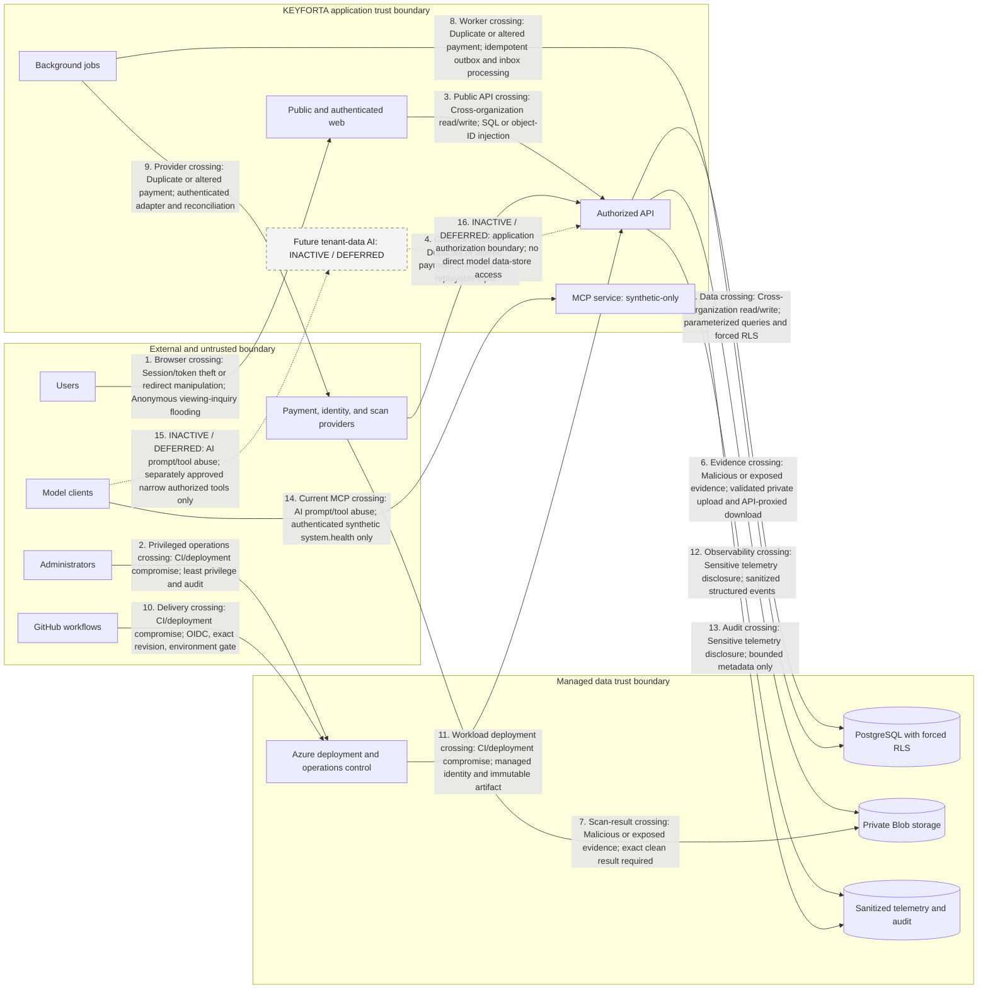

# Repository threat model

Review before external beta and whenever identity, authorization, payment,
document, AI, provider, or network boundaries change.

## Assets and boundaries

Assets include identities and sessions, organization membership, property and
lease records, applications and evidence, posted financial history, audit events,
infrastructure identities, deployment evidence, and future AI evidence. Boundaries
are browser to public API, API to PostgreSQL/Blob/providers,
GitHub OIDC to Azure, administrator workstation to Azure/PostgreSQL, and future
model tools to authorized application capabilities.

## Entry points and actors

Entry points are public pages, anonymous and bearer-token API routes, invitation
links, uploads, provider callbacks, deployment dispatches, PostgreSQL migrations,
and future AI tool calls. Threat actors include unauthenticated attackers,
malicious or compromised members, cross-organization users, replaying providers,
malicious files/documents, supply-chain attackers, compromised CI identities, and
operators making mistakes.

## Numbered threat-boundary data flow

Edge labels use the abuse-case names below so each trust crossing can be traced
to its existing mitigation and residual action. Dashed flows are inactive or
deferred; they do not describe a production capability.

## Abuse cases and mitigations

| Abuse case                                   | Existing mitigation                                                                             | Residual risk / action                                                           |
| -------------------------------------------- | ----------------------------------------------------------------------------------------------- | -------------------------------------------------------------------------------- |
| Cross-organization read/write                | Server authorization, membership/assignment checks, forced RLS, negative integration tests      | Expand tests with every data path; treat any leak as critical                    |
| Session/token theft or redirect manipulation | OIDC PKCE, exact CORS origin, fixed public callback, HTTPS endpoint validation                 | Browser token storage, MFA, and External ID policy require security review        |
| Duplicate or altered payment                 | Organization-scoped idempotency/provider uniqueness, balanced ledger, reversal/replacement      | Provider authentication adapter and reconciliation evidence remain release gates |
| Malicious or exposed evidence                | Private Blob, signature/size/MIME checks, opaque names, Defender-gated proxy download           | Monitor scan age/quota and exercise malicious upload runbook                     |
| SQL or object-ID injection                   | Zod contracts, parameterized queries, resource authorization, RLS                               | Continue negative and cross-org tests                                            |
| Anonymous viewing-inquiry flooding           | Honeypot, per-replica IP rate limit, listing/email duplicate suppression                        | Shared edge or distributed limiter remains required before external beta          |
| CI/deployment compromise                     | GitHub OIDC, exact-SHA plan evidence, immutable tags, environment gate                          | Enable platform secret/code scanning and review action pinning                   |
| AI prompt/tool abuse                         | No direct database, narrow typed authorized tools, human high-impact decisions, AI-off fallback | Runtime AI remains deferred until executable evals pass                          |
| Sensitive telemetry disclosure               | Sanitized API errors and logging conventions                                                    | Structured telemetry implementation and retention approval pending               |

Security assumptions: Azure/GitHub identity controls are administered correctly,
managed identity object IDs are trusted configuration, TLS endpoints are valid,
and PostgreSQL/Blob platform encryption operates as documented. These assumptions
must be tested operationally, not inferred from code alone.
