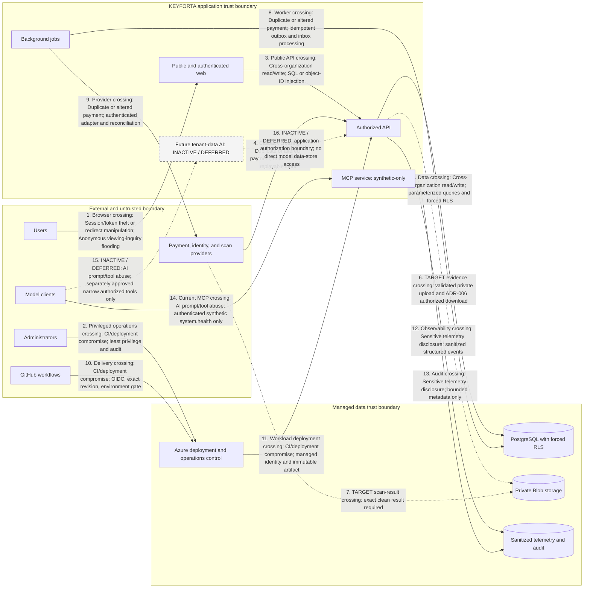

# Repository threat model

Review before external beta and whenever identity, authorization, payment,
document, AI, provider, or network boundaries change.

## Assets and boundaries

Assets include identities and sessions, organization membership, property and
lease records, applications and evidence, posted financial history, audit events,
infrastructure identities, deployment evidence, and future AI evidence. Boundaries
are browser to public API, API to PostgreSQL/Blob/providers,
GitHub OIDC to Azure, administrator workstation to Azure/PostgreSQL, and future
model tools to authorized application capabilities.

## Entry points and actors

Entry points are public pages, anonymous and bearer-token API routes, invitation
links, uploads, provider callbacks, deployment dispatches, PostgreSQL migrations,
and future AI tool calls. Threat actors include unauthenticated attackers,
malicious or compromised members, cross-organization users, replaying providers,
malicious files/documents, supply-chain attackers, compromised CI identities, and
operators making mistakes.

## Numbered threat-boundary data flow

Edge labels use the abuse-case names below so each trust crossing can be traced
to its existing mitigation and residual action. Dashed flows are inactive or
deferred; they do not describe a production capability.

## Abuse cases and mitigations

| Abuse case | Control status and mitigation | Residual risk / action |
| --- | --- | --- |
| Cross-organization read/write | Implemented in current data paths: server authorization, membership checks, forced RLS, and negative integration tests | Expand tests with every data path; treat any leak as critical |
| Session/token theft or redirect manipulation | Partial: OIDC PKCE, exact CORS origin, fixed callback, and HTTPS endpoint validation | Browser token storage, MFA, and External ID policy require security review |
| Duplicate or altered payment | Foundation: organization-scoped uniqueness, balanced ledger, and reversal/replacement | Provider authentication and reconciliation evidence remain release gates |
| Malicious or exposed evidence | Approved target: private Blob, validation, scan gating, and ADR-006 authorized download | No current evidence route; approve and exercise a runbook before activation |
| SQL or object-ID injection | Implemented in current paths: Zod contracts, parameterized queries, resource authorization, and RLS | Continue negative and cross-organization tests |
| Anonymous viewing-inquiry flooding | Partial: honeypot, per-replica rate limit, and duplicate suppression | Shared edge or distributed limiter remains required before external beta |
| CI/deployment compromise | Implemented repository controls: GitHub OIDC, exact-SHA evidence, immutable tags, and environment gate | GitHub administration remains an external control |
| AI prompt/tool abuse | Current synthetic MCP only: no database, tenant data, write tool, or autonomous decision | Tenant-data AI remains deferred until executable evaluations pass |
| Sensitive telemetry disclosure | Partial: sanitized API errors and logging conventions | Structured telemetry implementation and retention approval pending |

Security assumptions: Azure/GitHub identity controls are administered correctly,
managed identity object IDs are trusted configuration, TLS endpoints are valid,
and PostgreSQL/Blob platform encryption operates as documented. These assumptions
must be tested operationally, not inferred from code alone.
