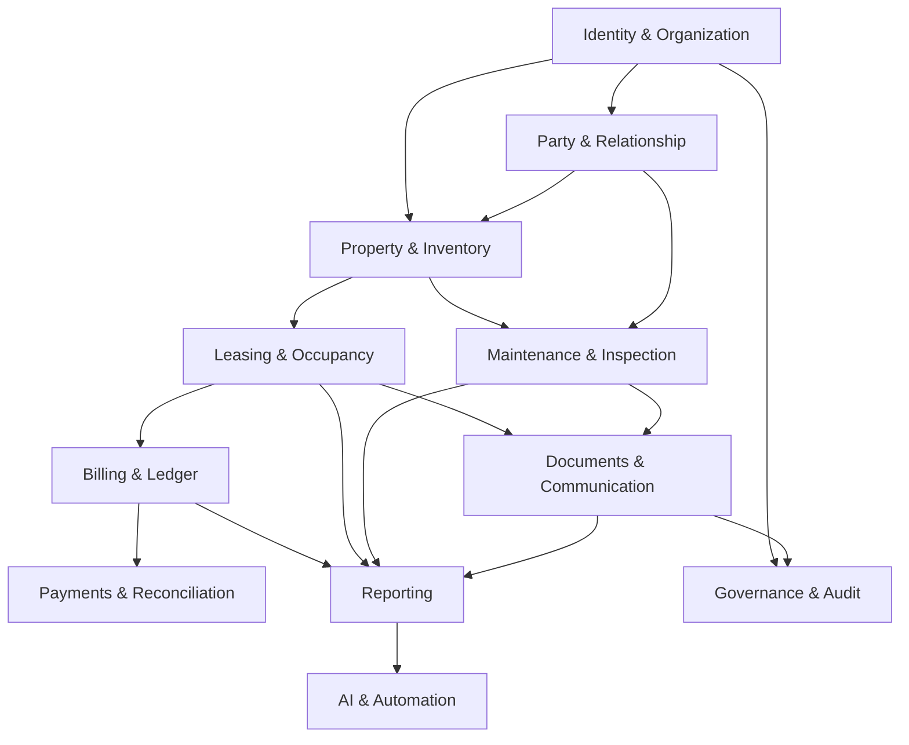
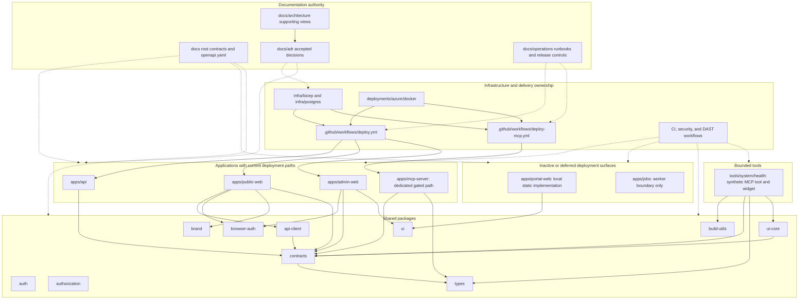
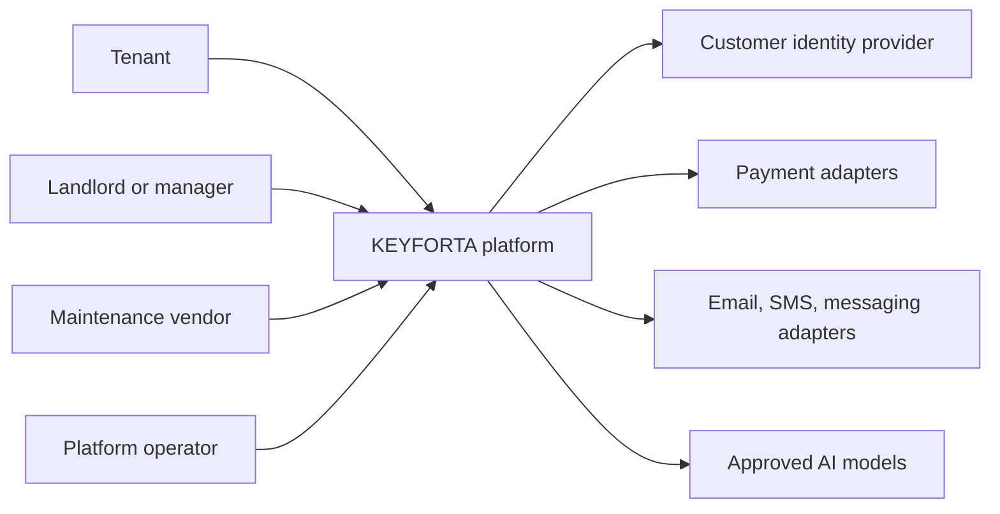

# KEYFORTA Context Map and Ownership

**Status:** Normative backend design v1.0

## 1. Context map

The arrows represent published facts or application-level contracts. They do not authorize direct reads of another module's private tables.

## 2. Ownership matrix

| Context | Business owner | Technical owner | Aggregate roots | Owned data | Published contract |
| --- | --- | --- | --- | --- | --- |
| Identity & Organization | Platform/product | Identity module | `Organization`, `Membership`, `Invitation`, `Party`, `Profile` | Identity linkage, parties, profiles, organizations, memberships, invitations | Identity claims, organization membership, invitation facts |
| Party & Relationship | Platform/product | Relationship module | `Relationship` | Effective-dated ownership, management, occupancy, eligibility, and assignment relationships | Relationship facts and authorization inputs |
| Property & Inventory | Landlord/product | Property module | `Property`, `Unit`, `PricingVersion` | Properties, spaces, units, pricing, availability, publication | Published property/unit and availability facts |
| Leasing & Occupancy | Landlord/operations | Leasing module | `ViewingRequest`, `RentalApplication`, `Lease`, `OccupancyPeriod` | Applications, application revisions, lease terms, occupancy periods | Application, lease, and occupancy facts |
| Billing & Ledger | Finance owner | Billing module | `ChargeSchedule`, `Charge`, `LedgerAccount`, `LedgerEntry` | Charge rules, charges, balances, immutable postings, reversals | Charges, ledger postings, balances |
| Payments & Reconciliation | Finance owner | Payments module | `PaymentIntent`, `Payment`, `Allocation`, `ReconciliationBatch` | Provider interactions, received money, allocations, refunds, reconciliation exceptions | Payment and settlement facts |
| Maintenance & Inspection | Operations | Maintenance module | `ServiceOffer`, `MaintenanceRequest`, `Assignment`, `Quote`, `Report` | Work requests, assignment windows, quotes, reports, evidence references | Maintenance lifecycle and evidence facts |
| Documents & Communication | Operations/privacy | Documents module | `Document`, `DocumentVersion`, `Conversation`, `Notification` | Metadata, versions, access grants, messages, delivery state | Document, message, and notification facts |
| Reporting | Product/operations | Reporting module | Projection models only | Read models and metric snapshots | Query-only dashboard/report contracts |
| Governance & Audit | Platform/security | Governance module | `AuditEvent`, `SupportAccessGrant`, `PolicyVersion` | Audit records, support access, policy history | Audit and support-access facts |
| AI & Automation | Product/security | AI module | `AIRequest`, `AIResult`, `HumanReviewTask` | Source references, model metadata, suggestions, review decisions | Advisory results and review tasks |
| Integrations | Relevant business owner | Integration module | Provider reference records | External IDs, webhook receipts, delivery attempts, adapter state | Provider-neutral application events |

Business owner means the person accountable for policy decisions. Technical owner means the team accountable for implementation and operational health. Both owners must be assigned before a context is released.

## 3. Context boundaries

### Identity & Organization

This context answers: “Who is this actor, and which organizations and roles are active?” It does not decide whether a landlord owns a property or whether an operator is assigned to a job.

### Party & Relationship

This context answers: “How are two parties related to a subject during a time interval?” Relationships are effective-dated and historical. It does not issue authentication tokens or silently grant roles.

### Property & Inventory

This context is the source of truth for physical and publishable inventory. Leasing consumes published units; it does not update property tables directly.

### Leasing & Occupancy

This context is the source of truth for applications, contractual lease terms, and occupancy periods. Billing consumes activated lease terms; a payment cannot activate a lease.

### Billing & Ledger

This context is the source of truth for assessed obligations and posted financial effects. A payment provider cannot write ledger rows directly.

### Payments & Reconciliation

This context is the source of truth for payment-provider interaction, receipt state, allocation, and reconciliation exceptions. It requests ledger effects through a published billing command.

### Maintenance & Inspection

This context is the source of truth for work lifecycle and operator access windows. A service offer grants discoverability only; assignment grants limited access.

### Documents & Communication

This context is the source of truth for document versions, access grants, messages, and delivery attempts. It never turns a private object-storage URL into a public URL.

### Reporting, Governance, AI, and Integrations

These contexts consume published facts and provide controlled capabilities. Reporting and AI never become alternative sources of transactional truth. Integrations isolate external provider models from the domain.

## 4. Prohibited dependencies

- No module imports another module's persistence entities or private repositories.
- No module joins another module's private tables in request handlers.
- No UI permission or hidden menu is treated as authorization.
- No provider identifier is used as a domain identifier.
- No reporting projection is used to authorize a command.
- No AI result is treated as a command until an authorized human submits the command.
- No payment callback directly changes a lease or posts a ledger entry without the payments application service and billing command.

## 5. Public module ports

Each module exposes only:

1. application commands;
2. authorized queries/read models;
3. published event schemas;
4. policy interfaces required by another context; and
5. health and operational diagnostics that do not expose private data.

The backend implementation must add an architecture test that fails when a module imports another module's persistence package or private table definition.

## 6. Ownership handoff rules

- A property is owned by one organization at a time; ownership history is retained as a relationship.
- Management delegation is separate from ownership and has its own effective dates and scope.
- A tenant's access to a unit is derived from application, lease, and occupancy relationships.
- An independent maintenance operator is platform-scoped for discoverability but organization/job-scoped for operational access.
- Finance viewers are read-only and cannot issue financial commands.
- Platform administrators have elevated permissions only through explicit, reason-coded operations.

## 7. Release gate

A bounded context is ready for implementation when its owner has approved:

- aggregate roots and invariants;
- command and event names;
- owned tables and prohibited dependencies;
- authorization policy;
- API/query contract;
- failure and reconciliation paths;
- acceptance tests; and
- an ADR for any unresolved architectural choice.

## Appendix A. Supporting repository topology

This appendix preserves the former supporting repository topology. It does not
alter this document's normative authority or the authority boundaries stated
below.

### Architecture supporting documents

This directory adds detailed KEYFORTA context, domain, integration, security,
data, and Azure views. The authoritative architecture decisions remain in
[`docs/adr/`](./adr/).

The files under `docs/architecture/adr/` are retained candidate and historical
decision records. They do not supersede [`docs/adr/`](./adr/), the backend
implementation specification, or the production data model unless a reviewed
decision explicitly reconciles and promotes them.

#### Repository topology and ownership

This map describes source-control ownership and available deployment paths, not
the live state of an environment. **Deployment-capable** means the repository
contains a gated workflow, image definition, and infrastructure definition;
deployment still requires reviewed evidence and human approval. Portal and jobs
remain outside those deployment paths.

Arrows from applications and tools to packages are current manifest
dependencies. The unconnected `auth` and `authorization` nodes are shared
package surfaces but are not direct application or tool dependencies in current
manifests.
Infrastructure and workflow arrows show delivery ownership, while dotted
documentation arrows show governance rather than runtime calls. See the
[diagram catalog](./README.md#mermaid-diagram-catalog) for status, semantic ownership, authoritative
sources, and review triggers.

## Appendix B. Supporting system context

This appendix preserves the former supporting system context. It does not
replace the normative context map or grant authority to an external provider.

### System Context

KEYFORTA owns the authoritative property, party, lease, operational, document,
and financial subledger records. External providers supply identity, delivery,
payment events, or model inference; they do not replace KEYFORTA’s business
state or authorization decisions.
