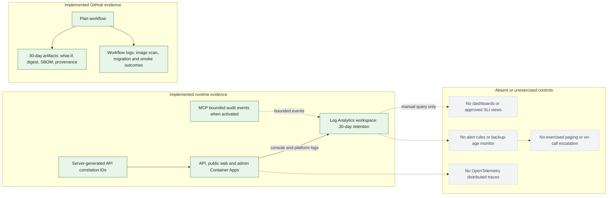

# Operations documentation

| Document | Purpose | Authority boundary |
| --- | --- | --- |
| [`RELEASE_CHECKLIST.md`](./RELEASE_CHECKLIST.md) | Human approval, evidence, observation, and rollback decisions | Workflow YAML controls executable deployment behavior |
| [Runbook catalog](#runbook-catalog) | Index of available incident procedures | Each linked runbook owns its procedure |
| [Missing procedures](#missing-procedures) | Incident procedures that still require an owner | Obtain the appropriate owner before execution |
| [Required runbook template](#required-runbook-template) | Mandatory content and data-safety boundary for new procedures | Every new runbook must include all listed fields |
| [Proposed service objectives](#proposed-service-objectives) | Proposed service indicators and objectives | No external commitment until approved and measured |
| [Supporting observability conventions](#supporting-observability-conventions) | Current evidence, absent controls, telemetry safety, and review triggers | Supporting guidance; reviewed infrastructure and workflows control implemented behavior |
| [Azure access and bootstrap](../../infra/README.md#appendix-b-azure-access-and-bootstrap) | Access prerequisites and bootstrap guidance | Bicep and workflows control current commands and configuration |
| [`MCP_DEV_RUNBOOK.md`](./MCP_DEV_RUNBOOK.md) | Synthetic MCP activation, containment, and rollback | Applies only to the separately gated MCP path |

Repository configuration is not proof of live deployment. Live claims require
SHA-bound release evidence or authorized Azure inspection.

## Runbook catalog

Runbooks will be exercised before real pilot data is imported.

Every release follows the
[release and deployment checklist](./RELEASE_CHECKLIST.md), including an
immutable evidence chain, post-deployment verification, and an initial
operating window.

| Scenario | Procedure status |
| --- | --- |
| Authentication redirect mismatch | [`AUTHENTICATION_REDIRECT_FAILURE.md`](./AUTHENTICATION_REDIRECT_FAILURE.md) |
| Suspected cross-organization access | [`CROSS_ORGANIZATION_ACCESS.md`](./CROSS_ORGANIZATION_ACCESS.md) |
| Duplicate or unidentified payment | [`PAYMENT_INTEGRITY_INCIDENT.md`](./PAYMENT_INTEGRITY_INCIDENT.md) |
| Document exposure or malicious upload | [`DOCUMENT_SECURITY_INCIDENT.md`](./DOCUMENT_SECURITY_INCIDENT.md) |
| Deployment or migration failure | [`DEPLOYMENT_MIGRATION_FAILURE.md`](./DEPLOYMENT_MIGRATION_FAILURE.md) |
| Backup restoration | [`backup-retention-runbook.md`](../database/backup-retention-runbook.md) |
| MCP dev activation or containment | [`MCP_DEV_RUNBOOK.md`](./MCP_DEV_RUNBOOK.md) |

The
[`authentication redirect mismatch`](./AUTHENTICATION_REDIRECT_FAILURE.md)
runbook is the executable procedure for OIDC callback failures.
The [`MCP dev activation and containment`](./MCP_DEV_RUNBOOK.md) runbook governs
the synthetic-only ChatGPT dev connector, including cost, monitoring, emergency
disable, and immutable-revision rollback.
The [`backup, recovery, and retention`](../database/backup-retention-runbook.md)
runbook defines restore authorization, isolation, stop conditions, verification,
evidence, and the controls that remain undeployed in the synthetic pilot.

Every runbook must identify detection, severity, containment, owner,
communication, recovery, evidence preservation, and follow-up actions.

## Missing procedures

| Scenario | Procedure status |
| --- | --- |
| Authentication/account recovery, incorrect charge schedule, AI grounding/tool policy, messaging outage, and data export/deletion | Missing focused procedures; identify and obtain the appropriate service, security, finance, AI, communications, or privacy owner before execution |

## Required runbook template

Use this template for new procedures:

- **Failure mode:**
- **Detection and user impact:**
- **Severity and owner:**
- **Prerequisites / safe access:**
- **Containment:**
- **Diagnosis commands (redacted outputs only):**
- **Recovery:**
- **Verification:**
- **Rollback / stop conditions:**
- **Communication:**
- **Evidence to preserve:**
- **Follow-up tests and review trigger:**

Never place tokens, credentials, personal data, document contents, or payment
details in the runbook or incident issue.

## Proposed service objectives

Pilot targets are learning targets, not customer commitments.

| Quality              | Pilot target                                                               |
| -------------------- | -------------------------------------------------------------------------- |
| Financial posting    | No duplicate posting; every correction is auditable                        |
| Data isolation       | Zero cross-organization access in the automated suite                      |
| Recovery point       | Proposed 15 minutes; unverified until a recorded restore exercise           |
| Recovery time        | Proposed four hours; unverified until a recorded restore exercise           |
| AI financial answers | Source-linked and exactly equal to deterministic results                   |
| Core continuity      | Lease, payment, receipt, and maintenance work remains available without AI |

Operational measurements and error budgets will be formalized before external
landlords receive a service commitment.

### Proposed measurable pilot indicators

The following are proposals requiring product-owner and SRE approval; they are
not customer commitments.

| Indicator                      | Proposed target                             | Window / source                         |
| ------------------------------ | ------------------------------------------- | --------------------------------------- |
| Public web availability        | 99.5% successful non-maintenance requests   | Rolling 30 days, ingress telemetry      |
| Authenticated API availability | 99.5% non-5xx responses                     | Rolling 30 days, route-template metrics |
| API latency                    | 95% below 750 ms excluding uploads          | Rolling 7 days, server duration         |
| Document scan outcome          | 99% reach terminal status within 15 minutes | Rolling 7 days, scan-state age          |
| Financial integrity            | Zero duplicate or unbalanced postings       | Continuous database invariant/audit     |
| Organization isolation         | Zero confirmed cross-organization access    | Continuous incidents plus CI regression |
| Synthetic MCP boundary         | Zero business-data or unapproved-tool exposure | Continuous audit plus registry tests  |
| MCP dev availability           | 95% successful authenticated synthetic calls during approved test windows | Per activation window, MCP audit and ingress telemetry |
| MCP containment                | Disable approved within 15 minutes          | Per exercise or incident, runbook evidence |

For availability objectives, the proposed monthly error budget is the allowed
failure fraction implied by the approved SLO. Exhaustion freezes risky releases
and prioritizes reliability work; security, isolation, financial integrity, and
data-loss incidents bypass budget calculations and stop promotion immediately.

Proposed alerts page only on actionable user impact: sustained availability or latency
burn, readiness failure across active revisions, migration failure, confirmed
isolation/financial invariant breach, or document scanning backlog. Severity 1
means active data exposure, integrity loss, or broad outage; Severity 2 means
material degraded operation; Severity 3 is bounded degradation handled in
business hours. Incident command, evidence, escalation, rollback, backup restore,
capacity, and cost review follow the [runbook catalog](#runbook-catalog) and
[`RELEASE_CHECKLIST.md`](./RELEASE_CHECKLIST.md).

No alert resources are currently deployed. Backup retention remains the deployed
seven-day pilot setting. The proposed RPO
and RTO above require a successful synthetic restore exercise before real pilot
data; until then they are unverified targets. Capacity and cost are reviewed per
release and before any SKU, HA, retention, telemetry, or scaling increase.

## Supporting observability conventions

This section separates deployed pilot evidence from the implementation contract
for future telemetry work. It is supporting guidance: reviewed infrastructure,
runtime source, and workflows control claims about implemented behavior.

### Current pilot state

The Azure foundation routes Container Apps logs to one Log Analytics workspace
with 30-day retention. API requests receive server-generated correlation IDs,
deployment workflows preserve migration, smoke-test, image-digest, SBOM,
provenance, vulnerability-scan, and `what-if` evidence, and the MCP boundary
records bounded audit events. Dashboards, alert rules, distributed tracing,
backup-age monitoring, and an exercised on-call escalation path are not yet
implemented. Do not interpret log availability as an SLO or incident-response
guarantee.

Solid green nodes are implemented evidence paths. Gray dotted nodes are absent
or unexercised and must not be inferred from Log Analytics retention or GitHub
artifact availability.

### Signals

- Emit structured request start/end and sanitized failure events with timestamp,
	environment, release SHA, service, route template, method, status class,
	duration, and server-generated correlation ID.
- Propagate W3C `traceparent` across browser requests, API, database, Blob, identity, and
	provider adapters when OpenTelemetry is introduced.
- Measure request rate, duration, error ratio, dependency duration/failure,
	readiness, migration outcome, document-scan state age, payment idempotency
	conflicts, and queue/outbox age where those capabilities exist.
- Dashboards map directly to the
	[proposed measurable pilot indicators](#proposed-measurable-pilot-indicators).
	Alerts must be actionable, routed to an owner, and linked to a runbook.

### Data safety

Never log tokens, cookies, secrets, request/response bodies, identity documents,
raw payment credentials, invitation tokens, tenant names, emails, phone numbers,
or free-form model transcripts. Do not use organization, actor, lease, document,
or correlation IDs as metric labels. Correlation IDs may be searchable structured
log fields with approved retention. Record authorization outcomes and resource
types, not sensitive resource content.

### MCP boundary telemetry

The standalone MCP service records one bounded audit event per request with
correlation ID, client identity, protocol version, JSON-RPC method, tool name,
result status, denial reason, policy version, and a hashed session reference.
Credentials, prompts, tool arguments, tool results, and personal data are
excluded. Alert design for authentication failures, limit rejections, latency,
and session saturation is part of the separately approved activation work.

### Review triggers

Telemetry packages, exporters, sampling, retention, paid Azure resources, new
business metrics, or cross-region export require architecture, security/privacy,
platform/SRE, and owner review. Product metrics must derive only from approved
requirements.