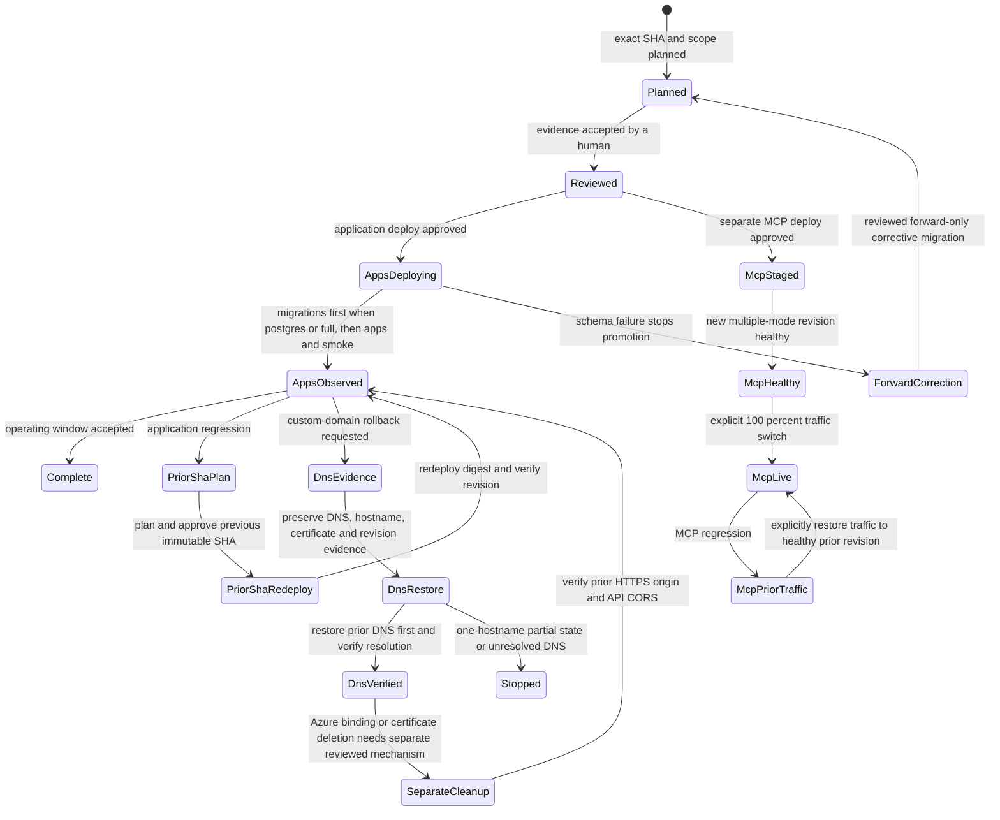

# Release and Deployment Checklist

This checklist tracks each KEYFORTA release from reviewed source through the
initial operating window. The Git commit SHA, pull request, CI run, deployment
run, migration execution, and Azure revision are the durable evidence chain.

## Release control flow

```mermaid
flowchart LR
  subgraph Source["Source and CI"]
    PR["Reviewed pull request"] --> Gates{"Required CI and security gates pass?"}
    Gates -->|"no"| Fix["Fix source, tests, or controls"]
    Fix --> PR
    Gates -->|"yes"| Merge["Merge immutable full SHA to main"]
  end

  subgraph PlanLane["Plan run: GitHub dev environment"]
    PlanApproval{"Environment approval before job starts"}
    PlanApproval --> Plan["Dispatch exact SHA and scope"]
    Plan --> Push["Build and push new SHA tag to ACR"]
    Push --> Digest["Resolve digest, lock tag, verify SBOM and provenance, scan"]
    Digest --> WhatIf["Run scoped Azure what-if"]
    WhatIf --> Evidence["Upload 30-day SHA-bound plan artifact"]
  end

  subgraph Human["Human control between runs"]
    Review{"Review digests, scans, attestations, what-if, cost and exposure"}
    Stop["Stop promotion or request a new plan"]
    Review -->|"reject"| Stop
  end

  subgraph DeployLane["Deploy run: GitHub dev environment"]
    DeployApproval{"Environment approval before job starts"}
    DeployApproval --> Import["Fetch exact plan run and import digest references"]
    Import --> Drift["Re-run normalized what-if and reject drift"]
    Drift --> Mutate["First Azure mutation uses repository at sha256 digest"]
    Mutate --> Scope{"Reviewed application scope"}
    Scope -->|"postgres or full"| Migration["Configure Entra access, deploy job, run forward migrations"]
    Scope -->|"api, public-web, admin-web or full"| Apps["Deploy selected Container Apps"]
    Migration -->|"full"| Apps
    Migration -->|"postgres"| Observe["Record evidence and observe"]
    Apps --> Smoke["Smoke public, API, CORS and admin boundaries"]
    Smoke --> Observe
  end

  subgraph McpLane["Separate Deploy MCP workflow"]
    McpPlan["Approved plan run pushes MCP SHA image and uploads hashed evidence"]
    McpReview{"Separate human review and deploy approval"}
    McpDeploy["Recheck drift, deploy healthy revision, switch 100 percent traffic, smoke"]
    McpPlan --> McpReview --> McpDeploy
  end

  Merge --> PlanApproval
  Evidence --> Review
  Review -->|"accept"| DeployApproval
  Merge -.-> McpPlan
```

## Release evidence lineage

This evidence view expands the existing control flow without replacing its
plan, review, deploy, migration, smoke, or rollback controls.

```mermaid
flowchart LR
  Merge["Merge SHA on main"]

  subgraph Plan["Plan run - protected dev environment"]
    PlanRecord["deployment-plan.txt<br/>SHA, run ID, scope, digest references"]
    Digests["Immutable registry digests"]
    Attest["SBOM and provenance JSON"]
    Scan["Blocking image scan logs"]
    WhatIf["Scoped Azure what-if JSON"]
    Artifact["deployment-plan-SHA artifact<br/>30-day retention"]
    PlanRecord --> Artifact
    Digests --> PlanRecord
    Attest --> Artifact
    Scan --> Artifact
    WhatIf --> Artifact
  end

  Review["Human review<br/>plan run and release decision"]

  subgraph Deploy["Approved deploy run - same SHA and scope"]
    Approval["Protected environment approval<br/>before job starts"]
    Import["Import exact plan artifact and digests"]
    Drift["Re-run normalized what-if<br/>reject drift"]
    Mutation["Approved Azure mutation"]
    Revision["Container App revision names"]
    Migration["Migration execution name and status<br/>for postgres or full"]
    Smoke["Workflow smoke result and summary"]
    Approval --> Import --> Drift --> Mutation
    Mutation --> Revision
    Mutation --> Migration
    Revision --> Smoke
    Migration --> Smoke
  end

  ReleaseRecord["Release record in pull request or linked issue<br/>CI and security URLs, plan and deploy runs,<br/>digests, revisions, migration, smoke, observation, rollback"]
  Gap["Current evidence gap<br/>no single consolidated post-deployment artifact"]

  Merge --> PlanRecord
  Merge --> Digests
  Artifact --> Review --> Approval
  Smoke --> ReleaseRecord
  Artifact --> ReleaseRecord
  Gap -.-> ReleaseRecord

  classDef gap fill:#fff3cd,stroke:#8a6d00,color:#332800;
  class Gap gap;
```

The plan artifact consolidates pre-deployment evidence. Deployment outputs are
currently distributed across the deploy workflow result and summary, Azure
revision and migration execution records, smoke observations, and the manually
maintained release record. There is no single consolidated post-deployment
artifact; the release record is therefore the required index across those
durable sources and must not claim evidence that was not preserved.

## Release record

Create one record in the pull request or linked issue and keep it current.

| Field        | Required evidence                                      |
| ------------ | ------------------------------------------------------ |
| Outcome      | User-visible or operational result                     |
| Requirements | Linked `REQ-XXX` identifiers                           |
| Owner        | Person responsible for the release decision            |
| Commit       | Immutable full SHA from `main`                      |
| CI           | Successful workflow URL for that SHA                   |
| Security     | SAST, secret, dependency/IaC, DAST, and image-scan evidence |
| Deployment   | Approved `dev` workflow run URL                        |
| Scope        | Reviewed deployment scope                              |
| Migration    | For `postgres` or `full`, job execution and status     |
| Seed         | Optional seed workflow URL, execution name, and status |
| Images       | Reviewed registry digests for the selected scope       |
| Revision     | For application scopes, deployed Container App revisions |
| Smoke tests  | URLs tested, UTC time, and result                      |
| Observation  | End time and reviewer for the initial operating window |
| Rollback     | Previous validated SHA and revision                    |

Do not put credentials, access tokens, personal data, exact property addresses,
or tenant data in the record.

## Before merge

- Confirm the change is linked to requirements, acceptance tests, and current
  product documentation.
- Confirm authorization, organization isolation, audit behavior, and public
  projection boundaries for every changed data path.
- Run `pnpm verify`; CI must also pass with PostgreSQL integration tests enabled.
- Review dependency audit, Semgrep, TruffleHog, Trivy filesystem, Checkov Bicep,
  and loopback-only ZAP results. ZAP runs the production persistence path against
  a migrated synthetic PostgreSQL database and requires database readiness.
  Scanner failures block promotion.
- Review migration compatibility. Migrations are forward-only and must tolerate
  being re-run through the migration runner.
- Identify the previous validated deployment SHA and the signals that would
  stop or reverse the release.

## Deployment

1. Merge the reviewed pull request into `main`.
2. Select the narrowest supported scope and dispatch `Deploy` with
   `operation=plan` for the immutable merge SHA:
   - `postgres` previews PostgreSQL Entra access, the migration job, and
    forward migrations. The plan builds, attests, scans, and records the
    immutable API image because that image
     contains the migration runner, but it does not deploy the API application.
   - `api` previews and deploys only the API image and Container App. It does
     not configure PostgreSQL access or run migrations.
   - `public-web` previews and deploys only the public-web image and Container App.
   - `admin-web` previews and deploys only the admin SPA image and Container App.
   - `full` composes `postgres`, `api`, `public-web`, and `admin-web`, and reconciles the
     dormant development seed-job definition without executing it.
   - `portal-web` remains a reserved name that fails closed. MCP is intentionally
     excluded from this workflow and uses the separately approved `Deploy MCP`
     plan, evidence, approval, deploy, traffic-switch, and smoke-test path.
3. On a fresh resource group, review the `foundation`-scoped plan and dispatch
   `operation=deploy-foundation` with its run ID. Then dispatch `operation=plan`
   again for the same SHA; do not deploy jobs or applications from a
   foundation-only plan.
4. Review all available Azure `what-if` results for deletes, replacements,
   public exposure, privilege expansion, and unexpected cost.
  Review each selected image digest, SBOM, and provenance record in the plan
  artifact, and the blocking High/Critical Trivy result in the workflow log.
5. Dispatch the same SHA and scope with `operation=deploy`, provide the reviewed
  plan's workflow run ID, and approve the protected `dev` environment. The
   workflow must retrieve plan evidence whose artifact name, scope, contents,
   and run ID match that SHA before deployment can continue.
6. Confirm the deploy run imports only the reviewed digest references, performs
  no image build or push, repeats `what-if`, and rejects normalized drift before
  the first Azure mutation.
7. For `postgres` or `full`, preserve the migration execution name and verify it
  reaches `Succeeded`.
   Migration `0017` stops without changing assignment history if a property has
   multiple active managers; an authorized operator must revoke the duplicates
  and retain that audit evidence before retrying. Migration `0020` repairs the
  publication function and establishes the schema marker required by API readiness.
8. For application scopes, preserve the deployed revision names and workflow summary.
9. For a public-domain cutover, verify the Cloudflare records are DNS-only,
   preserve the prior records, and confirm the reviewed API CORS deployment
  before binding the public-web managed certificates. If neither Container App
  hostname exists, review both the disabled-binding hostname bootstrap and the
  final managed-certificate what-if phases. Stop if exactly one hostname exists;
  do not bypass the workflow's partial-state guard. Verify the apex A-record
  certificate uses HTTP validation and the `www` certificate uses CNAME
  validation. Because managed-certificate validation properties are immutable,
  use a new certificate resource ID for any correction. Remove the obsolete
  certificate only through a separate reviewed cleanup after the replacement
  is secured.

The workflow must stop on a failed migration or smoke test. Never route around
an environment approval or replace a failed migration with manual SQL.

## Optional development data

After deploying the exact reviewed SHA, dispatch `Seed development data` from
`main`, enter `synthetic-dev-data`, and approve the protected `dev`
environment. Record the workflow URL and Container Apps execution name. The
operation is idempotent and contains only synthetic public catalogue data; it
must never be used for production or replaced with ad hoc database commands.

## Post-deployment verification

- Verify the home page and `/locations` through the public web endpoint.
- For public-web interface changes, verify English and French navigation,
  responsive menu branding, property filters, localized heading wrapping, and
  back-to-top keyboard behavior at phone, tablet, and desktop widths.
- Verify `https://keyforta.com` serves the expected revision and
  `https://www.keyforta.com` redirects to the same apex path.
- Verify the lease-schedule API returns the approved deterministic calculation.
- Confirm the catalogue returns only explicitly published fields and does not
  fall back to synthetic development listings.
- Test one authorized request and one denied cross-organization request when
  identity configuration is available.
- Inspect API and web logs for errors, correlation IDs, secret leakage, and
  unexpected personal data.
- Confirm API liveness remains healthy and database-backed readiness remains
  ready on every active revision.
- Confirm the previous application revision remains available for rollback.
- Verify the admin callback returns control to the SPA, one allowlisted Object
  ID can list pending applications, and an unlisted Object ID is denied.

## Initial operating window

For the first 30 minutes after deployment, review request failures, container
restarts, migration errors, database authentication failures, and public-page
availability. Record the outcome in the release record before declaring the
release complete.

If an application regression occurs, route traffic to the previous validated
immutable revision. If a schema issue occurs, stop promotion and apply a
reviewed forward corrective migration. Never edit or delete posted financial
history during recovery.

Scoped deployment creates no additional standing Azure resources by itself and
avoids reconciling unrelated components. Image builds and migration executions
still incur their normal transient cost. Roll an application scope back by
redeploying a reviewed previous immutable SHA; recover a PostgreSQL change only
through a reviewed forward corrective migration.

## Rollout and rollback states

For custom-domain rollback, first preserve the current DNS and Azure hostname,
certificate, and revision evidence. In a reviewed forward change, restore the
previous DNS records and confirm they resolve before changing Azure resources.
The current incremental Bicep path does not delete hostname bindings or managed
certificates; their removal requires a separate reviewed deletion mechanism and
explicit approval. Stop if only one hostname is present or restored DNS does not
resolve, and do not manually force a partial cleanup. Verify the prior HTTPS
origin and API CORS behavior before closing the rollback record.
