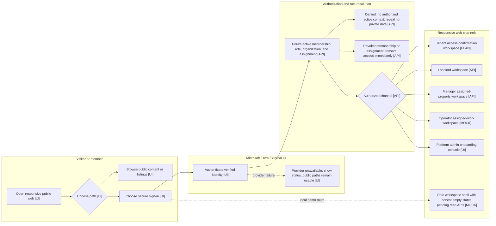
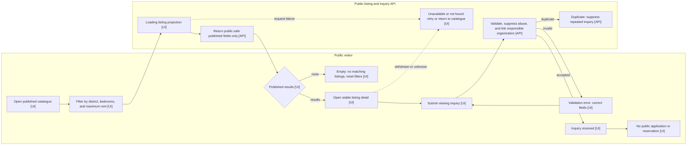
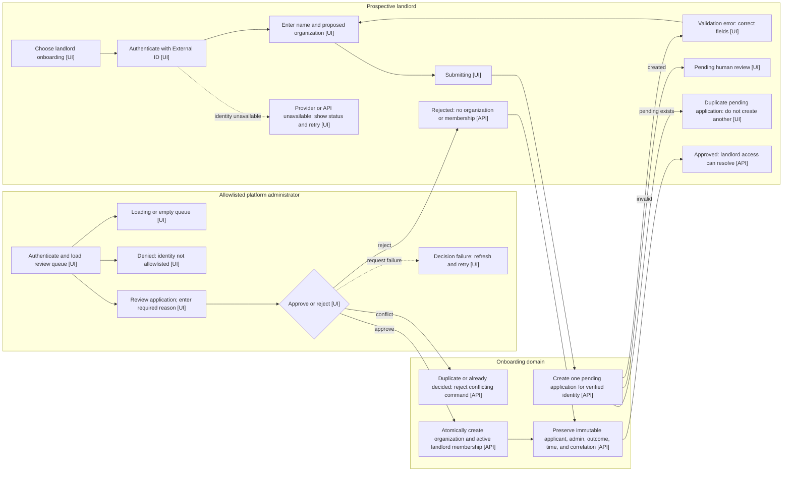
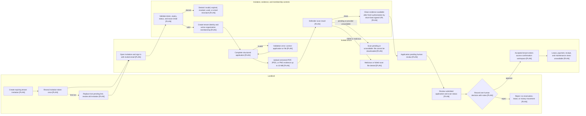
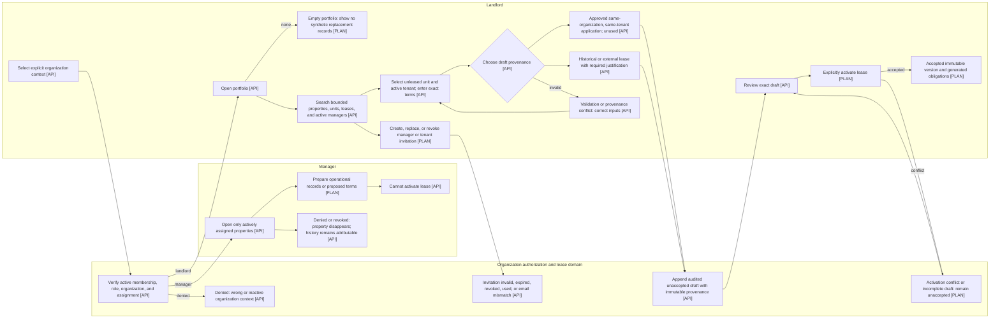
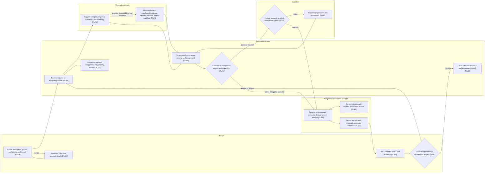

# Product Role Use Cases

**Status:** Draft for validation  
**Scope:** Public website, tenant portal, manager portal, and landlord portal

Companion visualization: [Descriptive user flow diagrams](#appendix-descriptive-user-flow-diagrams).
This draft provides detailed role boundaries and requirement proposals under
the approved PRD; it requires product-owner validation before it becomes
authority.

## Role boundaries

| Experience      | Primary user                                      | Purpose                                                                          | Operating boundary                                                             |
| --------------- | ------------------------------------------------- | -------------------------------------------------------------------------------- | ------------------------------------------------------------------------------ |
| Public website  | Visitor or prospective tenant                     | Discover published rentals, request a visit, contact the team, and reach sign-in | No applications, automatic reservations, or private records                    |
| Tenant portal   | Tenant or co-tenant                               | Understand and manage the user's own tenancy                                     | Access is limited to the user's accepted leases and related records            |
| Manager portal  | Authorized property manager                       | Perform delegated daily property operations                                      | Cannot change ownership, organization security, or reserved landlord decisions |
| Landlord portal | Property owner or authorized owner representative | Control the portfolio, approve sensitive actions, and review performance         | Human approval remains required for legal and financial decisions              |

In the product, **admin portal** means the manager portal used for property
administration. Platform administration is an internal support function, not a
customer-facing product portal. Internal administrators must not browse customer
records by default; any support access requires explicit authorization and an
audit trail.

## User scenarios

### Public visitor discovers and enters KEYFORTA (P1)

A visitor can understand what KEYFORTA does, which audiences it serves, how
privacy and support are handled, and how to sign in or contact the support team.

**Acceptance scenarios**

1. **Given** an unauthenticated visitor, **when** the visitor opens the website,
   **then** the visitor can view the product purpose, support contact method,
   privacy information, and sign-in action without seeing private property or
   tenant data.
2. **Given** a visitor looking for a rental, **when** the visitor browses the
   catalogue, **then** only explicitly published listings are shown, without an
   exact address, internal unit identifier, occupant, lease, or payment data.
3. **Given** a mobile device on a constrained connection, **when** the visitor
   opens a public page, **then** its essential content and actions remain usable.
4. **Given** a published listing, **when** a visitor submits valid contact
   details, **then** a visit inquiry is recorded without creating an application,
   reservation, or tenant-selection decision.

### Tenant understands and manages a tenancy (P1)

An authenticated tenant can see the exact accepted lease, obligations, balance,
payments, receipts, documents, messages, and maintenance activity that belong to
that tenant.

**Acceptance scenarios**

1. **Given** an authenticated tenant with an active lease, **when** the tenant
   opens the portal, **then** the current amount due, due date, recent payments,
   and maintenance status are visible.
2. **Given** a tenant reviewing a charge, **when** the tenant opens its details,
   **then** the contractual rent, concession, refundable guarantee, advance rent,
   allocations, and source lease version are distinguishable.
3. **Given** a tenant payment, **when** it is posted, **then** the tenant can view
   the numbered receipt and an updated statement matching the landlord record.
4. **Given** a maintenance problem, **when** the tenant submits its description,
   photos, and access preference, **then** the tenant can track progress and
   confirm or dispute completion.
5. **Given** a guessed identifier for another tenant or organization, **when**
   the tenant requests that record, **then** access is denied without revealing
   whether the record exists.

### Manager operates assigned properties (P1)

An authenticated manager can perform daily administration for properties the
landlord has assigned, while sensitive decisions remain under landlord control.
Each property contains one or more units and has exactly one active assigned
listing manager.

**Acceptance scenarios**

1. **Given** a manager assigned to a property, **when** the manager opens the
   portal, **then** the manager can see its units, occupants, lease milestones,
   balances, open maintenance work, and recent activity.
2. **Given** proposed tenant and lease terms, **when** the manager prepares the
   file, **then** the manager cannot create or activate the contractual lease;
   that command remains a landlord decision.
3. **Given** payment evidence, **when** the manager records it, **then** duplicate
   detection, allocation, receipt, and audit controls apply before posting.
4. **Given** a maintenance request, **when** the manager triages and assigns it,
   **then** urgency, assignee, approval, evidence, and status changes are retained.
5. **Given** an unassigned property or another organization, **when** the manager
   requests or modifies its data, **then** access is denied.
6. **Given** an assignment is revoked, **when** the manager next reads the
   portfolio, **then** the property, its units, and its leases are immediately
   absent while prior audit records remain attributable.
7. **Given** an active assignment to a property, **when** its manager creates,
  updates, publishes, or withdraws a unit listing, **then** the operation is
  authorized for that property only and retains correlated audit evidence.

### Landlord controls and reviews the portfolio (P1)

An authenticated landlord can configure the portfolio, approve high-impact
actions, monitor financial and operational performance, and obtain auditable
records.

**Acceptance scenarios**

1. **Given** an authorized landlord, **when** the landlord manages the portfolio,
  **then** multiple properties and their units can be created, updated,
  archived, and assigned to listing managers with an audit history.
2. **Given** an active landlord or manager membership in the same organization,
  **when** the landlord assigns that person, including themselves, as a
  property's listing manager, **then** the command replaces any prior active
  assignment, is correlated and audited, and cannot target another
  organization.
3. **Given** a large manager and property directory, **when** the landlord
   manages access, **then** server-side search, filters, manager selection, and
   bounded pages avoid loading or rendering the full manager-by-property matrix.
4. **Given** a portfolio containing thousands of units, **when** the landlord or
   manager browses housing, **then** server-side search, lease filters, and
   bounded pages return only the authorized slice requested.
5. **Given** a complete lease draft, **when** the landlord approves activation,
   **then** the exact accepted version and its generated obligations are preserved.
6. **Given** an unleased unit and an active tenant in the same organization,
   **when** the landlord enters the contractual rent and start date, **then** an
   audited, unaccepted draft is created without requiring technical identifiers.
7. **Given** posted financial activity, **when** the landlord reviews or corrects
   it, **then** statements reconcile and corrections use reversal and replacement
   rather than editing posted records.
8. **Given** portfolio activity, **when** the landlord opens the dashboard, **then**
   occupancy, contractual rent, collected and outstanding amounts, deposits,
   lease events, and maintenance work are traceable to source records.
9. **Given** a manager-proposed sensitive action, **when** landlord approval is
   required, **then** no lease activation, refund, pricing change, legal notice,
   or money movement occurs without an authorized human decision.

Current delivery evidence is summarized in
[`IMPLEMENTATION_STATUS.md`](./IMPLEMENTATION_STATUS.md). This draft retains
role requirements and does not establish implementation status.

## Functional requirements

### Public website

- **REQ-001:** The public website must explain KEYFORTA's value for landlords,
  managers, and tenants in French-first language.
- **REQ-002:** The public website must provide contact, privacy, security, and
  sign-in paths without exposing organization-owned data.
- **REQ-003 v2:** The public website must list only units explicitly approved for
  publication and expose only approved marketing fields. Public visibility
  requires an approved property verification, a published property, a published
  and available unit, and an active published listing. A property contains one
  or more units and has at most one active assigned listing manager. Only that
  manager may create,
  update, publish, or withdraw its unit listings. A landlord may manage listings
  only after assigning themselves as that property's manager.
- **REQ-024:** Visitors must be able to filter published listings by district,
  minimum bedrooms, and maximum monthly rent.
- **REQ-025:** A published listing must have a stable public detail page with
  approved images, approximate location, characteristics, exact currency and
  minor-unit rent, availability, and amenities.
- **REQ-026:** A visitor must be able to request a visit without creating a
  rental application, reservation, or autonomous selection decision.
- **REQ-027:** Visit inquiries must be validated, protected against automated
  abuse and duplicate submission, and linked internally to the responsible
  organization without exposing that relationship publicly.

Implementation evidence for these requirements is maintained in
[`IMPLEMENTATION_STATUS.md`](./IMPLEMENTATION_STATUS.md). The protected publication operation must
preserve the publisher, organization, correlation ID, and publication or
withdrawal time as immutable audit evidence.

### Tenant portal

- **REQ-004:** A tenant must see only leases, charges, payments, receipts,
  documents, communications, and maintenance requests connected to that user's
  authorized tenancy.
- **REQ-005:** The portal must present the accepted lease version and separate
  rent, concessions, refundable guarantees, advances, and other charges.
- **REQ-006:** A tenant must be able to view and download matching statements,
  receipts, and authorized documents.
- **REQ-007:** A tenant must be able to submit and track maintenance requests,
  evidence, access preferences, and completion feedback.
- **REQ-008:** A tenant must be able to manage notification preferences and view
  the communication history related to the tenancy.

### Manager portal

- **REQ-009:** A manager must see an operational dashboard only for assigned
  properties in authorized organizations.
- **REQ-010:** A manager must be able to maintain property, unit, tenant,
  occupancy, unit listing, and draft lease records within delegated authority.
- **REQ-011:** A manager must be able to record payment evidence and execute
  approved payment workflows with idempotency, receipts, allocations, and audit.
- **REQ-012:** A manager must be able to triage, assign, update, and close
  maintenance work while preserving status history and evidence.
- **REQ-013:** A manager must be able to prepare communications, documents, and
  reports, but reserved actions must wait for landlord approval.

### Landlord portal

- **REQ-014:** A landlord must be able to configure the organization's portfolio,
  units, delegated managers, and role assignments, including assigning
  themselves or another eligible member as a property's listing manager.
- **REQ-015:** A landlord must approve lease activation and retain every accepted
  lease version, acknowledgment, and supporting document.
- **REQ-016:** A landlord must be able to review charges, payments, allocations,
  guarantees, receipts, arrears, and reconciled statements without editing posted
  financial history.
- **REQ-017:** A landlord must be able to approve or reject sensitive proposals,
  including refunds, pricing changes, notices, and exceptional maintenance spend.
- **REQ-018:** A landlord must be able to export authorized portfolio, tenant,
  financial, maintenance, document, and audit records.

### Shared controls

- **REQ-019:** Every authenticated request must derive organization and resource
  access from verified identity, active membership, role, and assignment rather
  than trusting client-supplied identifiers.
- **REQ-020:** Every high-impact action must record actor, organization, time,
  target, outcome, and correlation identifier.
- **REQ-021:** Money must use exact currency and minor-unit values; posted
  transactions must be corrected by linked reversal and replacement.
- **REQ-022:** AI assistance must be read-only by default, cite authorized source
  records, abstain when evidence is missing, and never become required for core
  workflows.
- **REQ-023:** All four experiences must remain usable on mobile devices and
  constrained connections, with French as the initial interface language.

### Landlord onboarding and platform administration

- **REQ-028:** A newly initialized environment must contain no demonstration or
  customer organizations, memberships, properties, units, listings, leases, or
  financial records. Required schema metadata and externally configured
  platform-administrator authorization are not customer data.
- **REQ-029:** A prospective landlord must authenticate with a verified identity
  before submitting one pending onboarding application containing their name
  and proposed organization name. Repeated submission by the same identity must
  not create multiple pending applications.
- **REQ-030:** Only a platform administrator whose verified Entra object ID is
  present in the environment allowlist may list or decide landlord onboarding
  applications. The allowlist must not be stored as seed data or grant customer
  organization access.
- **REQ-031:** Approving a pending landlord onboarding application must
  atomically create one organization and one active landlord membership for the
  applicant. Rejection creates neither. Every decision must preserve the
  applicant identity, administrator identity, outcome, time, and correlation ID
  as immutable audit evidence.

## Decision authority

| Action                              | Public |       Tenant        |      Manager       | Landlord |
| ----------------------------------- | :----: | :-----------------: | :----------------: | :------: |
| View public product information     |  Yes   |         Yes         |        Yes         |   Yes    |
| View published rental listings      |  Yes   |         Yes         |        Yes         |   Yes    |
| Request a visit                     |  Yes   |         Yes         |        Yes         |   Yes    |
| View own tenancy and statement      |   No   |         Yes         | Only when assigned |   Yes    |
| Manage property and unit records    |   No   |         No          |   When delegated   |   Yes    |
| Manage unit listings                |   No   |         No          | Only when assigned | Only when self-assigned |
| Prepare a lease draft               |   No   |         No          |        Yes         |   Yes    |
| Accept own lease version            |   No   |         Yes         |         No         |    No    |
| Activate or change lease terms      |   No   |         No          |      Propose       | Approve  |
| Record payment evidence             |   No   | Submit own evidence |        Yes         |   Yes    |
| Reverse or refund a payment         |   No   |       Request       |      Propose       | Approve  |
| Submit maintenance request          |   No   |         Yes         |        Yes         |   Yes    |
| Assign maintenance work             |   No   |         No          |        Yes         |   Yes    |
| Change roles or manager assignments |   No   |         No          |         No         |   Yes    |
| Access another organization         |   No   |         No          |         No         |    No    |

## Edge cases

- A person holding roles in multiple organizations must explicitly switch
  organization context; data from those organizations must never be combined.
- A manager whose assignment or membership ends immediately loses access while
  historical actions remain attributable to that manager.
- A tenant attached to multiple leases sees each authorized tenancy but not the
  landlord's wider portfolio or another tenant's records.
- A disputed payment, maintenance completion, or lease term remains visible with
  its status and evidence; it is not silently overwritten.
- If identity, payment, messaging, or AI services are unavailable, users receive
  a clear status and can continue every unaffected core workflow.

## Success criteria

- **SC-001:** At least 90% of participating users can identify the correct portal
  and reach their primary task without assistance on their first attempt.
- **SC-002:** A tenant can find the current amount due, lease version, and latest
  receipt within two minutes.
- **SC-003:** A manager can record a payment or submit a complete maintenance
  assignment within three minutes when the required evidence is available.
- **SC-004:** A landlord can identify portfolio occupancy, outstanding rent, and
  open maintenance work within two minutes.
- **SC-005:** Authorization tests demonstrate zero cross-tenant and
  cross-organization disclosure for every protected journey.
- **SC-006:** Every payment has one traceable posting outcome, and tenant
  and landlord statements have no unexplained differences across two billing
  cycles.
- **SC-007:** Every activated lease, financial correction, sensitive approval,
  and maintenance closure has a complete human-attributable audit trail.

## Assumptions

- The product's customer-facing “admin” is the property manager, not a platform
  super-administrator.
- The public site publishes approved listings and accepts visit inquiries during
  the product; rental applications remain a future capability.
- Landlords may delegate operational work but retain ownership, role-management,
  lease-activation, legal, pricing, refund, and money-movement authority.
- Legal terminology and workflows require qualified DRC legal review before use
  with real tenants.

## Appendix: Descriptive user flow diagrams

**Authority safeguard:** This appendix is a descriptive, supporting companion.
It does not add or change requirements. This role-use-case document remains a
draft pending product-owner validation.

### User Flow Diagrams

**Status:** Descriptive companion to [Product Role Use Cases](#product-role-use-cases)
**Snapshot:** 2026-09-17

These diagrams visualize journeys and current delivery status. They do not add
or change requirements; the approved PRD and controlling contracts remain
authoritative, while `PILOT_ROLE_USE_CASES.md` is pending product-owner validation.
Mobile and desktop use the same responsive web experiences. Native applications
are out of scope.

### Status legend

- **[UI]** Implemented user interface
- **[API]** Implemented API or domain capability; a complete user interface is
  not implied
- **[MOCK]** Prototype or browser-local mock
- **[PLAN]** Planned behavior from approved product documentation

Exit nodes use the status of the behavior that owns the exit. “Provider
unavailable” means the affected provider-backed step reports a clear status;
unaffected core work continues where the approved requirements allow it.

### 1. Shared entry, authentication, role, and channel handoff

### 2. Public discovery and viewing inquiry

### 3. Prospective landlord onboarding

### 4. Invited tenant application and access confirmation

Approval does not reserve a unit or create or activate a lease. The
access-confirmation workspace is intentionally limited until tenant-scoped read
contracts and authorization tests are implemented.

### 5. Landlord portfolio, invitations, provenance, and activation

### 6. Cross-role maintenance journey

Maintenance remains a planned vertical slice. The manager and operator lanes
show only the authority and lifecycle already grounded in the approved role use
cases and product blueprint; they do not define new thresholds, statuses, or
service commitments.
