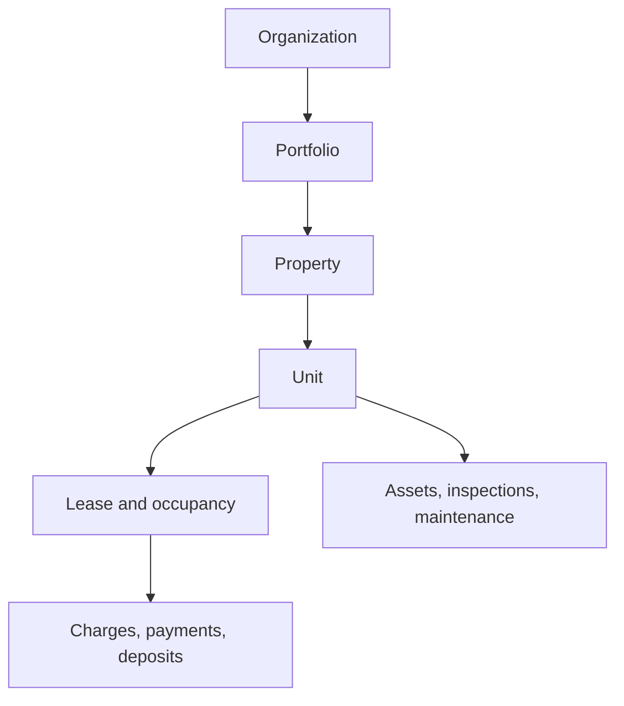
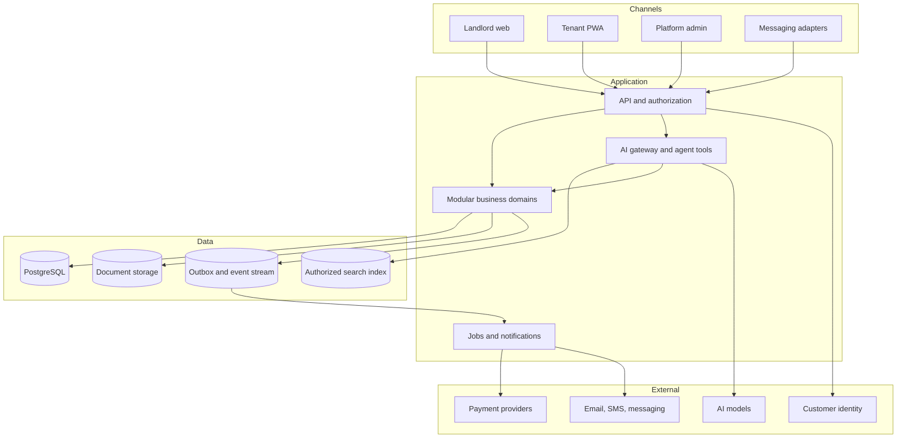

# KEYFORTA: AI-First Real Estate Platform Blueprint

**Status:** Product and solution blueprint v0.1  
**Initial pilot:** Celestin Mbuyamba's apartments in Kinshasa, Democratic Republic of the Congo  
**Long-term direction:** A professional, multi-tenant real-estate platform serving landlords, tenants, property managers, vendors, agents, buyers, and investors

## 1. Executive decision

Build **one extensible platform in stages**, beginning with a focused rental-management product. Do not build a small personal rent tracker that later has to be replaced.

The first release should be a **multi-tenant-ready modular monolith**:

- It operates initially for one landlord and a small number of apartments.
- Every business record belongs to an organization from day one, allowing other landlords to be onboarded safely later.
- Business capabilities are separated into clear modules, but deployed as one application while the product is young.
- Financial rules are deterministic and auditable.
- AI assists people through authorized tools; it does not bypass business rules or make irreversible legal or financial decisions.

This provides professional foundations without the cost and operational burden of premature microservices.

## 2. Product vision

> Give every landlord and tenant a trusted digital record of the property relationship, make routine property work conversational and automated, and grow that foundation into a complete real-estate platform.

### Initial value proposition

For the landlord:

- Know who occupies every unit, under which terms, and what is owed or paid.
- Generate correct rent schedules, receipts, reminders, statements, and documents.
- Keep all communications, maintenance, inspections, and evidence in one place.
- Ask the portfolio questions in natural language and receive answers grounded in actual records.

For the tenant:

- See lease terms, balance, payment history, receipts, and documents.
- Report problems with text, voice, and photos.
- Receive timely reminders and communicate without losing the history.
- Ask questions in plain language and receive answers that cite the relevant lease, invoice, or policy.

### Long-term value proposition

The trusted property, party, document, and financial records become the foundation for listings, applications, vendor services, sales transactions, portfolio analytics, and other real-estate services.

## 3. DRC-first assumptions for v0.1

These are design assumptions to validate, not legal conclusions:

- The initial properties are in Kinshasa.
- French is the first interface language; English and Lingala are planned. The data model supports additional languages.
- Both USD and CDF are supported. Every financial obligation and transaction retains its original currency; exchange-rate conversions are reported separately and never overwrite the source amount.
- The main experience is a low-bandwidth mobile-first progressive web app, with a desktop view for landlords.
- Cash, bank transfer, and mobile-money payments can all be recorded. Automated payment integrations come after the manual recording and reconciliation workflow is reliable.
- Lease, deposit, notice, privacy, identity-verification, and electronic-signature terms must be validated by qualified DRC counsel before commercial launch.
- Messaging integrations are replaceable adapters. The core system must work even if a particular messaging or payment provider changes.

## 4. Product boundaries

### Pilot MVP: must include

1. **Accounts and roles**
   - Platform administrator
   - Landlord/owner
   - Property manager
   - Tenant
   - Accountant or finance viewer
   - Maintenance worker/vendor, with limited access

2. **Property registry**
  - Organization, portfolio, property, and unit
   - Unit type, rooms, amenities, condition, photos, meter identifiers, and occupancy status
   - Ownership and management relationships effective over time
   - Controlled public listing projection with approved photos, approximate
     location, rent, availability, and visit inquiries

3. **People and relationships**
   - A reusable Party record for a person or organization
   - Tenant, co-tenant, guarantor, owner, manager, vendor, and emergency-contact roles
   - Contact preferences, language, consent, and verified identifiers

4. **Lease and occupancy**
   - Draft, review, approve, activate, renew, terminate, and archive
   - Multiple tenants and guarantors on one lease
   - Versioned terms and signed-document evidence
   - Rent, deposit/guarantee, discount, due date, grace period, late-fee rule, and renewal terms
   - Move-in and move-out inspections

5. **Billing, ledger, and payments**
   - Scheduled charges and one-time charges
   - Concessions/discounts as separate records rather than hidden changes to rent
   - Deposit obligations and movements separated from rental income
   - Invoice/statement generation
   - Cash, bank, mobile-money, and adjustment transactions
   - Allocation of one payment across one or more charges
   - Numbered receipts, reversals, refunds, and complete audit history
   - Arrears aging and collection status

6. **Maintenance and inspections**
   - Tenant request with text, voice transcript, photos, and desired access times
   - Triage, priority, assignment, estimate, approval, work, evidence, completion, and tenant confirmation
   - Property assets such as plumbing, electrical equipment, doors, or appliances
   - Cost and vendor history

7. **Documents and communication**
   - Lease, addendum, notice, receipt, inspection report, identity document, and property document
   - Document versions, access permissions, retention status, and signatures/acknowledgments
   - In-app and email notifications initially; SMS or messaging channels through adapters later
   - Immutable communication timeline connected to the relevant lease, charge, payment, or work order

8. **Operational dashboard and reports**
   - Occupancy and vacancy
   - Rent billed, collected, outstanding, and overdue
   - Deposits held or due
   - Upcoming lease events
   - Open maintenance by age and priority
   - Downloadable tenant statement and property cash summary

9. **AI assistant with controls**
   - Landlord copilot
   - Tenant concierge
   - Document extraction and summarization
   - Maintenance triage assistant
   - Drafting and reminder assistance
   - Evaluation, audit, evidence, and approval controls

### Deliberately excluded from the pilot

- Rental applications, automated reservations, and marketplace aggregation
- Automated tenant acceptance or rejection
- Autonomous rent pricing
- Autonomous eviction, legal notices, refunds, or movement of funds
- Full company accounting, payroll, or tax filing
- Property sales, mortgage origination, investment syndication, or construction management
- Microservices, native mobile apps, and custom machine-learning model training

These are future capabilities, not pilot dependencies.

## 5. Configuring the initial apartments

The system must express the current rules as data, not code.

| Unit example                                 | Base monthly rent | First two lease months | Refundable guarantee | Advance rent | Due at signing |
| -------------------------------------------- | ----------------: | ---------------------: | -------------------: | -----------: | -------------: |
| Two bedrooms, living room, kitchen, bathroom |              $400 |             $360/month |               $1,200 |         $360 |         $1,560 |
| Two bedrooms, living room, kitchen, bathroom |              $350 |             $315/month |               $1,050 |         $315 |         $1,365 |
| One bedroom, living room, kitchen, bathroom  |              $250 |             $225/month |                 $750 |         $225 |           $975 |

The approved pilot signing rule is three refundable guarantee months plus one
advance-rent month. The advance satisfies the first scheduled installment and
therefore receives the first-month 10% concession. DRC counsel must still
confirm the terminology and contract treatment before real tenant use.

Recommended representation:

- `BaseRent`: recurring monthly charge.
- `Concession`: 10% of base rent for lease periods 1 and 2.
- `RefundableGuaranteeRule`: three times contractual base rent, recorded as a
  distinct refundable obligation.
- `AdvanceRentRule`: one scheduled period allocated to period one after its
  approved concession.
- `ChargeSchedule`: the dated obligations generated from the approved lease terms.
- `LedgerEntry`: the posted financial truth; posted entries are reversed, never silently edited.

This preserves the true contractual rent while showing the temporary discount transparently.

## 6. Core user journeys

### A. Landlord creates and activates a lease

1. Select an available unit.
2. Add or invite the tenant and any co-tenant or guarantor.
3. Choose a lease template and enter terms.
4. The system calculates rent, discounts, deposit/advance, due dates, and total obligations.
5. The AI assistant checks for missing or contradictory information and explains the schedule.
6. The landlord and tenant review the exact terms.
7. Authorized people sign or acknowledge.
8. The system activates the lease, generates the schedule, and creates the move-in checklist.

### B. Tenant pays

1. The tenant sees the amount due and payment instructions.
2. A payment is submitted through an integration or recorded by an authorized user.
3. The system deduplicates, validates, and posts the transaction.
4. Allocation rules apply it to the correct obligations.
5. A numbered receipt and updated statement are produced.
6. Both sides see the same ledger balance.

### C. Tenant reports maintenance

1. The tenant describes the issue and can add voice or photos.
2. AI proposes category, urgency, troubleshooting questions, and a concise summary.
3. Deterministic safety rules escalate hazards; a human confirms priority and assignment.
4. The vendor records arrival, work, materials, cost, and evidence.
5. The tenant confirms resolution or reopens the issue.
6. The property and asset history update.

### D. Landlord asks the system

Examples:

- “Who has not paid September rent?”
- “Show the calculation for Unit A’s balance.”
- “Which leases expire within 60 days?”
- “Draft a courteous French reminder for tenants seven days overdue.”
- “Summarize recurring plumbing issues at this property.”

Every answer involving business facts must cite the underlying records and respect the requesting user’s permissions.

## 7. What “AI-first” means

AI-first does not mean that every feature uses a language model. It means that users can accomplish work conversationally, while deterministic services remain the authority for money, permissions, dates, and contract state.

### AI product principles

1. **Conversation is an interface, not the database.** The assistant calls authorized domain APIs; it never writes directly to production tables.
2. **Business facts come from tools.** Balances, due dates, parties, and lease status are calculated by deterministic services.
3. **Evidence accompanies answers.** The assistant links its answer to the relevant lease clause, invoice, receipt, work order, or policy.
4. **High-impact actions require confirmation.** A person approves lease changes, financial postings, notices, tenant decisions, and sensitive data disclosure.
5. **Tenant isolation applies to AI.** Retrieval, memory, prompts, logs, vector indexes, and tool execution are scoped to the organization and user.
6. **Models are replaceable.** A model gateway separates product workflows from one model vendor or version.
7. **Failure is safe.** If AI is unavailable or uncertain, ordinary forms and deterministic workflows still work.
8. **Quality is measured.** Maintain test sets for factual accuracy, permission enforcement, multilingual quality, extraction, tool selection, refusal behavior, cost, and latency.

### AI capability map

| Capability             | Pilot behavior                                                               | Control level                                   |
| ---------------------- | ---------------------------------------------------------------------------- | ----------------------------------------------- |
| Tenant concierge       | Explains balance, due dates, lease clauses, receipts, and maintenance status | Read-only; grounded citations                   |
| Landlord copilot       | Portfolio questions, summaries, drafts, and guided actions                   | Read-only by default; confirmation for changes  |
| Lease assistant        | Extracts terms, checks completeness, drafts clauses and schedules            | Human/legal review before activation            |
| Payment assistant      | Suggests matches for unidentified transfers and explains balances            | Human approval before posting uncertain matches |
| Collections assistant  | Drafts reminders based on ledger status and communication preference         | Human-approved templates and escalation policy  |
| Maintenance assistant  | Classifies requests, requests missing details, and suggests urgency          | Safety rules plus human confirmation            |
| Document intelligence  | Extracts structured fields from leases, IDs, receipts, and invoices          | Confidence thresholds and review queue          |
| Portfolio intelligence | Finds trends and answers natural-language analytics questions                | Read-only and source-linked                     |

### Actions AI must not take autonomously

- Accept or reject a tenant
- Determine a protected or sensitive characteristic
- Make an eviction decision or claim legal compliance
- Change rent or a signed lease
- Post an uncertain payment, issue a refund, or transfer funds
- Reveal one landlord’s or tenant’s data to another
- Treat an unverified model statement as a business record

Microsoft’s current responsible-AI guidance emphasizes lifecycle risk discovery, protection, governance, observability, and evaluations. Those controls should be implemented as product requirements, not postponed until launch.

## 8. Domain model

### Structural hierarchy



### Principal entities

| Domain               | Key entities                                                                                            |
| -------------------- | ------------------------------------------------------------------------------------------------------- |
| Identity and tenancy | Organization, OrganizationMember, User, Role, Permission, Invitation                                    |
| Parties              | Party, Person, Company, ContactMethod, Address, PartyRole, Consent, Verification                        |
| Property             | Portfolio, Property, Unit, Amenity, Asset, Meter, Media, OwnershipInterest, ManagementMandate           |
| Marketing            | Listing, ListingChannel, Inquiry, Viewing, Application, ApplicationDocument                             |
| Lease                | Lease, LeaseParty, LeaseVersion, Term, Occupancy, Renewal, Termination, Handover                        |
| Pricing              | RentRule, Concession, FeeRule, DepositRule, ChargeSchedule                                              |
| Finance              | Charge, Invoice, Account, LedgerEntry, Payment, PaymentAllocation, Refund, Receipt, Reconciliation      |
| Operations           | MaintenanceRequest, WorkOrder, Assignment, Vendor, Estimate, Approval, Inspection, Expense              |
| Content              | Document, DocumentVersion, Signature, Template, Conversation, Message, Notification                     |
| Governance           | AuditEvent, AccessEvent, RetentionPolicy, ExportRequest, Incident                                       |
| AI                   | AIInteraction, ToolCall, EvidenceReference, Recommendation, HumanDecision, Feedback, EvaluationResult   |

### Non-negotiable modeling rules

- Use globally unique, opaque identifiers; never expose sequential database IDs as authorization controls.
- Every tenant-owned record includes `organization_id` and is protected in application authorization and at the data layer.
- Effective-dated records preserve how ownership, management, prices, and occupancy changed over time.
- Money uses decimal/minor-unit safe storage plus ISO currency; never floating point.
- Store timestamps in UTC and retain the property’s local time zone for display and contractual deadlines.
- Documents and terms are versioned. Activation and signatures point to an exact version.
- Posted financial entries are immutable. Corrections use linked reversal and replacement entries.
- Audits capture actor, organization, action, target, timestamp, origin, correlation ID, and relevant before/after metadata.
- AI output is not a source-of-truth record until accepted through a normal domain command.

## 9. Recommended solution architecture

### Architecture style

Use a **modular monolith with asynchronous workers** for the pilot and early commercial product.



### Recommended Microsoft-oriented implementation

The accepted initial product implementation is:

- **Frontend:** Next.js/React progressive web app, responsive and installable.
- **Backend:** Fastify modular monolith with shared Zod contracts and
  framework-independent TypeScript domain packages.
- **Database:** Managed PostgreSQL with organization-scoped data and row-level security as defense in depth.
- **Files:** Azure Blob Storage with private containers, short-lived access, malware scanning, and version metadata.
- **Identity:** Microsoft Entra External ID for customer sign-up/sign-in; application roles and organization memberships remain in the product domain.
- **Runtime:** Azure Container Apps with public web and API ingress and a
  no-ingress worker.
- **Async work:** Transactional outbox plus Azure Service Bus and idempotent
  background consumers.
- **Secrets:** Managed identities and Azure Key Vault; no production secrets in code, prompts, logs, or client bundles.
- **Observability:** Structured logs, metrics, traces, correlation IDs, business events, alerting, and an audit trail.
- **AI:** Microsoft Foundry or another approved model provider behind the application’s AI gateway; retrieval and tools remain controlled by the application.
- **Infrastructure:** Infrastructure as code and separate development, test, and production environments.

Microsoft’s Azure Architecture Center treats multitenancy as a set of explicit business and technical tradeoffs, including identity, data isolation, resource sharing, noisy-neighbor risk, cost, and governance. Entra External ID supports self-service customer sign-up, sign-in, and reset flows. PostgreSQL row-level security can default-deny access when enabled without an applicable policy. These are helpful building blocks, but application authorization and security tests remain mandatory.

### Module boundaries

Start with one deployable API but enforce dependencies:

1. Identity and organization
2. Party and relationship
3. Property and unit
4. Leasing and occupancy
5. Billing and ledger
6. Payments and reconciliation
7. Maintenance and inspection
8. Document and communication
9. Reporting
10. AI orchestration
11. Integration adapters

Modules communicate through public application commands, queries, and events—not by reaching into another module’s internal tables. Split a module into a service only when scaling, deployment independence, regulation, or team ownership provides measurable value.

## 10. Security, privacy, and trust baseline

### Access model

- Authentication proves the user identity.
- Organization membership establishes which customer account the user can enter.
- Role and contextual policies determine allowed actions and records.
- Tenant users are additionally restricted to their own leases, payments, documents, conversations, and requests.
- Vendor access is limited to assigned work, necessary property access data, and a defined time window.
- Support impersonation is disabled by default; any controlled support access is time-limited, justified, visible, and audited.

### Required controls before external landlords

- MFA for platform administrators and landlord administrators
- Strong session management and customer account recovery
- Organization isolation tests on every query and mutation path
- Encryption in transit and at rest
- Private document storage and scoped download links
- Upload validation and malware scanning
- Idempotency and verified signatures for payment webhooks
- Rate limiting, abuse monitoring, and bot protection
- Backup restore tests and incident runbooks
- Dependency and container scanning
- Central audit log protected from ordinary edits
- Data export, correction, retention, and deletion workflows
- AI prompt-injection tests, tool allowlists, output validation, and permission-aware retrieval
- Recovery and break-glass procedures

## 11. Quality attributes and initial targets

| Attribute                | Pilot target                                                                  | Commercial target                                                 |
| ------------------------ | ----------------------------------------------------------------------------- | ----------------------------------------------------------------- |
| Availability             | Best effort with monitored production environment                             | 99.9% monthly for core account functions after validation         |
| Recovery point objective | No more than 15 minutes of committed operational data                         | 15 minutes or better, based on tier                               |
| Recovery time objective  | Four hours                                                                    | One hour for core services, based on tier                         |
| Performance              | Common read/write actions feel responsive on low-bandwidth mobile connections | p95 service target defined and tested per critical journey        |
| Financial integrity      | No duplicate posting; every correction auditable                              | Same, with automated reconciliation and exception queues          |
| Isolation                | Zero cross-organization access in authorization test suite                    | Same, plus regular independent assessment                         |
| AI grounding             | Source-linked answers for lease and finance facts                             | Measured by task-specific evaluation sets and production feedback |
| Accessibility            | Keyboard and screen-reader review of critical journeys                        | Formal acceptance criteria across supported experiences           |

Targets should become service-level objectives only after real pilot measurements establish realistic thresholds.

## 12. Delivery roadmap and gates

### Phase 0 — Product truth and risk definition

Deliver:

- Confirmed terminology for deposit, guarantee, advance rent, fee, and refundability
- Inventory of properties, units, current leases, tenants, balances, and documents
- Three end-to-end pilot scenarios with expected calculations
- Legal and privacy questions register
- Product principles, context map, threat model, and first ADRs
- Clickable UX prototype for landlord and tenant critical journeys

Exit gate: All sample rent schedules can be calculated manually and agreed upon; no unresolved ambiguity changes the financial ledger design.

### Phase 1 — Initial apartment operations

Deliver:

- Secure accounts, roles, property/unit registry, tenant records, leases, billing schedule, ledger, manual payments, receipts, statements, reminders, maintenance, documents, and audit
- French-first low-bandwidth PWA
- Read-only grounded assistant for landlord and tenant
- Data import and export
- Backup, monitoring, incident, and support basics

Exit gate: Run at least two complete billing cycles with all pilot apartments; reconcile every charge and payment; resolve defects; confirm tenants can understand their statements.

### Phase 2 — Controlled landlord beta

Deliver:

- Self-service organization onboarding and invitation
- Strong tenant isolation and automated security tests
- Configurable branding, templates, roles, rules, and subscription plans
- Payment and messaging adapters
- Vendor workflow and approval controls
- AI drafting, extraction, triage, evaluation, and human-confirmation flow
- Product support, usage analytics, privacy operations, and commercial terms

Exit gate: A small group of external landlords completes onboarding and recurring operations without developer intervention; support load and unit economics are measured.

### Phase 3 — Rental marketplace

Deliver only after supply and operations are proven:

- Public listings and search
- Inquiry, viewing, application, consent-based verification, and offer workflow
- Lead/source attribution and conversion analytics
- Marketplace trust, moderation, dispute, and fraud workflows

Exit gate: Measurable improvement in vacancy duration, qualified inquiries, or lease conversion without unacceptable fraud or support cost.

### Phase 4 — Broader real estate

Potential bounded products:

- Brokerage CRM and property sales
- Buyer and seller workspaces
- Agent mandates, offers, due diligence, and closing checklists
- Facilities and commercial-property management
- Owner/investor reporting
- Property valuation assistance using validated data
- Developer/new-construction inventory and handover

Each is a separate product hypothesis. Do not put all of them into the first roadmap.

## 13. Pilot success measures

### Operational

- Percentage of occupied units with an active digital lease
- Percentage of scheduled charges generated without correction
- Collection rate by due date and by 30 days
- Unidentified or unreconciled payments
- Time to produce a tenant statement or receipt
- Maintenance first-response and resolution times
- Lease expirations acted upon before deadline

### Trust and product quality

- Disputed balances and cause
- Duplicate financial postings
- Cross-user or cross-organization authorization failures
- Tenant understanding of statement and lease schedule
- Support requests per occupied unit
- Successful backup restoration and incident drills

### AI

- Factual accuracy on a versioned evaluation set
- Percentage of factual answers with valid evidence references
- Unauthorized data/tool access attempts correctly denied
- Human correction rate by use case
- Draft acceptance rate
- Escalation and safe-fallback rate
- Cost and latency per completed task

The product should not optimize “number of AI conversations.” It should optimize correct task completion, trust, time saved, and business outcomes.

## 14. First delivery backlog

| Epic                            | Outcome                                                          | Representative acceptance test                                                          |
| ------------------------------- | ---------------------------------------------------------------- | --------------------------------------------------------------------------------------- |
| E1 Organization and identity    | Correct users enter the correct organization and role            | A tenant cannot access another tenant or landlord’s records even with a guessed ID      |
| E2 Property and parties         | All pilot units and relationships have a reliable digital record | Occupancy, ownership, and contacts can be reconstructed for any effective date          |
| E3 Lease and rules              | Versioned leases produce correct obligations                     | The three pilot price/discount/deposit examples match approved calculations             |
| E4 Ledger and payments          | Both sides share an auditable balance                            | A duplicate callback cannot create a second payment; reversal preserves history         |
| E5 Documents and communications | Evidence is findable and linked to the business event            | A receipt, reminder, and signed lease version are traceable from the tenant timeline    |
| E6 Maintenance                  | Requests move through a controlled lifecycle                     | Tenant, manager, and vendor see only their authorized information and actions           |
| E7 Read-only AI                 | Users can ask questions safely                                   | Every lease/finance answer cites authorized records or explicitly says it cannot answer |
| E8 Operations and quality       | The pilot can run and recover professionally                     | Monitoring detects a failure and a tested restore meets the pilot recovery target       |

## 15. Documentation-as-code foundation

Recommended repository structure:

```text
myhouse-platform/
  apps/
    web/
    api/
    worker/
  docs/
    product/
      VISION.md
      PRD.md
      PILOT-SCENARIOS.md
    architecture/
      CONTEXT.md
      DOMAIN-MODEL.md
      DATA-MODEL.md
      SECURITY.md
      INTEGRATIONS.md
      adr/
    ai/
      AI-SYSTEM-CARD.md
      TOOL-POLICY.md
      EVALUATION-PLAN.md
      evals/
    operations/
      SLOS.md
      RUNBOOKS.md
      INCIDENT-RESPONSE.md
  infra/
  tests/
    acceptance/
    authorization/
    integration/
```

### Definition of done for every capability

- User story and acceptance criteria approved
- Domain rule and permissions documented
- Automated tests include happy path, error path, authorization, and organization isolation
- Audit behavior verified
- Accessibility and low-bandwidth behavior reviewed
- Telemetry and support diagnostics included
- Migration and rollback considered
- Relevant threat-model item resolved
- AI-enabled capabilities include evaluation cases, evidence rules, safe fallback, and human approval policy
- Documentation updated in the same change

## 16. Decisions required before implementation

| Decision                          | Why it matters                                                | Recommended starting position                                                                                                                                     |
| --------------------------------- | ------------------------------------------------------------- | ----------------------------------------------------------------------------------------------------------------------------------------------------------------- |
| Signing obligation classification | Determines accounting, refund, schedule, and contract wording | Selected for pilot: three base-rent months as refundable guarantee plus the discounted first installment as advance rent; confirm contract treatment with counsel |
| Primary payer channels            | Shapes receipts, reconciliation, and integrations             | Support manual cash/bank/mobile records first; integrate the highest-volume rail second                                                                           |
| Tenant sign-in method             | Affects inclusion, recovery, cost, and fraud                  | Phone or email one-time code with secure recovery; validate local usability                                                                                       |
| Messaging channel                 | Determines notification reliability and consent               | In-app plus email first; add SMS/messaging through adapters based on tenant evidence                                                                              |
| Legal documents and signatures    | Affects enforceability and evidence                           | Versioned templates and acknowledgment first; counsel validates electronic-signature path                                                                         |
| SaaS pricing                      | Determines organization, subscription, and limits model       | Defer price; measure support and infrastructure cost per active unit during pilot                                                                                 |
| Public product name               | Must remain credible beyond apartments and DRC                | Use “KEYFORTA” as the public product name; preserve existing technical identifiers until a deliberate migration is approved                                       |

## 17. Immediate next actions

1. Create the pilot property/unit inventory and assign stable unit codes.
2. Confirm with DRC counsel the selected three-month refundable guarantee plus one advance-rent structure and its contract wording.
3. Gather the current lease/contract, receipt, payment, reminder, and inspection examples.
4. Write three expected payment schedules, including late, partial, overpayment, refund, and early-termination cases.
5. Interview one landlord besides the owner and at least two prospective tenants to test terminology and workflow.
6. Turn the MVP scope into a PRD and acceptance-test pack.
7. Produce two clickable prototypes: landlord creates a lease; tenant views balance and submits maintenance.
8. Record ADR-001 for modular monolith and ADR-002 for tenant/data isolation.
9. Build a thin vertical slice: sign in → unit → lease terms → charge schedule → payment → receipt → grounded AI explanation.
10. Run the vertical slice with synthetic data before importing real identity, lease, or payment documents.

## 18. Architecture references

- Microsoft, [Architect multitenant solutions on Azure](https://learn.microsoft.com/en-us/azure/architecture/guide/multitenant/overview)
- Microsoft, [Multitenancy checklist on Azure](https://learn.microsoft.com/en-us/azure/architecture/guide/multitenant/checklist)
- Microsoft, [Architectural approaches for storage and data in multitenant solutions](https://learn.microsoft.com/en-us/azure/architecture/guide/multitenant/approaches/storage-data)
- Microsoft, [Microsoft Entra External ID for external tenants](https://learn.microsoft.com/en-us/entra/external-id/customers/)
- Microsoft, [Responsible AI for Microsoft Foundry](https://learn.microsoft.com/en-us/azure/foundry/responsible-use-of-ai-overview)
- Microsoft, [Baseline Microsoft Foundry chat reference architecture](https://learn.microsoft.com/en-us/azure/architecture/ai-ml/architecture/baseline-microsoft-foundry-chat)
- PostgreSQL, [Row security policies](https://www.postgresql.org/docs/current/ddl-rowsecurity.html)

---

**Working conclusion:** The first product is a trustworthy rental operating system. The future real-estate platform grows from the same organization, party, property, document, ledger, workflow, and audit foundations. The pilot succeeds when it proves those foundations with real apartment operations—not when it accumulates the largest feature list.
