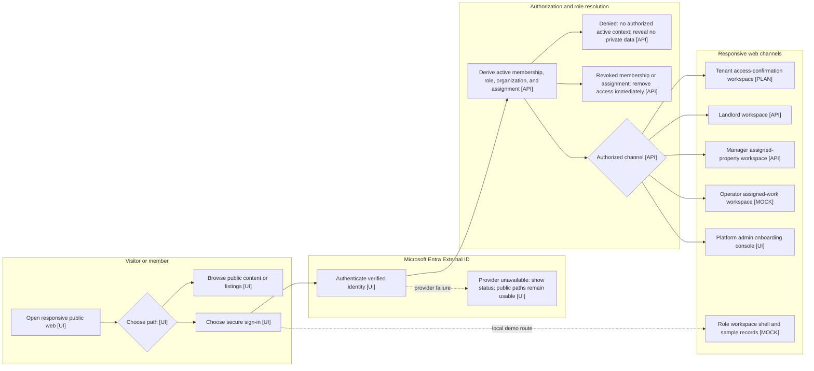
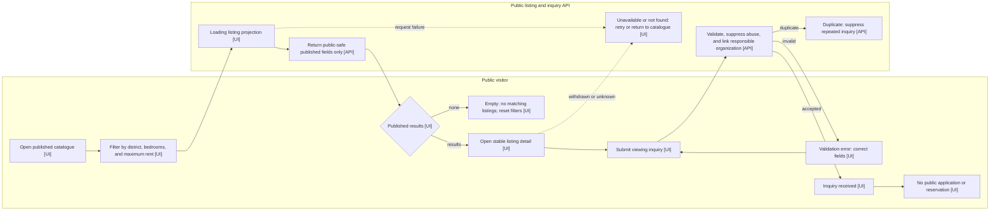
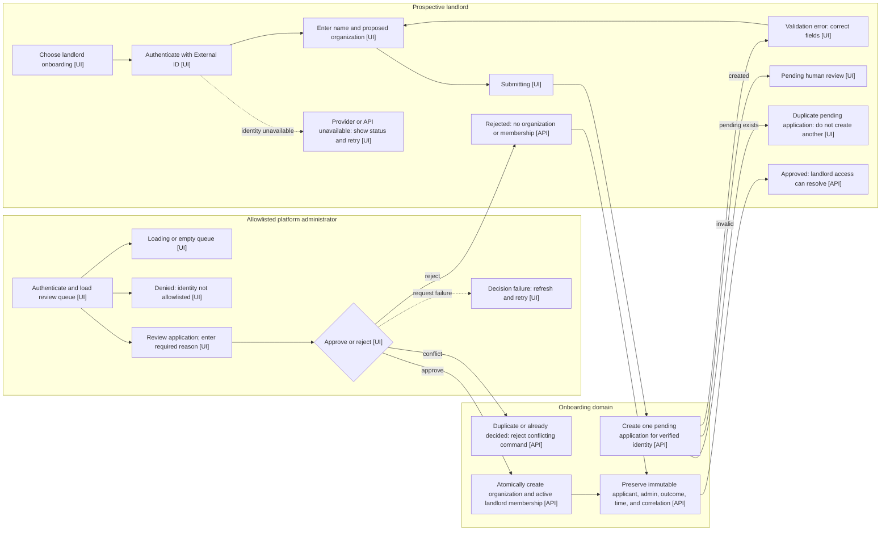
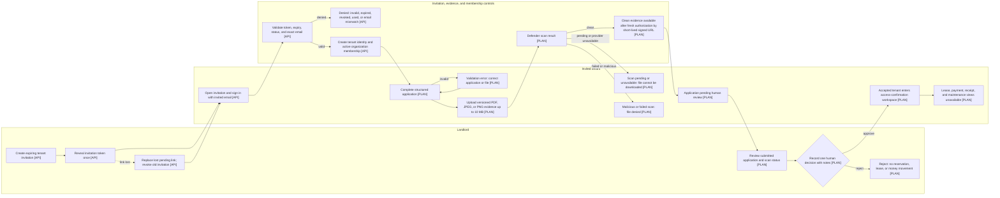
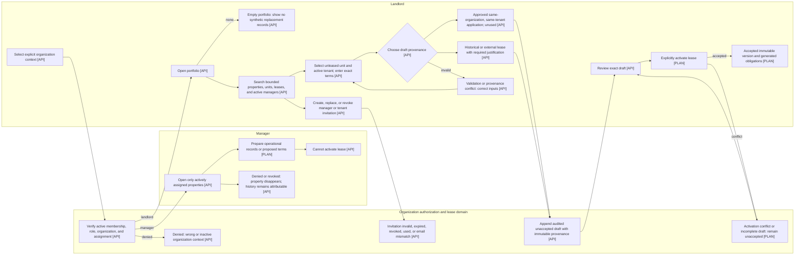
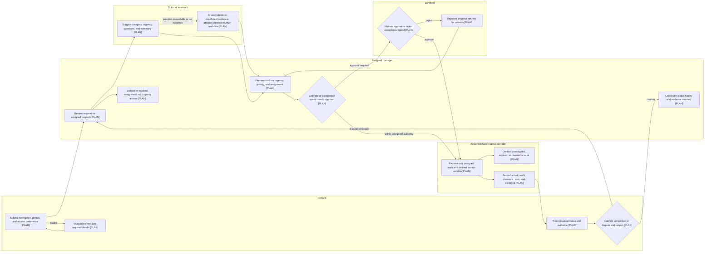

# User Flow Diagrams

**Status:** Descriptive companion to [Product Role Use Cases](PILOT_ROLE_USE_CASES.md)
**Snapshot:** 2026-09-17

These diagrams visualize approved journeys and current delivery status. They do
not add or change requirements; `PILOT_ROLE_USE_CASES.md` remains authoritative.
Mobile and desktop use the same responsive web experiences. Native applications
are out of scope.

## Status legend

- **[UI]** Implemented user interface
- **[API]** Implemented API or domain capability; a complete user interface is
  not implied
- **[MOCK]** Prototype or browser-local mock
- **[PLAN]** Planned behavior from approved product documentation

Exit nodes use the status of the behavior that owns the exit. “Provider
unavailable” means the affected provider-backed step reports a clear status;
unaffected core work continues where the approved requirements allow it.

## 1. Shared entry, authentication, role, and channel handoff

## 2. Public discovery and viewing inquiry

## 3. Prospective landlord onboarding

## 4. Invited tenant application and access confirmation

Approval does not reserve a unit or create or activate a lease. The
access-confirmation workspace is intentionally limited until tenant-scoped read
contracts and authorization tests are implemented.

## 5. Landlord portfolio, invitations, provenance, and activation

## 6. Cross-role maintenance journey

Maintenance remains a planned vertical slice. The manager and operator lanes
show only the authority and lifecycle already grounded in the approved role use
cases and product blueprint; they do not define new thresholds, statuses, or
service commitments.