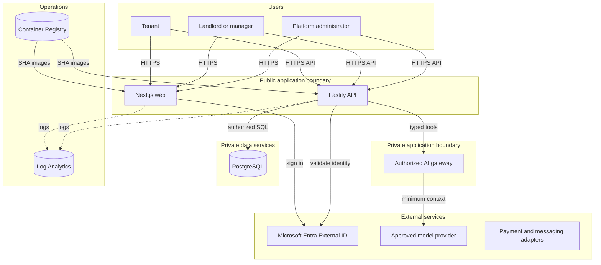
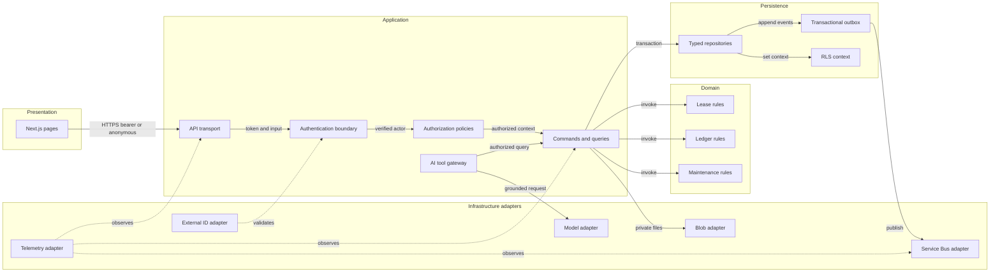
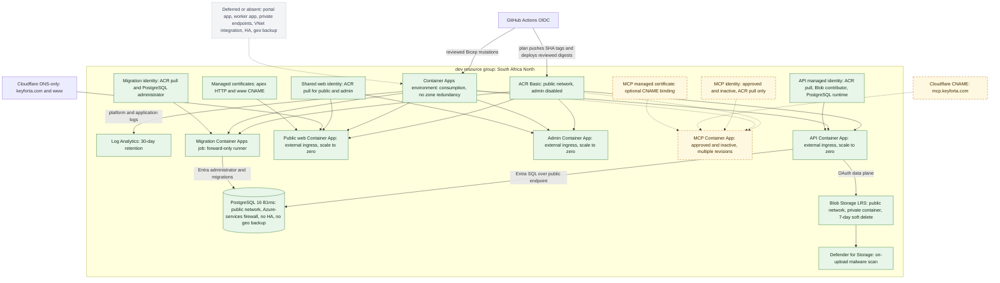

# Infrastructure

KEYFORTA pilot infrastructure targets Azure Container Apps in South Africa
North. The reviewed Bicep creates one lean `dev` stamp. Test, production, and
unused managed services are deferred until pilot evidence justifies them.

## Entry points

| File                          | Scope                                                             |
| ----------------------------- | ----------------------------------------------------------------- |
| `bicep/foundation.bicep`      | Resource group stamp, network, data, messaging, and observability |
| `bicep/migration-job.bicep`   | Private, manually triggered database migration job                |
| `bicep/seed-job.bicep`        | Dormant, manually triggered synthetic data job for `dev` only     |
| `bicep/apps.bicep`            | Public web and API, managed identities, and ACR access            |
| `bicep/database-access.bicep` | PostgreSQL Entra administrators and narrow DBA workstation access |
| `bicep/external-identity.bicep` | External ID tenant and dedicated Azure resource group           |

Foundation parameter files live in `config/`. Tenant IDs and application
registration values remain GitHub environment variables and are supplied at
deployment time. Templates compile independently before `what-if` is allowed.
The bootstrap administrator creates each environment resource group before the
resource-group-scoped foundation deployment runs.

Security CI scans Bicep with digest-pinned Checkov. The exact exclusions cover
the approved synthetic-pilot topology: public service endpoints
(`CKV_AZURE_35`, `CKV_AZURE_59`, `CKV_AZURE_139`), external plan-time Trivy
instead of ACR-native scanning and quarantine (`CKV_AZURE_163`,
`CKV_AZURE_166`), the statically unprovable generated storage name
(`CKV_AZURE_43`), and deferred geo-replication (`CKV_AZURE_206`). Checkov 3.3.17
cannot parse `mcp.bicep`, so that exact file is excluded from Checkov while
its compiler-generated ARM template is scanned separately and it remains
covered by required recursive Bicep compilation. Any broader
exclusion requires architecture and security approval.

`config/external-identity.dev.bicepparam` records the approved development
customer-identity tenant name and residency choice. South Africa (`ZA`) maps to
Microsoft Entra External ID's Europe data region. Tenant country and initial
domain choices are immutable; review `what-if` before creation. The Base A0
tenant uses External ID monthly active user billing. Deleting its Azure resource
is not a routine rollback and must not be attempted after customer identities or
application registrations exist.

The ordered SQL migrations in `postgres/migrations/` create organization,
party, effective membership, jurisdiction-policy, property, unit, lease,
tenant application evidence, payment, receipt, ledger, and audit tables and
functions. The migration Container Apps job owns schema changes; the API
identity receives only the restricted `keyforta_runtime`
database role. The API image includes the checksummed migration runner invoked
by that job. The runner validates each migration's transaction envelope, applies
its SQL and checksum ledger row in one transaction, and rejects checksum drift;
application startup never applies migrations.
The manually triggered migration job runs one replica and requires that replica
to complete, preventing concurrent migration runners inside one job execution.

Jurisdiction and legal-policy values remain unset until evidence-backed policy
activation. Migrations do not seed legal conclusions, consent, owner approval,
or counsel approval.

Synthetic deployed data is separate from migrations. SQL in
`postgres/seeds/dev/` uses stable identifiers and may be applied only by the
manual `Seed development data` workflow after typing `synthetic-dev-data`.
The seed job shares the migration identity, is idempotent, and cannot target a
non-`dev` environment. Each seed establishes its synthetic organization context
inside the runner transaction so forced row-level security remains enabled.
Never put real people, properties, identities, payment details, or production
exports in a seed.

## Image and deployment ownership

`deployments/azure/docker/` contains the active container build definitions
consumed by the gated GitHub deployment workflows. Workflow YAML controls build
context, scanning, digest publication, and deployment; these files cannot deploy
alone.

Infrastructure definitions remain in this directory. Every deployment still
requires the runtime/container contract, migration reconciliation, OIDC and
GitHub environment readiness, reviewed plan evidence, rollback evidence, and
explicit protected-environment approval in the
[release checklist](../docs/operations/RELEASE_CHECKLIST.md).

The public web container builds a standalone Next.js server and runs it as an
unprivileged Node user. The admin SPA runs as an unprivileged Nginx user on its
native Container Apps HTTPS FQDN. Browsers call the public API directly; API
CORS permits only `https://keyforta.com` and the exact admin FQDN, and does not
permit credentialed requests. Azure
managed certificates secure `keyforta.com` and `www.keyforta.com`; the `www`
host redirects permanently to the canonical apex host. Cloudflare remains the
authoritative DNS provider, but these traffic records must remain DNS-only so
Azure can issue and renew the certificates.
The deployment workflow builds the API, public-web, and admin-web Dockerfiles
under `deployments/azure/docker/` only during `operation=plan`. It publishes
BuildKit SBOM/provenance, blocks on High/Critical image findings, resolves ACR
digests, locks each SHA-tagged manifest against later writes, and stores those
references with normalized `what-if` evidence. The
deploy operation imports the reviewed digests, rebuilds nothing, rejects drift,
and passes only digest-addressed images to Bicep. The empty
`deployments/azure/workflows/` directory
is reserved and has no active deployment authority; GitHub discovers workflows
only under `.github/workflows/`.

## Deployment rules

The deployment workflow uses a SHA-bound, scope-bound plan:

| Scope        | Reconciled resources |
| ------------ | -------------------- |
| `postgres`   | PostgreSQL Entra access, migration image and job, forward migrations |
| `api`        | API image and Container App only |
| `public-web` | Public-web image and Container App only |
| `admin-web`  | Admin-web image and Container App only |
| `full`       | PostgreSQL, API, public web, admin web, and dormant development seed-job definition |

The `portal-web` and `mcp` names are reserved in the workflow but
fail before Azure sign-in because those applications do not yet have approved
container images and Azure resource definitions. A `postgres` deployment uses
the API image as its checksummed migration runner but does not deploy the API
Container App. PostgreSQL server provisioning remains part of the foundation;
the component scope does not create another server.

- Do not deploy or destroy resources without reviewed `what-if` output and
  explicit environment approval.
- Run the deployment workflow with `operation=plan` first. A fresh resource
  group produces a foundation-only artifact that can authorize only
  `operation=deploy-foundation`; run `operation=plan` again afterward. Review
  the resulting component plan for that exact SHA, then dispatch
  `operation=deploy` with the same scope and its workflow run ID. Deployment
  validates the SHA-bound, scope-bound plan artifact and is never the default
  operation.
- Expose the web application and API publicly. Restrict browser API access to
  the configured web origin and enforce authentication and authorization in the API.
- Use managed identities and Azure RBAC. Do not use registry admin credentials,
  storage keys, Service Bus connection strings, or long-lived GitHub secrets.
- Keep browser client IDs, authority, delegated scope, and platform-admin object
  IDs in the protected GitHub `dev` environment. They are identifiers, not
  credentials. Never add client secrets or access tokens to browser builds.
- Keep tenant application evidence in the private Blob container. Defender
  on-upload scanning must write Blob Index Tags; API download remains blocked
  until the result is exactly clean. Verify seven-day Blob soft delete and the
  Defender soft-delete-malicious-blobs control after deployment.
- Keep PostgreSQL password authentication disabled. The pilot permits Azure
  service traffic and relies on Entra database identities, restricted grants,
  application authorization, and RLS until private networking is justified.
- Limit approved DBA access to an Entra principal and exact workstation IP.
  Incremental deployment does not revoke existing access; explicitly delete
  both the administrator and firewall rule through a separately reviewed,
  recorded operation when access ends.
- Deploy only the `dev` environment during the private pilot.
- Prefer the narrowest scope. Scoped reconciliation adds no standing resources,
  although selected plan-time image builds and migration job executions retain
  their normal transient cost. Roll applications back to a previously reviewed
  immutable digest and revision; correct schema defects with a reviewed forward migration.
- Do not add general document storage, Key Vault, Service Bus, workers, HA, or production
  resources without a reviewed requirement and cost estimate.

## Public domain cutover

Preserve the prior Cloudflare records before changing them. Query the current
Container Apps environment immediately before cutover:

```bash
az containerapp env show --name "$APP_ENVIRONMENT" --resource-group "$RESOURCE_GROUP" \
  --query '{staticIp:properties.staticIp,verificationId:properties.customDomainConfiguration.customDomainVerificationId}'
az containerapp show --name "ca-keyforta-${ENVIRONMENT}-web" --resource-group "$RESOURCE_GROUP" \
  --query properties.configuration.ingress.fqdn -o tsv
```

The deployment workflow refuses a `public-web` deployment unless these live
values match public DNS and the existing API permits the canonical origin. The
2026-09-16 dev snapshot is:

| Type  | Name        | Value                                                                      | Proxy    |
| ----- | ----------- | -------------------------------------------------------------------------- | -------- |
| TXT   | `asuid`     | `B5783F46F1301E1DCA04EA5A00366ABCAD1672F49C0517FC29E444C4162B29CB`         | DNS only |
| TXT   | `asuid.www` | `B5783F46F1301E1DCA04EA5A00366ABCAD1672F49C0517FC29E444C4162B29CB`         | DNS only |
| A     | `@`         | `4.253.76.254`                                                             | DNS only |
| CNAME | `www`       | `ca-keyforta-dev-web.blueplant-a2bb85a6.southafricanorth.azurecontainerapps.io` | DNS only |

Do not reuse the snapshot after the Container Apps environment is recreated;
derive and review a fresh record set first.

Azure managed certificate issuance and renewal require the A and CNAME records
to resolve directly to Container Apps. Do not enable the Cloudflare proxy for
these records. If a CAA record is later added at the apex, include
`0 issue digicert.com`.

Cut over in this order:

1. Add both TXT validation records without changing traffic.
2. Merge and deploy the reviewed `api` scope so CORS permits
  `https://keyforta.com`.
3. Replace the current apex records with the DNS-only A record and add the
  DNS-only `www` CNAME.
4. Confirm public DNS, then deploy the reviewed `public-web` plan to issue and
  bind both managed certificates.
5. Verify the apex page, path-preserving `www` redirect, API allowed-origin
  response, and denied-origin behavior.

Rollback restores the preserved Cloudflare records. Remove certificate and
hostname bindings only through another reviewed Bicep plan; do not make
unrecorded Azure portal changes.

No click-created production resource is considered complete without its
equivalent reviewed infrastructure code and recovery documentation.

See
the [supporting Azure architecture](#appendix-a-supporting-logical-and-repository-defined-azure-architecture),
[Azure access and bootstrap](#appendix-b-azure-access-and-bootstrap),
[`RELEASE_CHECKLIST.md`](../docs/operations/RELEASE_CHECKLIST.md),
and [`docs/architecture/adr`](../docs/architecture/adr/) before changing this
directory.

## Appendix A. Supporting logical and repository-defined Azure architecture

This supporting appendix preserves the former logical and repository-defined
Azure architecture. Repository-defined or deployment-capable resources are not
proof of live Azure state; live state requires SHA-bound deployment evidence
and authorized Azure inspection.

### Azure Architecture

KEYFORTA uses one lean `dev` deployment stamp in South Africa North for the
private pilot. Test and production stamps and unused managed services are
deferred by ADR-0006. Reviewed Bicep and deployment workflows remain the
authority for deployed resources.

#### Application Architecture

<!-- mermaid-checked: no \n, no em-dash/en-dash, no {} in labels, subgraphs are id["label"], arrows are -->|"label"|, all subgraphs closed by end, ids unique -->



##### Technology Stack Summary

| Layer            | Technology                          | Purpose                                        |
| ---------------- | ----------------------------------- | ---------------------------------------------- |
| Web              | Next.js and React                   | French-first responsive UI                     |
| API              | Fastify and Zod                     | Validation, authorization, orchestration       |
| Domain           | Framework-free TypeScript           | Deterministic business rules                   |
| Runtime          | Azure Container Apps                | Public web and API revisions                   |
| System of record | PostgreSQL Flexible Server          | Transactional, organization-scoped records     |
| Identity         | Microsoft Entra External ID         | Customer authentication                        |
| Observability    | Log Analytics                       | Bounded platform and application logs          |
| Evidence         | Private Azure Blob Storage          | Scan-gated tenant application documents        |
| Delivery         | GitHub Actions OIDC, Bicep, and ACR | Reviewed immutable deployments                 |

##### Model Context Protocol Boundary

`apps/mcp-server` is a standalone authenticated read-only MCP service accepted
by [ADR-012](../docs/adr/ADR-012-standalone-mcp-service.md). Its separate Bicep and
`Deploy MCP` workflow can provision a Container App, managed identity, ACR pull
grant, ingress, and optional managed certificate in the pilot environment. The
capability is approved but inactive and is not part of the application `Deploy`
workflow. It never imports API implementation modules, connects to PostgreSQL,
or calls a model provider. Activation still requires the protected `dev`
environment approval, the bounded MCP budget, reviewed plan evidence, approved
client configuration, and a separate traffic switch.

##### Data Storage and External Services

PostgreSQL is authoritative for application state, application document
metadata, the transactional outbox, financial postings, authorization
memberships, and audit records. Tenant application evidence bytes use private
Blob Storage behind a scan-gated API adapter. Other document workflows,
asynchronous delivery, and AI providers remain deferred adapters. External
identity and payment providers never establish KEYFORTA authorization or
financial truth.

The implemented public-discovery backend uses managed-identity PostgreSQL
connections, security-definer listing functions, strict API projections, and a
serialized visit-inquiry command. It does not expose organization or unit IDs.
Protected-route bearer authentication and browser consumption of this API are
separate, incomplete slices.

##### Key Architectural Decisions

- Use a modular monolith with separately scalable web, API, and worker processes.
- Expose the web application and API. Restrict browser access with exact-origin
  CORS and independently authenticate and authorize every protected API request.
- Use application authorization first and PostgreSQL RLS as defense in depth.
- Keep AI behind narrow typed tools and preserve deterministic workflows when AI
  is unavailable.

#### Component Relationships

<!-- mermaid-checked: no \n, no em-dash/en-dash, no {} in labels, subgraphs are id["label"], arrows are -->|"label"|, all subgraphs closed by end, ids unique -->



##### Component Inventory

| Component               | Layer          | Responsibility                                       |
| ----------------------- | -------------- | ---------------------------------------------------- |
| Next.js pages           | Presentation   | Role-specific, mobile-first user workflows           |
| API transport           | Application    | CORS, input validation, correlation, safe projection |
| Authentication boundary | Application    | Validate issuer, audience, subject, and token state  |
| Authorization policies  | Application    | Resolve membership and record-level permissions      |
| Commands and queries    | Application    | Validate, authorize, transact, version, and audit    |
| Domain rules            | Domain         | Deterministic lease, ledger, and workflow invariants |
| Typed repositories      | Persistence    | Parameterized SQL within explicit transactions       |
| RLS context             | Persistence    | Defense-in-depth organization and actor scoping      |
| Transactional outbox    | Persistence    | Commit events atomically with domain changes         |
| Infrastructure adapters | Infrastructure | Isolate Azure and provider SDKs from domain code     |
| AI tool gateway         | Application    | Narrow authorized tools, evidence, and safe fallback |

#### Pilot Deployment

| Property             | Pilot value                  |
| -------------------- | ---------------------------- |
| Resource group       | `rg-keyforta-dev-san`        |
| App minimum replicas | Zero                         |
| PostgreSQL           | Burstable B1ms, no HA        |
| Backup retention     | 7 days                       |
| Log retention        | 30 days                      |
| Deployment           | Manual, reviewed registry digest |
| Public web origin     | `https://keyforta.com`        |
| DNS authority         | Cloudflare, DNS-only records  |

##### Repository-defined pilot topology



Solid green nodes are deployment-capable in the application workflow and
foundation Bicep. Amber dashed nodes are separately deployment-capable but
approved/inactive MCP scope. Gray dotted nodes are deferred or absent. The
diagram describes repository capability, not proof that a resource is live.

Production architecture is intentionally undefined until pilot evidence sets
availability, recovery, compliance, and budget requirements.

#### Network and Access Rules

- Allow PostgreSQL traffic from Azure services during the private pilot.
- Disable PostgreSQL password authentication and require Entra database
  identities, restricted grants, application authorization, and RLS.
- Disable ACR admin authentication. Deployment uses `AcrPush`; Container Apps
  pulls with managed identity.
- Do not lock PostgreSQL VNet, subnet, or private DNS resources in ways that
  interfere with HA or DNS updates.
- Authenticate data-plane access with managed identities and Azure RBAC.

#### Cost Controls

- Scale Container Apps to zero and use consumption capacity.
- Use burstable PostgreSQL without HA and retain backups for seven days.
- Use ACR Basic and 30-day log retention.
- Review the Azure resource inventory and cost after every deployment.
- Add a subscription budget before redeployment.

#### Security and Operational Gates

No real tenant data is imported until authentication, application authorization,
cross-organization tests, RLS tests, private document access, audit records,
backup restore, incident handling, and rollback exercises pass. No Azure resource
is deployed or destroyed without reviewed `what-if` output and explicit approval.

#### References

- [Azure Container Apps networking](https://learn.microsoft.com/azure/container-apps/networking)
- [Private PostgreSQL networking](https://learn.microsoft.com/azure/postgresql/flexible-server/concepts-networking-private)
- [PostgreSQL business continuity](https://learn.microsoft.com/azure/postgresql/flexible-server/concepts-business-continuity)
- [Azure resource locks](https://learn.microsoft.com/azure/azure-resource-manager/management/lock-resources)

## Appendix B. Azure access and bootstrap

This guide defines the one-time prerequisites for KEYFORTA deployments. It does
not authorize deployment or resource deletion. Every deployment requires a
reviewed plan, `what-if` output, and explicit environment approval.

### Selected Azure context

- Subscription: Visual Studio Enterprise Subscription
- Primary region: South Africa North
- Environment: one `dev` resource group for the private pilot
- Resource prefix: `keyforta`
- Microsoft Entra External ID tenant: `keyfortacustomers.onmicrosoft.com`

Keep subscription, tenant, and client identifiers in GitHub environment
configuration rather than source files. They are not passwords, but centralizing
them prevents accidental coupling to one tenant or subscription.

### Required GitHub configuration

Create one GitHub environment named `dev`.

Set these environment variables:

| Variable                      | Purpose                                    |
| ----------------------------- | ------------------------------------------ |
| `AZURE_CLIENT_ID`             | Environment deployment identity client ID  |
| `AZURE_TENANT_ID`             | Azure directory tenant ID                  |
| `AZURE_SUBSCRIPTION_ID`       | Target subscription ID                     |
| `POSTGRES_DBA_CLIENT_IP`      | Approved DBA workstation public IP         |
| `POSTGRES_DBA_OBJECT_ID`      | Approved DBA Entra user or group object ID |
| `POSTGRES_DBA_PRINCIPAL_NAME` | Approved DBA Entra principal name          |
| `POSTGRES_DBA_PRINCIPAL_TYPE` | `User` or `Group`; defaults to `User`      |

The deployment workflow consumes these non-secret application identifiers from
the protected `dev` environment:

| Variable                           | Purpose                                 |
| ---------------------------------- | --------------------------------------- |
| `ENTRA_AUDIENCE`                   | Expected API access-token audience      |
| `ENTRA_ISSUER`                     | External ID token issuer                |
| `ENTRA_JWKS_URI`                   | External ID signing-key endpoint        |
| `ENTRA_AUTHORITY`                  | External ID browser authority           |
| `ENTRA_API_SCOPE`                  | Delegated API scope                     |
| `PUBLIC_ENTRA_CLIENT_ID`           | Public-web SPA client ID                |
| `ADMIN_ENTRA_CLIENT_ID`            | Admin-web SPA client ID                 |
| `PLATFORM_ADMIN_OBJECT_IDS`        | Comma-separated approved administrator Entra object IDs |

`AZURE_TENANT_ID` identifies the directory that owns Azure resources and
managed identities. External ID issuer and endpoint values may belong to a
different tenant and must not be substituted for the Azure resource tenant.

The customer app registration must emit the optional `email` claim in access
tokens and ID tokens, and `ENTRA_API_SCOPE` must include `email`. B2B guest UPNs
use a transformed `#EXT#` value and must never be treated as the invited email
address.

### Customer identity onboarding

The public and admin SPAs use the provisioned External ID email OTP user flow.
Authentication alone grants no organization or platform access. The API derives
the immutable object ID from the verified access token; landlord membership is
created only after a separately authorized administrator approves the pending
application.

Platform administrator bootstrap is configuration-only: deployment owners pass
approved immutable Entra object IDs through `PLATFORM_ADMIN_OBJECT_IDS`. An empty
allowlist denies all onboarding review access. It does not create a platform or
customer organization, user, or membership record.

#### Local invitation email testing

Microsoft Graph invitation redirects require a recipient-reachable HTTPS URL;
do not set `KEYFORTA_PUBLIC_BASE_URL` to the deployed web app while testing a
different local build. Start a short-lived anonymous Dev Tunnel to the local web
port instead:

```sh
devtunnel host -p 3000 --protocol http --allow-anonymous --expiration 1d \
  --host-header unchanged --origin-header unchanged
```

Set `KEYFORTA_PUBLIC_BASE_URL` in `apps/api/.env.local` to the reported HTTPS
URL. Configure the browser to use `<tunnel-url>/auth/callback`, then add that
callback to the app registration's SPA redirect URIs without removing the
localhost or deployed callbacks. Restart the local API and web app before
issuing an invitation. Keep the tunnel process running until acceptance
completes, then remove the temporary callback URI; a new tunnel URL requires a
new callback registration. Treat the anonymous tunnel URL as temporary access
to the local web boundary and never use it for production or sensitive test
data.

For Azure deployments, keep `https://keyforta.com/auth/callback` and the exact
admin Container Apps FQDN plus `/auth/callback` registered as SPA redirects.

Do not configure an Azure client secret, certificate, publish profile, registry
password, database password, storage key, or Key Vault secret in GitHub.

Configure environment protection:

- Restrict deployment branches to `main`.
- Prevent self-review where the GitHub plan supports it.
- Keep the repository workflow token read-only by default. Grant
  `id-token: write` only in Azure deployment jobs.

Protect `main` with pull requests, the CI status check, conversation
resolution, and no force pushes. Do not allow deployment workflows to substitute
a user-supplied branch or image tag.

### Azure provider registration

An authorized subscription administrator verifies registration for:

- `Microsoft.App`
- `Microsoft.ContainerRegistry`
- `Microsoft.DBforPostgreSQL`
- `Microsoft.ManagedIdentity`
- `Microsoft.OperationalInsights`

Provider registration changes subscription state and therefore requires explicit
approval before execution.

### Bootstrap identities

Create one user-assigned deployment identity for `dev`. Configure its GitHub
federated credential with:

- Issuer: `https://token.actions.githubusercontent.com`
- Audience: `api://AzureADTokenExchange`
- Subject: the exact `dev` environment subject emitted by GitHub's OIDC token

The bootstrap administrator creates each target resource group and deployment
identity, then configures its federated credential and resource-group role
assignments. GitHub deployments are resource-group scoped and do not require a
subscription-wide `Contributor` assignment. Use the least-privileged
combination that can deploy the reviewed templates:

| Principal               | Scope                        | Required role or capability                                          |
| ----------------------- | ---------------------------- | -------------------------------------------------------------------- |
| Bootstrap administrator | Subscription or bootstrap RG | Managed identity and federated credential creation                   |
| Bootstrap administrator | Target scopes                | Role assignment and lock creation                                    |
| Deployment identity     | Environment resource group   | `Contributor`                                                        |
| Deployment identity     | Environment resource group   | Constrained `Role Based Access Control Administrator` or custom role |
| Deployment identity     | Environment ACR              | `AcrPush`                                                            |

For `dev`, the bootstrap resource group is `rg-keyforta-dev-san` and the
federated subject is
`repo:keyforta@329171003/keyforta-property@1370148176:environment:dev`.
Create the resource group before running the deployment workflow; the
resource-group-scoped foundation template intentionally does not create it.

Prefer a custom role constrained to the exact runtime role assignments once the
Bicep resource inventory is stable. Do not grant runtime identities `Contributor`,
`Owner`, or deployment permissions.

### Runtime identities

Provision separate identities for:

- Public web
- Public API
- PostgreSQL application access
- PostgreSQL migration administration
- Deployment automation

Expected data-plane assignments are documented and reviewed with the Bicep
change. The initial direction is:

| Identity  | Resource   | Intended access                           |
| --------- | ---------- | ----------------------------------------- |
| Web       | ACR        | `AcrPull`                                 |
| API       | ACR        | `AcrPull`                                 |
| Migration | ACR        | `AcrPull`                                 |
| API       | PostgreSQL | Restricted application role through Entra |

The foundation allow-lists only the PostgreSQL extensions required by reviewed
migrations. The initial schema requires `pgcrypto` for UUID generation; keep the
`azure.extensions` server configuration aligned with migration dependencies.

Database grants and RLS policy are applied by a migration identity, not by the
runtime identity. The migration identity is configured as the PostgreSQL Entra
administrator, runs only the manual migration job, and grants the API identity
the restricted `keyforta_runtime` role. The migration maps that database login
to the API managed identity's immutable object ID by transactionally creating a
login role and attaching its `pgaadauth` security label. This documented direct
label mechanism avoids optional server helper functions and does not rely on a
tenant-wide display-name lookup. Idempotent mapping checks read that label
through `pg_roles` and `pg_seclabel`.
`DATABASE_AUTH=entra` selects the attached user-assigned identity explicitly
from `AZURE_CLIENT_ID` and rejects missing or blank PostgreSQL access tokens.
The API parses the passwordless Entra `DATABASE_URL` into explicit connection
options before applying the token callback; passing both directly to `pg` lets
the parsed empty password replace the callback during client construction.

An approved DBA user or group may be configured as an additional Entra
administrator. Direct access is limited to the exact public IP in
`POSTGRES_DBA_CLIENT_IP`. The client IP, object ID, and principal name must be
configured together or all left unset. Leaving them unset prevents creation but
does not revoke previously deployed access because deployments are incremental.
Revocation requires a separately reviewed explicit deletion of both the Entra
administrator and `AllowDbaWorkstation` firewall rule; preserve that operation
as release evidence, then clear the DBA environment variables. The DBA account
is for diagnostics and approved recovery operations. Schema and data
corrections still use forward migrations, and posted financial records must be
reversed and replaced rather than edited.

After the access deployment succeeds, obtain a short-lived token and connect:

```bash
export PGPASSWORD="$(az account get-access-token --resource-type oss-rdbms --query accessToken -o tsv)"
psql "host=<server>.postgres.database.azure.com port=5432 dbname=keyforta user=<entra-principal-name> sslmode=require"
```

### External ID bootstrap

The development External ID tenant was bootstrapped separately from the Azure
application deployment. An identity administrator provisioned the CIAM
directory, API registration and delegated scope, public and admin SPA
registrations, consent, exact callback URIs, and the `KEYFORTA_SignUpSignIn`
email OTP user flow. These Microsoft Graph resources are mandatory deployment
prerequisites; the application workflow does not create or modify them.

Before planning any application deployment, the protected `dev` environment
must supply the recorded audience, client IDs, authority, issuer, JWKS URI,
scope, and administrator Object ID allowlist. The workflow fails closed unless
the configured issuer publishes reachable HTTPS OpenID metadata with the exact
configured issuer and JWKS URI, and the JWKS contains signing keys.

The metadata check proves tenant endpoint consistency only. An identity
administrator must separately review app registrations, delegated consent,
callback URIs, email OTP user flow, named administrators, recovery, MFA,
break-glass, and offboarding whenever those resources change. Do not grant the
deployment identity Microsoft Graph write permissions to automate this review.

Application identity proves a subject. KEYFORTA database membership still
determines organization, role, property, unit, lease, and tenant access.

Do not substitute the Azure resource tenant for the External ID customer tenant.

### Local validation

Required tools:

```bash
az version
az bicep version
pnpm --version
docker --version
```

Compile each entry point without deploying:

```bash
az bicep build --file infra/bicep/foundation.bicep
az bicep build --file infra/bicep/migration-job.bicep
az bicep build --file infra/bicep/apps.bicep
az bicep build --file infra/bicep/database-access.bicep
```

Run repository and container validation:

```bash
pnpm verify
docker build --file deployments/azure/docker/api.Dockerfile .
docker build --file deployments/azure/docker/public-web.Dockerfile .
```

Poll a migration execution by passing the job name and execution name
separately:

```bash
az containerapp job execution show \
  --name caj-keyforta-dev-migration \
  --job-execution-name <execution-name> \
  --resource-group rg-keyforta-dev-san
```

These commands validate source artifacts only. `what-if`, deployment, provider
registration, role assignment, resource lock changes, and resource deletion
require separate explicit approval.

### Predeployment checklist

1. Confirm the selected subscription and active tenant.
2. Confirm South Africa North quota and availability for every selected SKU.
3. Review estimated monthly cost, budgets, and alert recipients.
4. Review Bicep build output and linter findings.
5. Review `what-if` for unexpected deletes, replacements, public endpoints, or
   privilege expansion.
6. Verify immutable image SHA and successful CI evidence.
7. Approve the GitHub environment deployment.
8. Run web/API health, CORS, authorization, and tenant-isolation smoke tests.
9. Preserve deployment evidence and verify rollback readiness.

### Break-glass and secrets

Do not place credentials in tickets, pull requests, workflow inputs, command
history, or chat. Enter interactive credentials only into the trusted Azure or
GitHub interface. Any break-glass action must be time-limited, justified,
reviewed, and captured in the audit and incident record.
